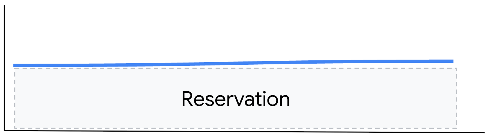
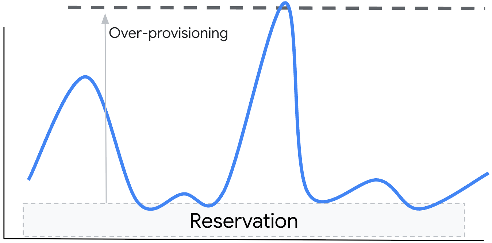

# Optimizing GKE Workloads with Custom Compute Classes

Organizations running specialized workloads, particularly in AI/ML and
high-performance computing, often face a critical challenge in securing the
right accelerator-optimized hardware (like GPUs and TPUs) precisely when needed,
without overspending. Demand for these resources can be highly elastic, with
unpredictable spikes that make traditional capacity planning difficult. This
forces a difficult trade-off between over-provisioning for peak demand, which is
costly and inefficient, and under-provisioning, which risks performance
degradation and workload failure when capacity is unavailable. This guide
addresses how Google Kubernetes Engine (GKE) provides a solution to this problem
through custom compute classes.

Custom compute classes in Google Kubernetes Engine (GKE) provide a powerful way
to define and prioritize the types of virtual machine instances (nodes) that
your workloads run on. By creating tailored profiles, you can ensure that GKE's
autoscaler provisions the right hardware for your specific needs, whether the
goal is to secure scarce resources like GPUs/TPUs, minimize costs, or maximize
performance. Custom compute classes are available by default in all eligible GKE
Autopilot and GKE Standard clusters. For additional information see
[About custom compute classes](https://cloud.google.com/kubernetes-engine/docs/concepts/about-custom-compute-classes).

This document outlines the strategic use of custom compute classes to achieve
distinct objectives.

## Why Use Custom Compute Classes?

Workloads typically fall into one of two broad demand patterns:

1. Steady demand: reservations and/or Committed Use Discounts (CUDs) are ideal
   for handling the P99 percentile of demand, providing predictable costs.  
   

1. Surge demand: here relying solely on reservations or over-provisioning would
   be wasteful. Instead, the strategy is to set a baseline reservation to handle
   the flat portion of the demand and then leverage autoscaling to handle the
   peaks.  
   

This brings us to the core question this guide aims to answer: How do you know
you'll get price-performant VM resources when you need them, especially when
demand fluctuates significantly?

Custom compute classes offer several key benefits to address this challenge and
to manage GKE clusters effectively:

- **Prioritized Resource Allocation with Fallback:** Define a hierarchy of
  preferred node configurations. If the primary configuration is unavailable,
  GKE automatically provisions the next best option, minimizing scheduling
  delays and ensuring workloads run on optimized hardware.
- **Granular Autoscaling Control:** Tailor node configurations to specific
  workloads, allowing GKE to prioritize these configurations during scaling
  events.
- **Declarative Infrastructure Management:** Adopt a declarative approach to
  infrastructure, enabling GKE to automatically create nodes that precisely
  match your workload requirements.
- **Active Workload Migration:** GKE can automatically migrate workloads to new
  nodes with a more preferred machine configuration if those resources become
  available.
- **Cost Optimization:** Reduce cluster expenses by prioritizing cost-efficient
  node types, such as Spot VMs.
- **Namespace-Level Default Compute Classes:** Set default compute classes
  within Kubernetes namespaces, ensuring workloads are optimized even without
  explicit requests.
- **Custom Node Consolidation:** Define custom resource usage thresholds for
  nodes. GKE will consolidate workloads onto similar, available nodes and scale
  down underutilized ones if usage falls below the threshold.

Consider implementing custom compute classes in the following scenarios:

- Running AI/ML workloads on specific GPU or TPU configurations.
- Setting default hardware configurations for specific teams, reducing overhead
  for application operators.
- Optimizing workloads that perform best on particular Compute Engine machine
  series or hardware configurations.
- Declaring hardware configurations to meet specific business requirements
  (e.g., high performance, cost optimization, high availability).
- Desiring hierarchical fallback to specific hardware configurations during
  compute resource unavailability, ensuring workloads always run on suitable
  machines.
- Centralizing decisions on optimal configurations across your enterprise fleet
  for predictable costs and reliable workload execution.
- Specifying which Compute Engine capacity reservations GKE should use for
  provisioning new nodes for specific workloads.

## How It Works

You define a `ComputeClass` as a custom resource in your cluster. In your
workload's YAML manifest, you then reference this class using a `nodeSelector`.
When the workload needs to be scheduled and no suitable nodes are available, the
GKE autoscaler uses the priorities defined in your `ComputeClass` to create a
new node pool.

```
     nodeSelector:
        cloud.google.com/compute-class: <compute_class_name>
```

A `ComputeClass` contains a `priorities` list. GKE evaluates this list from top
to bottom, attempting to provision a node based on the first specification it
can fulfill. The attributes within your compute classes dictate how GKE
configures new nodes for workloads. Modifications to an existing compute class
apply only to future nodes; GKE does not retroactively change the configuration
of existing nodes.

To optimize your custom compute classes for your fleet, consider these
guidelines:

- **Understand Compute Requirements:** Identify the specific compute needs of
  your fleet, including any application-specific hardware requirements.
- **Establish a Design Theme:** Define a guiding theme for each compute class.
  For example, a performance-optimized class might use a fallback strategy that
  prioritizes high-CPU machine types.
- **Select Machine Families and Series:** Choose the Compute Engine machine
  family and series that best align with your workloads. Refer to the
  [Machine families resource and comparison guide](https://cloud.google.com/compute/docs/machine-resource)
  for details.
- **Plan a Fallback Strategy:** Implement a fallback plan within each compute
  class to ensure workloads consistently run on nodes with similar machine
  configurations. For instance, if the N4 machine series is unavailable, you
  could fall back to N2 machines.

If you have deployed a version of the
[Base GKE Accelerated Platform](https://github.com/GoogleCloudPlatform/accelerated-platforms/blob/main/docs/platforms/gke/base/README.md)
there are some standard `ComputeClass` resources created in the  
`platforms/gke/base/kubernetes/manifests` folder based on the templates in the
[`platforms/gke/base/core/custom_compute_class/templates/manifests`](https://github.com/GoogleCloudPlatform/accelerated-platforms/tree/main/platforms/gke/base/core/custom_compute_class/templates/manifests)
folder of the repository.

To view the latest custom resource definition (CRD) for the `ComputeClass`
custom resource, including all fields and their relationships, refer to the
[ComputeClass resource documentation](https://cloud.google.com/kubernetes-engine/docs/reference/crds/computeclass).

You can also view the CRD in your cluster by running the following command:

```shell
kubectl describe crd computeclasses.cloud.google.com
```

## Strategy Profiles

Compute classes enable the creation of profiles tailored to various strategies,
such as resource obtainability, cost optimization, performance, etc.

### Obtainability

This profile is ideal for critical jobs or other workloads where securing a
specific accelerator is the top priority, and cost is a secondary concern. The
goal is to create the widest possible net to catch an available resource. The
priority list is structured to try the most reliable long term options first,
falling back to more ephemeral options. Here, we want to acquire an
`nvidia-h200-141gb` GPU. The priority order is:

1. **Specific Reservation:** The highest probability of success. You've already
   paid for this capacity.
1. **Dynamic Workload Scheduler (DWS) FlexStart:** A newer option for securing
   capacity for a fixed duration (e.g., 7 days, then 1 day).
1. **Spot VM:** The final attempt, using preemptible spare capacity.
1. **On-Demand:** The standard provisioning model for VMs, but subject to
   regional capacity.

```yaml
apiVersion: cloud.google.com/v1
kind: ComputeClass
metadata:
  name: gpu-h200-141gb-ultra-x8
spec:
  activeMigration:
    optimizeRulePriority: true
  nodePoolAutoCreation:
    enabled: true
  priorities:
    # Use a specific reservation
    - gpu:
        count: 8
        driverVersion: latest
        type: nvidia-h200-141gb
      machineType: a3-ultragpu-8g
      maxPodsPerNode: 32
      reservations:
        affinity: Specific
        specific:
          - name: nvidia-h200-141gb-specific
            reservationBlock:
              name: nvidia-h200-141gb-block
      spot: false

    # Use DWS FlexStart with 7 day limit
    - flexStart:
        enabled: true
        nodeRecycling:
          leadTimeSeconds: 3600
      gpu:
        count: 8
        driverVersion: latest
        type: nvidia-h200-141gb
      machineType: a3-ultragpu-8g
      maxPodsPerNode: 32
      maxRunDurationSeconds: 604800

    # Use DWS FlexStart with 1 day limit
    - flexStart:
        enabled: true
        nodeRecycling:
          leadTimeSeconds: 3600
      gpu:
        count: 8
        driverVersion: latest
        type: nvidia-h200-141gb
      machineType: a3-ultragpu-8g
      maxPodsPerNode: 32
      maxRunDurationSeconds: 86400

    # Use spot
    - gpu:
        count: 8
        driverVersion: latest
        type: nvidia-h200-141gb
      machineType: a3-ultragpu-8g
      maxPodsPerNode: 32
      spot: true

    # Use on-demand
    - gpu:
        count: 8
        driverVersion: latest
        type: nvidia-h200-141gb
      machineType: a3-ultragpu-8g
      maxPodsPerNode: 32
      spot: false
```

This profile is also applicable to other GPU types and TPUs.

### Cost Optimization

This strategy is best for batch processing, development/testing environments, or
any workload that can tolerate potential interruptions. The priority is to
always use the cheapest available option. The priority list is inverted from the
obtainability model. Here, the goal is to run the job as cheaply as possible.

1. **Specific Reservation:** Use a reservation you've already paid for, as this
   is the most cost-effective option.
1. **Spot VM:** The cheapest option, using spare Google Cloud capacity at a
   steep discount. This is the first choice.
1. **Dynamic Workload Scheduler (DWS) FlexStart**: A newer option for securing
   capacity for a fixed duration (e.g., 7 days, then 1 day).
1. **On-Demand:** The most expensive option, used only if no cheaper
   alternatives can be found.

```yaml
apiVersion: cloud.google.com/v1
kind: ComputeClass
metadata:
  name: gpu-h200-141gb-ultra-x8-cost
spec:
  activeMigration:
    optimizeRulePriority: true
  nodePoolAutoCreation:
    enabled: true
  priorities:
    # Use a specific reservation
    - gpu:
        count: 8
        driverVersion: latest
        type: nvidia-h200-141gb
      machineType: a3-ultragpu-8g
      maxPodsPerNode: 32
      reservations:
        affinity: Specific
        specific:
          - name: nvidia-h200-141gb-specific
            reservationBlock:
              name: nvidia-h200-141gb-block
      spot: false

    # Use spot
    - gpu:
        count: 8
        driverVersion: latest
        type: nvidia-h200-141gb
      machineType: a3-ultragpu-8g
      maxPodsPerNode: 32
      spot: true

    # Use DWS FlexStart with 7 day limit
    - flexStart:
        enabled: true
        nodeRecycling:
          leadTimeSeconds: 3600
      gpu:
        count: 8
        driverVersion: latest
        type: nvidia-h200-141gb
      machineType: a3-ultragpu-8g
      maxPodsPerNode: 32
      maxRunDurationSeconds: 604800

    # Use DWS FlexStart with 1 day limit
    - flexStart:
        enabled: true
        nodeRecycling:
          leadTimeSeconds: 3600
      gpu:
        count: 8
        driverVersion: latest
        type: nvidia-h200-141gb
      machineType: a3-ultragpu-8g
      maxPodsPerNode: 32
      maxRunDurationSeconds: 86400

    # Use on-demand
    - gpu:
        count: 8
        driverVersion: latest
        type: nvidia-h200-141gb
      machineType: a3-ultragpu-8g
      maxPodsPerNode: 32
      spot: false
```

This profile is also applicable to other GPU types and TPUs.

### Performance

This strategy is for user-facing applications, critical databases, or any
workload where consistent, low-latency performance is non-negotiable. Cost and
even obtainability take a backseat to raw power and stability. The priority list
focuses exclusively on high-performance, non-preemptible machine types. Here,
the workload needs the fastest CPU and memory available.

1. **Specific Reservation:** The highest probability of success. You've already
   paid for this capacity.
1. **High-Performance On-Demand:** Prioritize a top-tier, performance-optimized
   machine series like C3 or A3. We use on-demand to guarantee we get it without
   relying on reservations being in the right place.
1. **Fallback to another Performance Family:** If the primary choice is
   unavailable, fall back to another strong performance family (e.g., C2D)
   rather than a general-purpose one. Spot VMs are explicitly avoided as their
   preemption would disrupt performance.

```yaml
apiVersion: cloud.google.com/v1
kind: ComputeClass
metadata:
  name: cpu-perf
spec:
  activeMigration:
    optimizeRulePriority: true
  nodePoolAutoCreation:
    enabled: true
  priorities:
    # Best performance machine available, reservation
    - machineType: c3-highcpu-22
      reservations:
        affinity: Specific
        specific:
          - name: c3-highcpu-22-specific
            reservationBlock:
              name: c3-highcpu-22-block
      spot: false

    # Best performance machine available, on-demand
    - machineType: c3-highcpu-22
      spot: false

    # Use strong performance-oriented series if C3 is unavailable
    - machineType: c2d-highcpu-28
      spot: false
```

### Blended Strategies

You are not limited to choosing between pure obtainability or maximum
optimization. Many workloads benefit from a blended strategy that finds a middle
ground. For example, you might create a ComputeClass for a semi-critical batch
job that prioritizes Spot VMs for cost-effectiveness but includes a fallback to
a specific on-demand machine type. This ensures the job runs reliably if Spot
capacity is unavailable, providing a balance between cost and completion
assurance without the extensive fallbacks of a pure obtainability profile.
