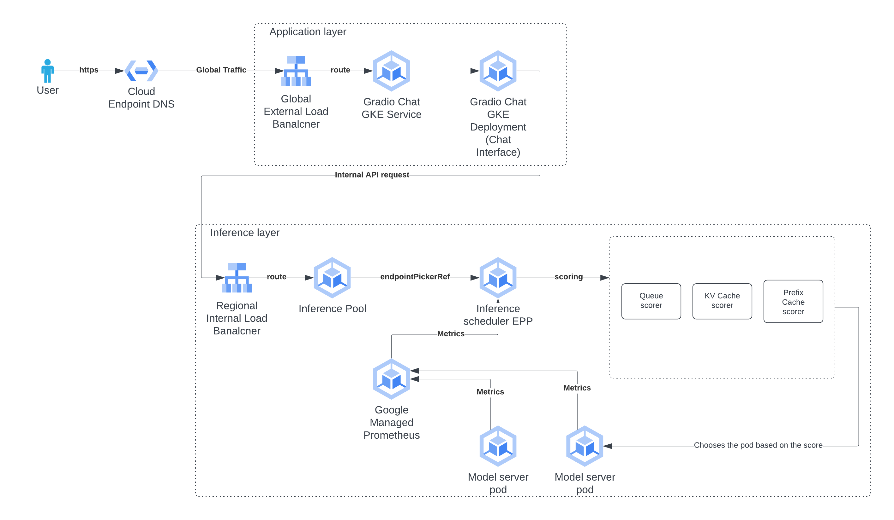
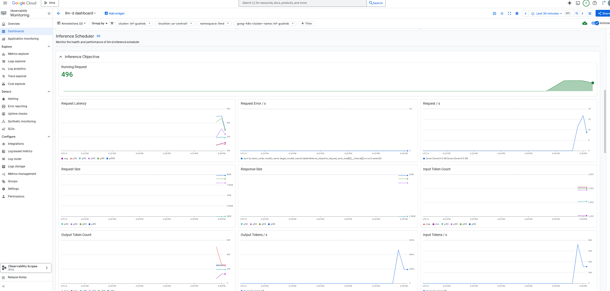

# Intelligent inference scheduling with llm-d

## Prerequisite

This architecture and workflow assumes that the reader is familiar with the
following GKE, Google Cloud Networking and llm-d components:

- [Gateway API resources](https://docs.cloud.google.com/kubernetes-engine/docs/concepts/gateway-api#gateway_resources)
- [GKE Gateway Controller](https://docs.cloud.google.com/kubernetes-engine/docs/concepts/gateway-api#gateway_controller)
- [Google Cloud Load Balancer through GKE](https://docs.cloud.google.com/kubernetes-engine/docs/concepts/service-load-balancer#load_balancer_types)
- [Gateway API Inference Extension(GAIE)](https://github.com/kubernetes-sigs/gateway-api-inference-extension/tree/main/docs/proposals/0683-epp-architecture-proposal)
- [vLLM-Optimized Inference Schedule](https://llm-d.ai/docs/architecture)

## Architecture



## Workflow

- User securely hits the Cloud Endpoint DNS from a web browser.
- The DNS resolves to an External IP mapped to a
  `Global External Load Balancer`.
- The `Global External Load Balancer` has a `HTTPRoute` that points to the
  Gradio chat GKE service as the backend. It also has a backend policy
  specifying that the request to the backend will have
  `IAP(Identity-aware proxy)` authentication enabled.
- The `Global External Load Balancer` routes the request via `IAP` to the Gradio
  chat GKE service backend.
- Gradio chat GKE service forwards the request to the Gradio GKE Deployment and
  the user will see the chat interface loading on the browser.
- When the user sends a request via chat interface, the request reaches the
  Gradio GKE deployment as explained in previous steps.
- The Gradio GKE deployment takes the chat message and routes the request to the
  `Internal Regional Load Balancer` fronting the llm-d deployment.
- The `Internal Regional Load Balancer` has a `HTTPRoute` attached to it that
  points to an `InferencePool` as the backend. This `InferencePool` contains the
  pods running the model server, specifically running the inference of the model
  of your choice via `vllm`.
- The `InferencePool` has a reference to the GAIE endpoint picker(`EPP`) which
  means that the `GKE Gateway Controller` instead of routing the request to the
  backend in round-robin fashion, will consult the `EPP` to provide it with the
  backend where the traffic should be routed.
- The `EPP` has
  [scheduling profiles](https://github.com/llm-d/llm-d-inference-scheduler/blob/main/docs/architecture.md)
  that defines how to score the pods in the `InferencePool`. The scoring is done
  on the metrics coming out of the pods.
- Once the `EPP` identifies the pod which should be used based on the scores, it
  returns its IP address to the `GKE Gateway Controller` corresponding to the
  `Internal Regional Load Balancer` which then routes the request to the pod.

## Pull the source code

- Open [Cloud Shell](https://cloud.google.com/shell).

- Clone the repository and change directory to the guide directory

  ```
  git clone https://github.com/GoogleCloudPlatform/accelerated-platforms && \
  cd accelerated-platforms && \
  export ACP_REPO_DIR="$(pwd)"
  ```

  To set the `ACP_REPO_DIR` value for new shell instances, write the value to
  your shell initialization file.

  `bash`

  ```
  sed -n -i -e '/^export ACP_REPO_DIR=/!p' -i -e '$aexport ACP_REPO_DIR="'"${ACP_REPO_DIR}"'"' ${HOME}/.bashrc
  ```

  `zsh`

  ```
  sed -n -i -e '/^export ACP_REPO_DIR=/!p' -i -e '$aexport ACP_REPO_DIR="'"${ACP_REPO_DIR}"'"' ${HOME}/.zshrc
  ```

## Configure

Terraform loads variables in the following order, with later sources taking
precedence over earlier ones:

- Environment variables (`TF_VAR_<variable_name>`)
- Any `*.auto.tfvars` or files, processed in lexical order of their filenames.
- Any `-var` and `-var-file` options on the command line, in the order they are
  provided.

- Set the platform defaults project ID

  ```
  export TF_VAR_platform_default_project_id="<PROJECT_ID>"
  ```

  **-- OR --**

  ```
  platform_default_project_id="<PROJECT_ID>"
  sed -i '/^platform_default_project_id[[:blank:]]*=/{h;s/=.*/= "'"${platform_default_project_id}"'"/};${x;/^$/{s//platform_default_project_id = "'"${platform_default_project_id}"'"/;H};x}' ${ACP_REPO_DIR}/platforms/gke/base/_shared_config/platform.auto.tfvars
  ```

- Optional : By default, the platform name is set to `dev`. If you want to
  change it, set the platform name

  ```
  platform_name="<PLATFORM_NAME>"
  sed -i '/^platform_name[[:blank:]]*=/{h;s/=.*/= "'"${platform_name}"'"/};${x;/^$/{s//platform_name="'"${platform_name}"'"/;H};x}' ${ACP_REPO_DIR}/platforms/gke/base/_shared_config/platform.auto.tfvars
  ```

- Optional : Run the following step if you want to run the model on an
  accelerator other than L4 which is the default accelerator for this
  deployment.

  ```
  llmd_accelerator_type="<ACCELERATOR>"
  sed -i '/^llmd_accelerator_type[[:blank:]]*=/{h;s/=.*/= "'"${llmd_accelerator_type}"'"/};${x;/^$/{s//llmd_accelerator_type="'"${llmd_accelerator_type}"'"/;H};x}' ${ACP_REPO_DIR}/platforms/gke/base/use-cases/inference-ref-arch/terraform/_shared_config/llmd.auto.tfvars
  ```

  Valid values for `ACCELERATOR` are:

  - `cpu`
  - `nvidia-a100-80gb`
  - `nvidia-h100-80gb`
  - `nvidia-l4` **(default)**
  - `nvidia-rtx-pro`
  - `nvidia-tesla-a100`

## Configure Identity-Aware Proxy (IAP)

Identity-Aware Proxy (IAP) lets you establish a central authorization layer for
applications accessed by HTTPS, so you can use an application-level access
control model instead of relying on network-level firewalls.

IAP policies scale across your organization. You can define access policies
centrally and apply them to all of your applications and resources. When you
assign a dedicated team to create and enforce policies, you protect your project
from incorrect policy definition or implementation in any application.

For more information on IAP, see the
[Identity-Aware Proxy documentation](https://cloud.google.com/iap/docs/concepts-overview#gke)

### Configure OAuth consent screen for IAP

For this guide we will configure a generic OAuth consent screen setup for
internal use. Internal use means that only users within your organization can be
granted IAM permissions to access the IAP secured applications and resource.

See the
[Configuring the OAuth consent screen documentation](https://developers.google.com/workspace/guides/configure-oauth-consent)
for additional information

- Set environment variables.

  ```shell
  source "${ACP_REPO_DIR}/platforms/gke/base/use-cases/inference-ref-arch/terraform/_shared_config/scripts/set_environment_variables.sh"
  ```

- Ensure that IAP is enabled.

  ```shell
  gcloud services enable iap.googleapis.com \
  --project="${llmd_iap_oath_branding_project_id}"
  ```

- Check if the branding is already configured.

  ```shell
  gcloud iap oauth-brands list \
  --project="${llmd_iap_oath_branding_project_id}"
  ```

  > If an entry is displayed, the branding is already configured.

- Configure the branding.

  ```shell
  gcloud iap oauth-brands create \
  --application_title="IAP Secured Application" \
  --project="${llmd_iap_oath_branding_project_id}" \
  --support_email="<SUPPORT_EMAIL_ADDRESS>"
  ```

  Replace `<SUPPORT_EMAIL_ADDRESS>` with a group email address that you are a
  manager on or your personal email address. The email address should be
  supplied without the domain.

### Default IAP access

For simplicity, in this guide access to the IAP secured applications will be
configure to allow all users in the organization. Access can be configured per
IAP application or resources.

- Set the IAP allow domain

  ```
  IAP_DOMAIN=$(gcloud auth list --filter=status:ACTIVE --format="value(account)" | awk -F@ '{print $2}')
  echo "IAP_DOMAIN=${IAP_DOMAIN}"
  ```

  **If the domain of the active `gcloud` user is different from the organization
  that the `llmd_iap_oath_branding_project_id` project is in, you will need to
  manually set `IAP_DOMAIN` environment variable**

  ```
  IAP_DOMAIN="<project_id's organization domain>"
  ```

- Set the IAP domain in the configuration file

  ```
  sed -i '/^llmd_iap_domain[[:blank:]]*=/{h;s/=.*/= "'"${IAP_DOMAIN}"'"/};${x;/^$/{s//llmd_iap_domain="'"${IAP_DOMAIN}"'"/;H};x}' ${ACP_REPO_DIR}/platforms/gke/base/use-cases/inference-ref-arch/terraform/_shared_config/llmd.auto.tfvars
  ```

### Install Terraform 1.8.0+

> [!IMPORTANT]  
> At the time this guide was written, Cloud Shell had Terraform v1.5.7 installed
> by default. Terraform version 1.8.0 or later is required for this guide.

- Run the `install_terraform.sh` script to install Terraform 1.8.0.

  ```shell
  "${ACP_REPO_DIR}/tools/bin/install_terraform.sh"
  ```

## Deploy

```
${ACP_REPO_DIR}/platforms/gke/base/use-cases/inference-ref-arch/terraform/deploy-llmd.sh
```

## Resources created

The `deploy-llmd.sh` script will perform the following steps:

- Set up base GKE cluster platform.
- Create resources required to deploy llm-d on the GKE cluster and access it.
- Deploy a model server using vllm for Qwen3-0.6B inference on `nvidia-l4`
  accelerator and make the model accessible through gradio chat backed by
  Identity-Aware Proxy.
- Creates a custom Cloud Monitoring dashboard named `llm-d dashboard`

The model server uses Qwen3-0.6B model from HuggingFace which requires the model
server deployment to have a read token. When the `deploy-llmd.sh` is completed,
run the following steps to add a HuggingFace read token to the secret manager.

- [Generate a Hugging Face tokens](https://huggingface.co/docs/hub/security-tokens)
  with token type **Read**.
- Add the token to the secret manager
  ```
  HF_TOKEN_READ=<YOUR_HUGGINGFACE_READ_TOKEN>
  echo ${HF_TOKEN_READ} | gcloud secrets versions add ${huggingface_hub_access_token_read_secret_manager_secret_name} --data-file=- --project=${huggingface_secret_manager_project_id}
  ```

## Verify llm-d deployment is up and running

- Set the environment variables

  ```
  source "${ACP_REPO_DIR}/platforms/gke/base/use-cases/inference-ref-arch/terraform/_shared_config/scripts/set_environment_variables.sh"
  ```

- Get cluster credentials

  ```
  ${cluster_credentials_command}
  ```

- Check the all the deployments

  ```
  kubectl get deployments -n ${llmd_kubernetes_namespace}
  ```

  You should see three deployments

  ```
  NAME                                                   READY   UP-TO-DATE   AVAILABLE   AGE
  gaie-inference-scheduling-epp                          1/1     1            1           XXX
  gradio-nvidia-l4                                       1/1     1            1           XXX
  ms-inference-scheduling-llm-d-modelservice-nvidia-l4   2/2     2            2           XXX
  ```

  Note:

  - gaie-inference-scheduling-epp is the Gateway API Inference Extension
    endpoint picker.
  - gradio-nvidia-l4 is the front end chat interface abstracting the model
    server.
  - ms-inference-scheduling-llm-d-modelservice-nvidia-l4 is the model server
    running inference of Qwen3-0.6B. It may take some time for this deployment
    to be up completely depending upon the GPU availability

- Check all the resources

  ```
  kubectl get all -n ${llmd_kubernetes_namespace}
  ```

  You should see output similar to the following:

  ```
  NAME                                                                   READY    STATUS    RESTARTS    AGE
  pod/gaie-inference-scheduling-epp-XXXX                                 1/1      Running    0          XX
  pod/gradio-nvidia-l4-XXXX                                              1/1      Running    0          XX
  pod/ms-inference-scheduling-llmd-modelservice-nvidia-l4-XXXX           2/2      Running    0          XX
  pod/ms-inference-scheduling-llmd-modelservice-nvidia-l4-XXXX           2/2      Running    0          XX

  NAME                                             TYPE        CLUSTER-IP       EXTERNAL-IP   PORT(S)             AGE
  service/gaie-inference-scheduling-epp            ClusterIP   34.118.230.43    <none>        9002/TCP,9090/TCP   XX
  service/gaie-inference-scheduling-ips-XXXX       ClusterIP   None             <none>        54321/TCP           XX
  service/gradio-svc-nvidia-l4                     ClusterIP   34.118.232.165   <none>        8080/TCP            XX

  NAME                                                                  READY   UP-TO-DATE   AVAILABLE   AGE
  deployment.apps/gaie-inference-scheduling-epp                         1/1     1            1           XX
  deployment.apps/gradio-nvidia-l4                                      1/1     1            1           XX
  deployment.apps/ms-inference-scheduling-llmd-modelservice-nvidia-l4   2/2     2            2           XX

  NAME                                                                             DESIRED   CURRENT   READY   AGE
  replicaset.apps/gaie-inference-scheduling-epp-XXXX                                1         1         1       XX
  replicaset.apps/gradio-nvidia-l4-XXXX                                             1         1         1       XX
  replicaset.apps/ms-inference-scheduling-llmd-modelservice-nvidia-l4-XXXX          2         2         2       XX
  ```

- Wait for the model server deployment to be ready before accessing the chat
  interface.

  ```
  watch --color --interval 5 --no-title \
  "kubectl --namespace=${llmd_kubernetes_namespace} get deployment/${llmd_ms_deployment_name}-${llmd_accelerator_type} | GREP_COLORS='mt=01;92' egrep --color=always -e '^' -e '1/1     1            1'"
  ```

- When the deployment is ready, you will output similar to the following

  ```
  NAME                                                  READY   UP-TO-DATE   AVAILABLE   AGE
  ms-inference-scheduling-llmd-modelservice-nvidia-l4   2/2     2            2           XX
  ```

- Output the Chat URL.

  ```
  echo -e "\nChat URL: https://${llmd_endpoints_hostname}\n"
  ```

- Open the Chat URL in a web browser.

> [!TIP]  
> If the browser doesn't load the Gradio chat interface, the SSL certificate
> could still be getting provisioned. Check the status of the certificate by
> running the following command:
>
> `gcloud compute ssl-certificates describe ${llmd_ssl_certificate_name} --project ${cluster_project_id} --format=json | jq -r '.managed.status'`
>
> If the output of the command is `PROVISIONING`, it means the certificate has
> not been provisioned yet. Wait for the status to change to `ACTIVE`

## Stress test llm-d

In this section you will spawn many requests to the gradio endpoint which will
route the request to the model server via llm-d's intelligent scheduling.

Note: The stress test script you will run in this section has been tested on
machine type `g2-standard-32` with 1 `nvidia-l4` GPU. If you choose a different
accelerator for the reference architecture like `nvidia-rtx-pro` , the script
may not be able to generate enough stress on the deployment.

- In order to send a request to the gradio chat interface fronting llm-d and
  model server, the active `gcloud` account needs to have the
  [Service Account Token Creator](https://cloud.google.com/iam/docs/roles-permissions/iam#iam.serviceAccountTokenCreator)
  role for the stress test service account. The following command will add the
  role to the active `gcloud` account.

  ```shell
  gcloud iam service-accounts add-iam-policy-binding ${stress_test_service_account_email} \
  --member="user:$(gcloud auth list --filter=status:ACTIVE --format="value(account)")" \
  --project="${stress_test_service_account_project_id}" \
  --role="roles/iam.serviceAccountTokenCreator"
  ```

  The stress test service account has the role `roles/iap.httpsResourceAccessor`
  and can access the gradio chat application secured by Identity-Aware proxy.

- Generate JSON Web Token (JWT)

  ```shell
  cd ${ACP_REPO_DIR}/platforms/gke/base/use-cases/inference-ref-arch/terraform/llmd && \
  cat > jwt-claim.json << EOF
  {
    "iss": "${stress_test_service_account_email}",
    "sub": "${stress_test_service_account_email}",
    "aud": "https://${llmd_endpoints_hostname}/gradio_api/api/sync_chat/",
    "iat": $(date +%s),
    "exp": $((`date +%s` + 3600))
  }
  EOF
  ```

  Wait for a couple of mins as the IAM permissions could take some time to
  reflect the changes.

  ```shell
  gcloud iam service-accounts sign-jwt --iam-account="${stress_test_service_account_email}" jwt-claim.json token.jwt
  ```

- Set up python virtual environment and install required packages

  ```
  python3 -m venv venv &&
  source venv/bin/activate &&
  pip install aiohttp
  ```

- Run the script to trigger stress test.

  ```shell
  python ${ACP_REPO_DIR}/platforms/gke/base/use-cases/inference-ref-arch/terraform/llmd/scripts/stress_test.py
  ```

  The script spawns high volume of requests to the gradio chat service that
  routes requests to llm-d gateway.

- The response should look like this:

  ```shell
  Starting QUEUE FILL Test: XXX Simultaneous Users...
  Launching requests...
  [Req XXXX] User XXX | Status: 200
  [Req XXXX] User XXX | Status: 200
  [Req XXXX] User XXX | Status: 200
  [Req XXXX] User XXX | Status: 200
  ```

- Let the stress test run and go to
  [Cloud Monitoring Dashboard page](https://console.cloud.google.com/monitoring/dashboards?pli=1)
  and search for `llm-d dashboard`. Open the dashboard. You will see something
  similar to the following pic.

  

- You can view the metrics published by `vllm` and `gaie` on the dashboard. Note
  that for `nvidia-l4` GPUs, some of the network metrics like
  `Throughput TX Bytes per Pod` will missing as they are not supported by
  `nvidia-l4` machine type.

## Teardown

Teardown the llm-d platform

```shell
${ACP_REPO_DIR}/platforms/gke/base/use-cases/inference-ref-arch/terraform/teardown-llmd.sh
```
