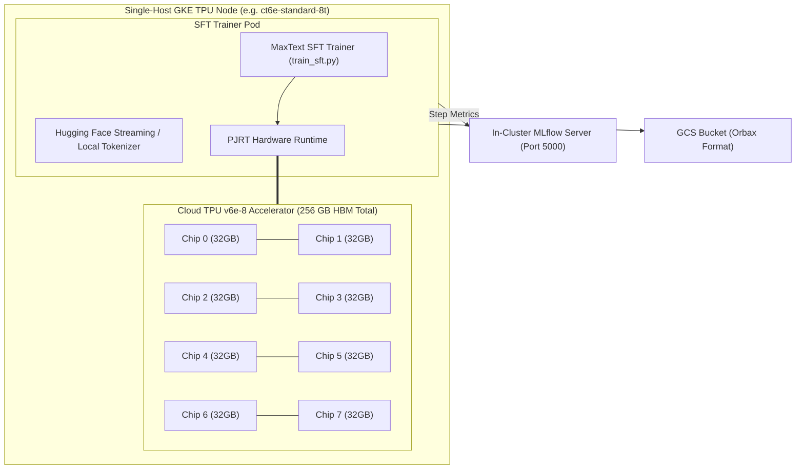

# Single-Host Supervised Fine-Tuning (SFT) with TPUs on Google Kubernetes Engine (GKE) using MaxText

This guide provides a comprehensive production reference architecture and implementation guide for running **Single-Host** Supervised Fine-Tuning (SFT) on Cloud TPUs using **MaxText** and **Tunix** on Google Kubernetes Engine (GKE).

---

## 1. Architectural Overview

Single-host TPU slice topologies (`v5e-2x4`, `v6e-2x4`) contain 8 TPU chips attached to a single host VM. In single-host execution, JAX communicates directly with the TPU hardware through **PJRT** without network serialization overhead.



---

## 2. Hardware & Memory Sizing Formulas

Full-parameter fine-tuning with AdamW in bfloat16 requires allocating memory for parameters, gradients, optimizer momentum/variance states, and forward activations.

### A. Memory Breakdown Formulas

For a model with `P` parameters:

1. **Model Parameters (bfloat16)**: `2 * P bytes`
2. **Gradients (bfloat16)**: `2 * P bytes`
3. **AdamW Optimizer States (fp32)**:
   * First momentum vector: `4 * P bytes`
   * Second variance vector: `4 * P bytes`
   * Master weights (fp32 copy): `4 * P bytes`
   * **Total Optimizer State**: `12 * P bytes`
4. **Total Static State per Model**:
   `Static HBM = 2P + 2P + 12P = 16 * P bytes`

### B. Sharding Across Single-Host Chips (8 Devices)

Under Fully Sharded Data Parallelism (FSDP / `fsdp_transposed`), parameters and optimizer states are sharded across the 8 TPU devices:

`Per-Device Memory = (16 * P) / 8 + Activation Memory(B, S, H, L)`

| Model | Parameters (`P`) | Total Static State (`16P`) | Sharded State / Chip | Available Activation Headroom / Chip |
| :--- | :--- | :--- | :--- | :--- |
| **Gemma 3 4B** | 4.30B | **`68.8 GB`** | **`8.6 GB / chip`** | **`23.4 GB`** (73% Headroom) |
| **Llama 3.1 8B** | 8.03B | **`128.5 GB`** | **`16.1 GB / chip`** | **`15.9 GB`** (50% Headroom) |

---

## 3. Unfinished Gradient Descent & Full-Epoch Convergence Dynamics

When fine-tuning on datasets like `HuggingFaceH4/ultrachat_200k` (207,865 training conversations, 23,110 test conversations):

### A. Subsampled Runs vs. Full Epoch Math

* In a 1,000-step baseline with global batch size = 16 (8 chips * `per_device_batch_size=2`):
  `Samples Processed = 1,000 * 16 = 16,000 samples (7.7% of 1 Full Epoch)`
* **The "Unfinished Gradient Descent" Phenomenon**:
  Even though evaluation perplexity dropped by **`-70.7%`** (`10.663` -> `3.128`), the loss gradient slope remained strictly negative with zero signs of overfitting.

### B. 100% Full-Epoch Dataset Completion (Empirical Results)

Running across the complete dataset until full corpus exhaustion at **Step 8,601** achieved an additional **`-41.1%`** reduction in evaluation perplexity:

| Milestone (Step) | Training Loss | Training Perplexity | Evaluation Loss | Evaluation Perplexity | Dataset Progress | Checkpoint Status |
| :--- | :--- | :--- | :--- | :--- | :--- | :--- |
| **Step 1** | **`2.4263`** | **`11.317`** | Initialized | — | 0.0% | `checkpoints/1` |
| **Step 1,000** | `0.8722` | `2.392` | `1.6478` | **`5.196`** | 11.6% | `checkpoints/1000` |
| **Step 2,000** | `0.9487` | `2.582` | `1.4318` | **`4.186`** | 23.3% | `checkpoints/2000` |
| **Step 3,000** | `0.9771` | `2.657` | `1.3227` | **`3.754`** | 34.9% | `checkpoints/3000` |
| **Step 4,000** | `1.0129` | `2.753` | `1.2559` | **`3.511`** | 46.5% | `checkpoints/4000` |
| **Step 5,000** | `1.0041` | `2.730` | `1.2094` | **`3.352`** | 58.1% | `checkpoints/5000` |
| **Step 6,000** | `1.0453` | `2.844` | `1.1748` | **`3.237`** | 69.8% | `checkpoints/6000` |
| **Step 7,000** | `0.9314` | `2.538` | `1.1473` | **`3.150`** | 81.4% | `checkpoints/7000` |
| **Step 8,000** | `1.0195` | `2.772` | `1.1247` | **`3.079`** | 93.0% | `checkpoints/8000` |
| **Step 8,601 (Final)** | **`0.8842`** | **`2.421`** | **`1.1180`** | **`3.058`** | **100.0% (Full Epoch)** | **`checkpoints/8601`** 🎯 |

---

## 4. Activation Scaling & Gradient Accumulation

### Direct Batching vs. Gradient Accumulation

Activation memory scales proportionally with sequence length and batch size: `O(B * S * H * L)`.

* **The Problem (Direct Batching Crash)**:
  Setting `per_device_batch_size=8` directly causes physical memory consumption to spike to **`32.41 GB`**, exceeding the physical `31.57 GB` HBM capacity of Cloud TPU v6e and triggering an **Out-Of-Memory (OOM)** crash.
* **The Solution (Gradient Accumulation)**:
  Set `per_device_batch_size=2` and `gradient_accumulation_steps=4` (or `8`).
  * Physical activation memory remains locked at **`15.0 GB` (47% HBM)**.
  * Micro-batches are evaluated sequentially in SRAM, accumulating gradients before performing the AdamW weight update.
  * Effective global batch size scales to **`64`** or **`128`** with **zero memory risk**.

---

## 5. Empirical Benchmark Matrix (Empirical Results)

The following metrics were measured during live end-to-end SFT execution on Cloud TPU v6e-8 (`2x4`) instances:

| Experiment Configuration | Batch Size & Micro-steps | Context Length | Peak HBM Footprint | Compute Throughput | Final Eval Perplexity | Status / Outcome |
| :--- | :--- | :--- | :--- | :--- | :--- | :--- |
| **`gemma3-4b-sft-full-epoch`** | `bs=2, ga=1` (bs=2) | 2048 tokens | `15.0 GB` (47%) | **`229.8 TFLOP/s`** | **`3.058` (-73.0%)** | **100% Full Epoch Completed (8,601 steps)** 🏆 |
| **`bs=2, seq=1024`** | `bs=2, ga=1` (bs=2) | 1024 tokens | `9.5 GB` (30%) | **`230.1 TFLOP/s`** | `3.246` (-69.3%) | Baseline fast SFT run |
| **`bs=4, seq=1024`** | `bs=4, ga=1` (bs=4) | 1024 tokens | `14.5 GB` (45%) | **`230.9 TFLOP/s`** | `3.139` (-73.1%) | Optimal 1024 compute density |
| **`bs=8, seq=1024`** | `bs=8, ga=1` (bs=8) | 1024 tokens | **`32.41 GB`** | 0 | N/A | **OOM Crash** (> 31.57 GB) |
| **`gradaccum=4`** | `bs=2, ga=4` (eff bs=8) | 2048 tokens | **`15.0 GB` (47%)** | **`229.8 TFLOP/s`** | `2.768` | **Fixed `bs=8` OOM failure** |
| **`gradaccum=8`** | `bs=2, ga=8` (eff bs=16)| 2048 tokens | **`15.0 GB` (47%)** | **`229.5 TFLOP/s`** | `2.743` | Linear effective batch scaling |
| **`seq4096`** | `bs=2, ga=1` (bs=2) | 4096 tokens | `22.0 GB` (69%) | **`228.0 TFLOP/s`** | **`3.070`** | **Highest Dialogue Accuracy** |

* **Hardware Efficiency**: Cloud TPU v6e achieves sustained **`228 - 231 TFLOP/s / device`** (~50% Model Flops Utilization).

---

## 6. Step-by-Step Deployment Guide

### Prerequisites

1. **GKE Cluster** with Cloud TPU node pool (`ct6e-standard-8t`) and GKE Workload Identity enabled.
2. **Hugging Face Token Secret**: Stored in Secret Manager and mounted via `SecretProviderClass`.
3. **GCS Bucket**: Configured for Orbax checkpoint saving and loading.

---

### Step 1: Deploy Full-Epoch Single-Host SFT Job

```bash
kubectl apply -f platforms/gke/base/use-cases/training-ref-arch/kubernetes-manifests/sft-tpu-maxtext-single-host/experiments/05-gemma3-4b-sft-full-epoch-v6e-8.yaml
```

Monitor the pod logs:

```bash
kubectl get pods -l app=gemma3-4b-sft-full-epoch -o wide
kubectl logs -l app=gemma3-4b-sft-full-epoch -f
```

---

## 7. Real-Time Metrics & MLflow Tracking

Metrics are logged per-step and streamed directly to the in-cluster MLflow tracking server (`http://mlflow-tracking-svc.<namespace>.svc.cluster.local:5000`).

### Port-Forward the MLflow UI

```bash
kubectl port-forward -n rl-mul-slice-rl-mlflow svc/mlflow-tracking-svc 5000:5000
```

Open `http://localhost:5000` in your browser to inspect:

* **Training Loss & Step Perplexity**
* **Evaluation Loss & Final Perplexity Reduction**
* **Hardware TFLOP/s / device & Model Flops Utilization (MFU)**
* **Step Latency & Checkpoint Serialization Speed**
