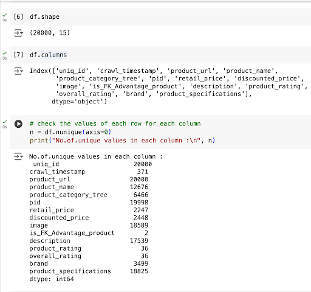
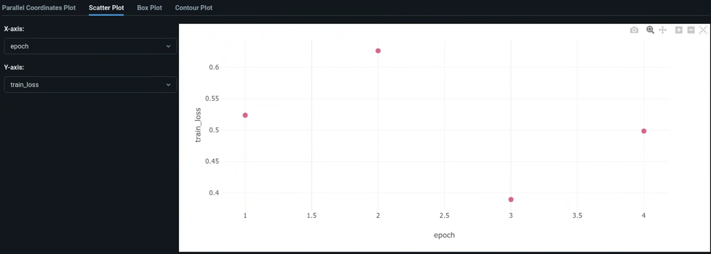
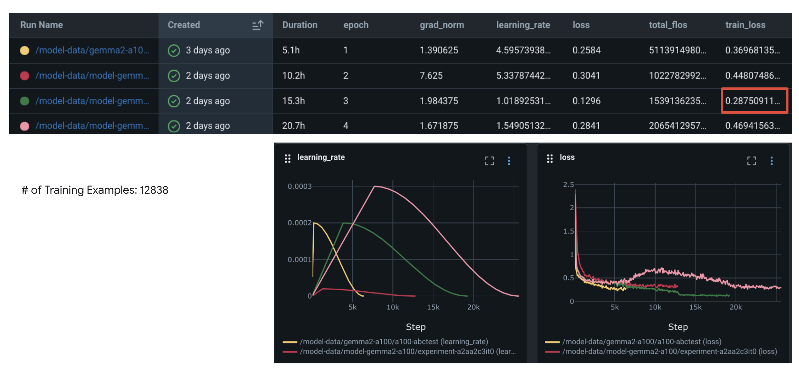

## Introduction

This document presents a comprehensive guide to implementing the ML use case from start to finish. It explores the key components involved, outlines the step-by-step process flow, and highlights crucial considerations for successful implementation.

## Use case

The goal is to build a Virtual Retail Assistant \- a chat bot that is contextually sensitive to a retailer's product catalog, capable of responding to customer inquiries and suggesting alternatives and complimentary outfits.

An instruction tuned base model can help with the conversation, but further fine-tuning is necessary to include retailer's product catalog data and to respond in an instructed way. Throughout this process, we will explore:

- Data Set Preparation
- Fine-Tuning of the Instruction Tuned Model
- Hyperparameter Tuning to Generate Multiple Model Iterations
- Model Validation, Evaluation, and Identification of the Optimal Model

Within each topic, we will share methodologies, frameworks, tools, and lessons learned to support your journey.

## Process Flow for Implementing the ML Use Case End to End


## Data Preprocessing

The data preprocessing phase in MLOps is foundational. It directly impacts the quality and performance of machine learning models. Preprocessing includes tasks such as data cleaning, feature engineering, scaling, and encoding, all of which are essential for ensuring that models learn effectively from the data.

### Dataset

We are leveraging a [pre-crawled public dataset](https://www.kaggle.com/datasets/PromptCloudHQ/flipkart-products), [license], taken as a subset (20000) of a bigger dataset (more than 5.8 million products) that was created by extracting data from [Flipkart](https://www.flipkart.com/), a leading Indian eCommerce store.



### Data Preprocessing Steps

The dataset has 15 different columns. The columns of our interest are: 'uniq_id', 'product_name', 'description', 'brand' ,'product_category_tree', 'image' ,'product_specifications'.

Other than dropping null values and duplicates, we will do following steps:

1. description: Cleaning up Product Description by removing stop words & punctuations
2. product_category_tree: Split into different columns
3. product_specifications: Parse the Product Specifications into Key:Value pairs
4. image: Parse the list of image urls. Validate the URL and download the image.

Now, consider the scenario where a preprocessing task involves extracting multiple image URLs from each row of a large dataset and uploading the images to a Google Cloud Storage (GCS) bucket. This might sound straightforward, but with a dataset containing 20,000+ rows, each with potentially up to seven URLs, the process can become incredibly time-consuming when executed serially in Python. In our experience, such a task can take upwards of eight hours to complete.

### Parallelism: The Solution to Scalability

To tackle this scalability issue, we turn to parallelism. By breaking the dataset into smaller chunks and distributing the processing across multiple threads or processes, we can drastically reduce the overall execution time.

For implementation steps, please check this document [Distributed Data Preprocessing with Ray](/use-cases/model-fine-tuning-pipeline/data-processing/ray/README.md)

## Data Preparation

For our use case, we are fine tuning the Gemma2 9B Instruction Tuned model to align it with our specific requirements. The instruction-tuned nature of this model mandates that input data adheres to a natural language conversational format. However, our preprocessed product catalog is currently structured in a tabular format, necessitating a data preparation phase to construct suitable prompts.

These prompts will consist of a range of potential questions that an online shopper might pose, alongside corresponding answers derived from the product catalog. The answers will be presented in a contextually relevant manner, simulating the interaction between a shopper and a knowledgeable assistant within an e-commerce environment.

**Methodology:**

The dataset underwent a filtering process to concentrate exclusively on clothing items, catering specifically to Women, Men, and Kids. Products with less than ten units in a specific category were excluded.

To optimize instruction-tuned models, it is imperative that each data point consists of three distinct components: Question, Answer and Context

[Llama 3.1 on Vertex AI](https://console.cloud.google.com/vertex-ai/publishers/meta/model-garden/llama-3.1-405b-instruct-maas) was used for the generation of natural shopping-style conversational questions/Inputs and answers/Outputs. The formulation of these Input and Output was based on the product specifications detailed within the catalog.

The prompts were created utilizing the previously generated questions and answers. The product category is used to set the context of the conversation.

**Prompt Sample:**

```
<start_of_turn>user
Context:Online shopping for Men's Clothing
What is the fabric of Numero Uno Solid Men's Polo Neck T-Shirt<end_of_turn><start_of_turn>model
The fabric of Numero Uno Solid Men's Polo Neck T-Shirt is cotton 
Product Name: Numero Uno Solid Men's Polo Neck T-Shirt
Product Category: Men's Clothing
Product Details:
- Sleeve: Half Sleeve
- Number of Contents in Sales Package: Pack of 1
- Fabric: Cotton
- Type: Polo Neck
- Fit: Slim
- Pattern: Solid
- Occasion: Casual
- Ideal For: Men's
- Style Code: NMFNHZ444_SIMPLY GREEN..F
<end_of_turn>
```

The 'End Of Sequence' token was appended to each prompt.

EOS_TOKEN \= '\<eos\>'

For implementation steps, please check this document [Data preparation for fine tuning Gemma IT model](/use-cases/model-fine-tuning-pipeline/data-preparation/gemma-it/README.md)

## Fine-tuning

With our prepared dataset, we proceed to fine-tune the Gemma model using PyTorch's Low-Rank Adaptation (LoRA) within the Parameter-Efficient Fine-Tuning (PEFT) framework. This approach incorporates Transformer Reinforcement Learning's (TRL) Supervised Fine-Tuning (SFT) methodology. The SFT process is initiated by providing the _`SFTrainer`_ with both the dataset and the specific tuning parameter configurations.

While single-GPU setups without quantization might be sufficient, scaling to multiple GPUs across multiple hosts necessitates sharding and distributed workload management. We employ Fully Sharded Data Parallelism ([FSDP](https://pytorch.org/blog/introducing-pytorch-fully-sharded-data-parallel-api/)) for model sharding and leverage [Accelerate](https://huggingface.co/docs/accelerate/en/index) for efficient distributed training.

The resulting fine-tuned model is, Built with Meta Llama 3.1, using the the data prepared by the Llama 3.1 on Vertex AI API.

### **Initial Fine-Tuning and Optimization**

The initial fine-tuning run utilized a baseline set of parameters. Accelerate aggregates data across all shards and saves the model to a mounted Google Cloud Storage (GCS) bucket for convenient access and persistence.

Having established a working baseline, our focus shifts to optimization. Our goal is to minimize loss while ensuring the model achieves a satisfactory level of accuracy. We'll systematically adjust hyperparameters such as learning rate, the number of training epochs to identify the optimal configuration for our specific task and dataset.

## Hyperparameter Tuning to Generate Multiple Model Iterations

Fine-tuning large language models like Gemma involves carefully adjusting various hyperparameters to optimize performance and tailor the model's behavior for specific tasks. These hyperparameters control aspects of the model's architecture, training process, and optimization algorithm.

In our fine-tuning process, we focused on the following key parameters:

### **Core LoRA Parameters**

- **lora_r (Rank):** This parameter controls the rank of the low-rank matrices used in LoRA. A higher rank increases the expressiveness of the model but also increases the number of trainable parameters.
- **lora_alpha (Alpha):** This scaling factor balances the contribution of the LoRA updates to the original model weights. A larger alpha can lead to faster adaptation but may also introduce instability.
- **lora_dropout (Dropout):** Dropout is a regularization technique that helps prevent overfitting. Applying dropout to LoRA layers can further improve generalization.

### **Learning Rate, Optimization, and Training Duration**

- **learning_rate (Learning Rate):** The learning rate determines the step size the optimizer takes during training. Finding the optimal learning rate is crucial for efficient convergence and avoiding overshooting.
- **epochs (Number of Epochs):** The number of epochs dictates how many times the model sees the entire training dataset. More epochs generally lead to better performance, but overfitting can become a concern.
- **max_grad_norm (Maximum Gradient Norm):** Gradient clipping helps prevent exploding gradients, which can destabilize training. This parameter limits the maximum norm of the gradients.
- **weight_decay (Weight Decay):** Weight decay is a regularization technique that adds a penalty to the loss function based on the magnitude of the model weights. This helps prevent overfitting.
- **warmup_ratio (Warmup Ratio):** This parameter determines the proportion of the total training steps during which the learning rate is gradually increased from zero to its initial value. Warmup can improve stability and convergence.

### **Sequence Length Considerations**

- **max_seq_length (Maximum Sequence Length):** This parameter controls the maximum length of the input sequences the model can process. Longer sequences can provide more context but also require more computational resources.

### Experimental Values

The following table displays the experimental values across multiple jobs we used for the aforementioned parameters:

| parameter      | base     | job-0    | job-1    | job-2    |
| :------------- | -------- | -------- | -------- | -------- |
| epochs         | 1        | 2        | 3        | 4        |
| lora_r         | 8        | 8        | 16       | 32       |
| lora_alpha     | 16       | 16       | 32       | 64       |
| lora_dropout   | 0.1      | 0.1      | 0.2      | 0.3      |
| max_grad_norm  | 0.3      | 1        | 1        | 1        |
| learning_rate  | 2.00E+04 | 2.00E+05 | 2.00E+04 | 3.00E+04 |
| weight_decay   | 0.001    | 0.01     | 0.005    | 0.001    |
| warmup_ratio   | 0.03     | 0.1      | 0.2      | 0.3      |
| max_seq_length | 512      | 1024     | 2048     | 8192     |

### Monitoring Hyperparameter tuning jobs

Tracking multiple hyperparameter tuning jobs with varying parameters and metrics requires a mechanism to track input parameters, monitor the training progress and share the results. Custom tools can be developed, but there are also open-source options like [MLflow](https://www.mlflow.org/).

MLflow is an open-source platform for tracking experiments, including hyperparameter tuning. It provides a central repository for storing and organizing experimental data, making it easy to compare and analyze different configurations and results. MLflow was deployed onto the platform cluster to track our experiments.

**Incorporating MLflow**

Incorporating MLflow into your code is straightforward. Import the MLflow library and set the tracking server URI. Enable system metrics logging by setting the MLFLOW_ENABLE_SYSTEM_METRICS_LOGGING environment variable and installing the psutil and pynvml libraries.

```py
import mlflow

mlflow.set_tracking_uri(remote_server_uri)
mlflow.autolog()
```

This will allow MLflow to track fine-tuning parameters, results, and system-level metrics like CPU, memory, and GPU utilization. This added layer of monitoring provides a comprehensive view of batch fine-tuning jobs, making it easier to compare different configurations and results.





Alternative solutions, such as MLflow and Weights & Biases, offer additional capabilities. While MLflow provides comprehensive pipeline features, our immediate requirements are satisfied by its core tracking functionality.

Integrating MLflow was relatively simple, involving the deployment of a tracking server and a local SQLite database. While the file-based approach is swift and straightforward, it becomes inefficient at scale. In a production-grade deployment, organizations may opt for a managed Postgres database (e.g., Cloud SQL, AlloyDB) to host MLflow data.

For implementation steps, please check this document [Fine tuning Gemma IT model](/use-cases/model-fine-tuning-pipeline/fine-tuning/pytorch/README.md)

## Model evaluation and validation

After each fine-tuning cycle, the model must be validated for precision and accuracy. This assessment involves a two-stage process:

### Prediction Stage

- The fine-tuned model, loaded into vLLM for efficient serving, is presented with prompts derived from the test dataset.
- Model outputs (predictions) are captured and stored for subsequent analysis.

### Accuracy Calculation

Accuracy calculation will be performed on the predictions by comparing the responses from the model with the product data from the training dataset.

Key metrics that this task will output the following fields:

- **Training Data Set Size:** The total number of samples in the training dataset.
- **Data Match:** The count of predictions that exactly align with the ground truth.
- **False Positives:** The count of predictions where the model incorrectly recommended a product.
- **No Product Details:** The count of instances where the model failed to extract product details when they were present in the training dataset
- **Calculated Accuracy:** The overall proportion of correct predictions made by the model.
- **Calculated Precision:** The proportion of positive predictions made by the model that were actually correct.

### Our Results

| Model           | Job | Training Data Size | Test Data Size | True Positives | False Positives | No Product Details | Accuracy (match/total) | Precision (match/(total-false)) |
| :-------------- | --- | ------------------ | -------------- | -------------- | --------------- | ------------------ | ---------------------- | ------------------------------- |
| Gemma 1.1 7b-it | 1   | 3902               | 976            | 815            | 160             | 1                  | 83.50%                 | 83.59%                          |
| Gemma 1.1 7b-it | 2   | 3902               | 976            | 737            | 225             | 14                 | 75.51%                 | 76.61%                          |
| Gemma 2 9b-it   | 1   | 3902               | 976            | 836            | 137             | 4                  | 85.66%                 | 86.01%                          |
| Gemma 2 9b-it   | 2   | 3902               | 976            | 812            | 164             | 0                  | 83.20%                 | 83.20%                          |
| Gemma 2 9b-it   | 1   | 12838              | 3210           | 2838           | 372             | 0                  | 88.41%                 | 88.41%                          |
| Gemma 2 9b-it   | 2   | 12838              | 3210           | 2482           | 719             | 9                  | 77.32%                 | 77.54%                          |

### Interpreting Results and Decision-Making

Above evaluation provides a granular understanding of the model's performance. By examining the accuracy, precision, and the distribution of errors (false positives, no product details), the team can make informed decisions about the model's suitability for deployment:

- **Acceptable Accuracy Threshold:** Determine a minimum accuracy level required for the model to be considered effective.
- **Error Analysis:** Investigate the types of errors the model makes to identify potential areas for improvement in future fine-tuning iterations.
- **Deployment Decision:** If the model meets or exceeds the predetermined criteria, it can be confidently deployed for real-world use. If not, further refinement or adjustments may be necessary.

**Additional Considerations**

- Ensure the test dataset accurately reflects the real-world data distribution the model will encounter in production.
- Consider the size of the test dataset to assess the statistical significance of the results.

For implementation steps, please check this document [Model evaluation and validation](/use-cases/model-fine-tuning-pipeline/model-eval/README.md)
