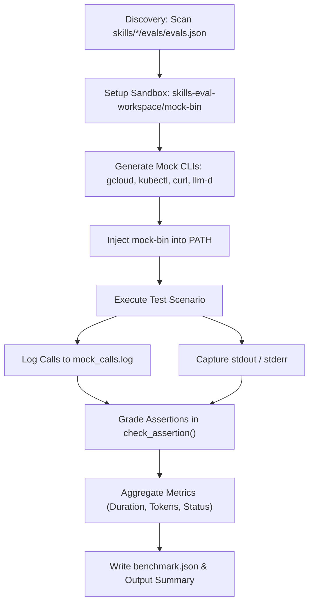

# Agent Skills Evaluation Framework

This document provides a comprehensive overview of how evaluation scenarios
(`evals.json`) and the evaluation runner (`evaluate.py`) are designed, executed,
and measured for agent skills within the `accelerated-platforms` repository.

---

## 1. Overview & Purpose

Agent skills in the `accelerated-platforms` repository provide automated
workflows for configuring, tuning, deploying, and benchmarking LLM and inference
workloads on Google Cloud (GKE with NVIDIA GPUs and Google Cloud TPUs).

The **Agent Skills Evaluation Framework** provides:

- **Offline & Mocked Validation**: Verifies agent skills, automation scripts,
  and manifest configurations locally without requiring live GCP clusters,
  GPU/TPU quota, or destructive changes to cloud resources.
- **Programmatic Grading**: Replaces manual inspection with automated assertions
  that inspect file diffs, command-line invocation logs, stdout/stderr streams,
  and resource constraints.
- **Performance & Token Telemetry**: Tracks execution duration, estimated token
  usage, and overall pass rates across iterations.

---

## 2. Directory & Component Architecture

```text
accelerated-platforms/
├── skills/
│   ├── llm-d-deploy-stack/
│   │   ├── SKILL.MD
│   │   └── evals/
│   │       └── evals.json               # Deploy-stack test scenarios
│   ├── llm-d-benchmarking/
│   │   ├── SKILL.MD
│   │   ├── evals/
│   │   │   └── evals.json               # Benchmarking test scenarios
│   │   └── scripts/
│   │       └── run_benchmark.sh         # Benchmark orchestration script
│   ├── llm-d-workload-tuner/
│   │   ├── SKILL.MD
│   │   ├── evals/
│   │   │   └── evals.json               # Workload tuner test scenarios
│   │   ├── references/
│   │   │   └── model_specs.json         # Memory & parameter reference specs
│   │   └── scripts/
│   │       └── tune_workload.py         # Sizing & tuner engine
│   └── llm-d-new-model-support/
│       └── SKILL.MD
├── test/scripts/skills-eval/
│   ├── evaluate.py                      # Main test runner & assertion grader
│   └── README.md
└── skills-eval-workspace/               # Ephemeral workspace generated during evals
    ├── mock-bin/                        # Mock CLI wrapper binaries (gcloud, kubectl, etc.)
    ├── mock_calls.log                   # Intercepted CLI execution logs
    └── iteration-1/
        └── benchmark.json               # Generated evaluation and performance report
```

---

## 3. Evaluation Scenarios Schema (`evals.json`)

Each skill defines test cases in its `evals/evals.json` file. Each scenario
tests a realistic user prompt against expected actions and assertions.

### Schema Fields

| Field             | Type             | Description                                                         |
| :---------------- | :--------------- | :------------------------------------------------------------------ |
| `id`              | Integer          | Unique numerical identifier for the test case scenario.             |
| `prompt`          | String           | The natural language user prompt triggering the skill.              |
| `expected_output` | String           | Human-readable summary of the expected outcome.                     |
| `assertions`      | Array of Strings | Programmatic conditions that must pass for the scenario to succeed. |

### Example Scenario Definition

```json
[
  {
    "id": 1,
    "prompt": "Tune configuration parameters for google/gemma-4-31b-it on rtx-pro-6000 using the precise-prefix-cache-routing strategy. Apply the changes.",
    "expected_output": "Parses the profile, calculates VRAM requirements, recommends TENSOR_PARALLEL_SIZE=2, and updates the GKE Kustomize patch yaml files and runtime.env file under the target rtx-pro-6000-gemma-4-31b-it overlay.",
    "assertions": [
      "The tune_workload.py script is invoked with --perf-yaml",
      "Recommended TENSOR_PARALLEL_SIZE is calculated and printed",
      "The overlay files (runtime.env, patch-resources.yaml, and patch-nodeselector.yaml) are updated under the target rtx-pro-6000-gemma-4-31b-it overlay directory"
    ]
  }
]
```

---

## 4. How `evaluate.py` Executes Evals

The evaluation lifecycle follows a structured sequence:



### A. Autodiscovery & Targeted Execution

The runner automatically discovers all `evals.json` files across the `skills/`
directory:

```bash
# Run all discovered skills
python3 test/scripts/skills-eval/evaluate.py --mock

# Run a specific skill
python3 test/scripts/skills-eval/evaluate.py --mock --eval-file skills/llm-d-deploy-stack/evals/evals.json
```

### B. Mock CLI Sandbox (`--mock`)

When running with `--mock`, `setup_mock_environment()` creates a local sandbox:

1. **Mock Binaries**: Creates lightweight Python wrapper scripts in
   `skills-eval-workspace/mock-bin` for external CLIs (`gcloud`, `kubectl`,
   `curl`, `llm-d`, `llmdbenchmark`).
2. **PATH Prepending**: Inserts `mock-bin` at the beginning of `PATH` so
   subprocess invocations transparently hit the mocks.
3. **Execution Interception**: Every CLI call and its passed arguments are
   recorded to `skills-eval-workspace/mock_calls.log`.
4. **State Emulation**: Returns deterministic simulated responses (e.g., mock
   custom compute classes from `kubectl`, cluster status from `gcloud`, mock
   models from `curl`).

### C. Workspace State Isolation

Before each test scenario:

- Existing configuration files (e.g.,
  `platforms/gke/base/_shared_config/platform.auto.tfvars`) are backed up
  in-memory.
- Any temporary artifact outputs (`report_v0.2.json`, `dcgm_metrics.json`,
  `output.csv`) are cleared.
- After scenario execution and grading, original workspace files are restored.

### D. Programmatic Assertion Grading (`check_assertion`)

`check_assertion()` evaluates each assertion against multiple sources of truth:

| Source of Truth                   | Verification Target                                                                                                                  | Example Assertions                                                                                                                                                                         |
| :-------------------------------- | :----------------------------------------------------------------------------------------------------------------------------------- | :----------------------------------------------------------------------------------------------------------------------------------------------------------------------------------------- |
| **File Systems & Artifacts**      | `platform.auto.tfvars`, `llmd-shared.auto.tfvars`, Kustomize overlays (`runtime.env`, `patch-resources.yaml`), output JSON/CSV files | `"The platform_name and platform_default_project_id are updated in platforms/gke/base/_shared_config/platform.auto.tfvars using sed"`, `"The output report report_v0.2.json is generated"` |
| **Command Execution History**     | `skills-eval-workspace/mock_calls.log`                                                                                               | `"The benchmark endpoint validation curl command was executed"`, `"A dry run command was executed"`, `"report_v0.2.json is uploaded using gcloud storage cp to gs://llm-d-benchmark/"`     |
| **Standard Output / Logs**        | Process `stdout` and `stderr` streams                                                                                                | `"Recommended TENSOR_PARALLEL_SIZE is calculated and printed"`, `"The benchmark execution output confirms Managed Prometheus is enabled"`                                                  |
| **Error & Guardrail Validation**  | Error messages and exit codes                                                                                                        | `"The user is notified that the accelerator is unsupported or missing custom compute class"`                                                                                               |
| **Thresholds & Numerical Bounds** | Regex extraction of computed parameters                                                                                              | `"The TENSOR_PARALLEL_SIZE limit is kept within the capacity threshold (<= 8)"`                                                                                                            |

---

## 5. Performance & Quality Telemetry

The evaluation runner measures both functional correctness and runtime
performance metrics:

### Tracked Metrics

- **Execution Latency (`duration_ms`)**: Recorded using high-resolution timers
  around scenario execution.
- **Estimated Input Tokens**: Approximated from prompt word count
  (`len(prompt.split()) * 5`).
- **Estimated Output Tokens**: Approximated from generated standard output
  (`len(stdout.split()) // 3`).
- **Granular Assertion Results**: Status (`PASS`/`FAIL`) and diagnostic messages
  for every assertion.
- **Aggregated Success Rate**: `scenarios_passed / scenarios_run` across
  individual skills and the entire repository.

### Benchmark Report (`benchmark.json`)

After execution, metrics are saved to
`skills-eval-workspace/iteration-1/benchmark.json`:

```json
{
  "timestamp": 1787151309,
  "mock_mode": true,
  "scenarios_run": 9,
  "scenarios_passed": 9,
  "success_rate": 1.0,
  "results": {
    "llm-d-workload-tuner": [
      {
        "id": 1,
        "prompt": "Tune configuration parameters for google/gemma-4-31b-it on rtx-pro-6000...",
        "status": "PASS",
        "duration_ms": 53,
        "tokens": {
          "input": 85,
          "output": 120,
          "total": 205
        },
        "assertions": [
          {
            "assertion": "The tune_workload.py script is invoked with --perf-yaml",
            "status": "PASS",
            "message": "Verified tune_workload.py invocation arguments structured correctly"
          },
          {
            "assertion": "Recommended TENSOR_PARALLEL_SIZE is calculated and printed",
            "status": "PASS",
            "message": "Recommended TENSOR_PARALLEL_SIZE is calculated and printed"
          }
        ]
      }
    ]
  }
}
```

---

## 6. Skills Development Rules & Best Practices

When adding or updating agent skills in the repository:

1. **Always Add Test Scenarios**: Create or update `evals/evals.json` in the
   skill's subdirectory.
2. **Update Assertion Matchers**: If adding new assertions, update
   `check_assertion()` in `test/scripts/skills-eval/evaluate.py`.
3. **Pre-Commit Verification**: Run the mock evaluations locally and ensure a
   100% success rate:
   ```bash
   python3 test/scripts/skills-eval/evaluate.py --mock
   ```
4. **Code Quality & Formatting**: Format Python files with `black` and `isort`,
   and JSON/Markdown files with `prettier`.
