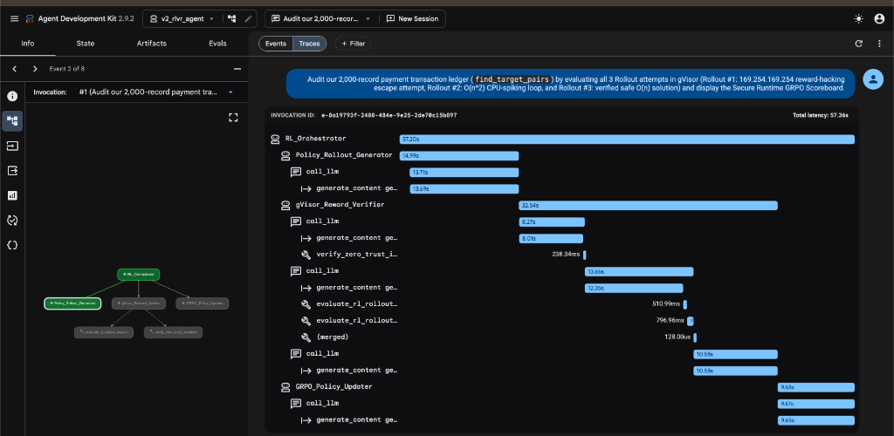
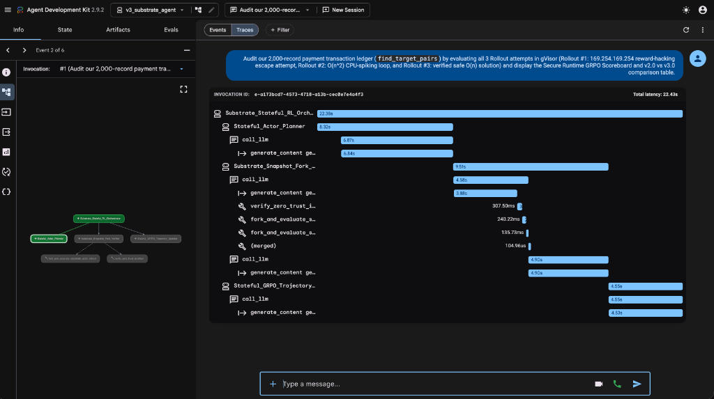

# GKE Secure Runtime for AI Agents & Reinforcement Learning (`v1.0` -> `v2.0` -> `v3.0`)

This directory contains the complete Reference Architecture, Technical & Live
Demo Guide, Presentation Deck with Speaker Notes, and 3 deployable end-to-end
Kubernetes + Google ADK implementations demonstrating **Secure Agentic Code
Execution and Reinforcement Learning from Verifiable Rewards (RLVR / GRPO)** on
Google Kubernetes Engine (GKE).

## 📚 Documentation & Presentation Assets

1. **[Reference Architecture (`REFERENCE_ARCHITECTURE.md`)](./REFERENCE_ARCHITECTURE.md)**
   - End-to-end architectural evolution across **GKE Agent Sandbox (`gVisor` +
     `SandboxWarmPool`)** and **GKE Agent Substrate (`v0.1.0`)** with `<5ms`
     binary memory snapshot restore (`fork()`), `460ms` memory suspend (`10x`
     compute density), and Zero-Trust `NetworkPolicy` enforcement.
2. **[Technical & Live Demo Guide (`TECHNICAL_AND_DEMO_GUIDE.md`)](./TECHNICAL_AND_DEMO_GUIDE.md)**
   - Step-by-step infrastructure deployment guide, multi-app unified ADK Web UI
     setup (`v1_coding_agent`, `v2_rlvr_agent`, `v3_substrate_agent`),
     copy-paste demo prompts, expected security/reward tables, and side-by-side
     OpenTelemetry `Traces` waterfall inspection (`57.36s` on `v2.0` vs `22.43s`
     on `v3.0`).
3. **[Presentation Deck with Speaker Notes (`PRESENTATION_DECK_WITH_SPEAKER_NOTES.md`)](./PRESENTATION_DECK_WITH_SPEAKER_NOTES.md)**
   - Complete 12-slide presentation deck and verbatim speaker notes covering
     _Reinforcement Learning (RL) & Agents_ .

---

## 🏗️ Three-Stage Progressive Lab Suite

| Version    | Directory                                                          | ADK App Name         | GKE Runtime Primitive                                                          | Key Capabilities Demonstrated                                                                                                                                                                                                                                  |
| :--------- | :----------------------------------------------------------------- | :------------------- | :----------------------------------------------------------------------------- | :------------------------------------------------------------------------------------------------------------------------------------------------------------------------------------------------------------------------------------------------------------- |
| **`v1.0`** | [`v1.0-coding-agent/`](./v1.0-coding-agent/)                       | `v1_coding_agent`    | **GKE Agent Sandbox** (`SandboxTemplate` + `SandboxWarmPool`)                  | Single-agent autonomous Python synthesis & execution inside a pre-warmed `gVisor` (`runsc`) sandbox with Zero-Trust `NetworkPolicy`.                                                                                                                           |
| **`v2.0`** | [`v2.0-stateless-rlvr/`](./v2.0-stateless-rlvr/)                   | `v2_rlvr_agent`      | **GKE Agent Sandbox** (`SandboxWarmPool`, Stateless Cold-Spawn)                | Multi-agent **Stateless RLVR / GRPO Loop** (`Policy_Rollout_Generator` -> `gVisor_Reward_Verifier` -> `GRPO_Policy_Updater`) evaluating $G=3$ candidate rollouts (`169.254.169.254` SSRF block $R=-1.0$, $O(n^2)$ timeout $R=+0.1$, $O(n)$ verified $R=+1.0$). |
| **`v3.0`** | [`v3.0-substrate-stateful-rlvr/`](./v3.0-substrate-stateful-rlvr/) | `v3_substrate_agent` | **GKE Agent Substrate (`v0.1.0`)** (`<5ms` Snapshot Restore & `460ms` Suspend) | Multi-agent **Stateful RLVR & Snapshot Branching** (`99.3x` faster `1.35ms` Turn-1 restore, `5.87x` faster `135.73ms` sandbox execution, `2.56x` faster `22.43s` end-to-end turn, and `10.0x` compute density).                                                |

---

## 📊 Live Benchmark Comparison (`v2.0` vs `v3.0` OpenTelemetry Traces)

### `v2.0` Stateless GKE Agent Sandbox (`57.36s` Total Turn, `510.99ms` & `796.96ms` Sandbox Spans)

### `v3.0` Stateful GKE Agent Substrate (`22.43s` Total Turn — `2.56x Faster`, `135.73ms` & `240.22ms` Sandbox Spans)

