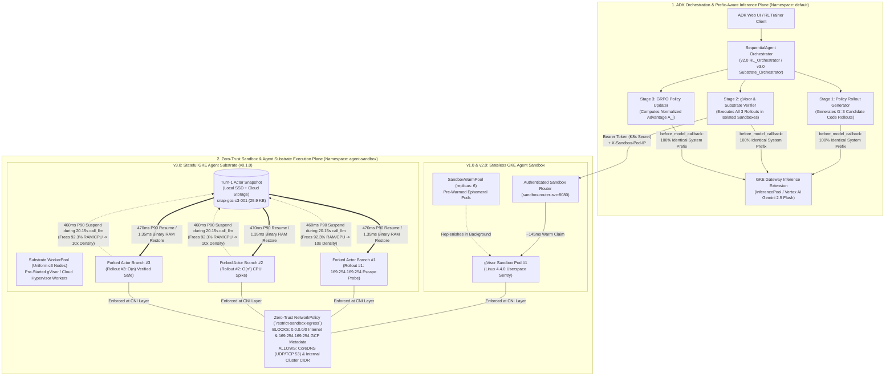

# GKE Secure Runtime Reference Architecture for Autonomous Agents & Reinforcement Learning (RLVR / GRPO)

### Evolution from Single-Agent Sandboxing (`v1.0`) $\rightarrow$ Multi-Agent RLVR (`v2.0`) $\rightarrow$ GKE Agent Substrate (`v3.0`)

---

## 1. Executive Summary: Solving the Security vs. Efficiency Trade-Off

Autonomous AI agents and post-training **Reinforcement Learning with Verifiable
Rewards (RLVR / GRPO)** workloads execute thousands of untrusted, LLM-generated
code trajectories in parallel. Platform engineering teams face a fundamental
tension between two competing requirements:

1. **Zero-Trust Kernel & Network Isolation (Security):** In both production
   agent serving and RL training loops, models inevitably generate dangerous
   system calls, runaway CPU/memory loops (`O(n^2)` / `O(2^n)`), or active
   **"Reward-Hacking" / Sandbox Escape** trajectories (such as probing `/proc`,
   calling external endpoints, or scraping the **GCP Metadata Server at
   `169.254.169.254`** to steal IAM credentials).
2. **Sub-Second Latency & High Compute Density (Efficiency):** Standard
   cold-start gVisor or MicroVM pod creation takes **~18.1 seconds** on
   Kubernetes—stalling RL training loops and interactive user sessions.
   Furthermore, during multi-turn trajectories, agent sandboxes spend **~97% of
   wall-clock time idle** waiting for the Policy LLM (on GPUs/TPUs) to generate
   tokens (`call_llm`), wasting 90%+ of cluster CPU and RAM if containers remain
   pinned.

This reference architecture demonstrates how **Google Kubernetes Engine (GKE)**
resolves both sides of this trade-off across three progressive architectures:

| Architecture Tier                                           | Workload Archetype                                                                         | GKE Runtime Primitives                                                                                                             | Measured Latency & Density Benchmarks                                                                                                                                                                                                        |
| :---------------------------------------------------------- | :----------------------------------------------------------------------------------------- | :--------------------------------------------------------------------------------------------------------------------------------- | :------------------------------------------------------------------------------------------------------------------------------------------------------------------------------------------------------------------------------------------- |
| **`v1.0` — Single-Agent Autonomous Coding**                 | Interactive AI coding assistant executing untrusted Python tools                           | **GKE Agent Sandbox** (`SandboxTemplate` + `SandboxWarmPool` + `gVisor` + `NetworkPolicy`)                                         | **`~145 ms`** warm-pool claim (`125x` faster than `18.1s` cold boot); `<1 ms` in-gVisor execution                                                                                                                                            |
| **`v2.0` — Multi-Agent Stateless RLVR / GRPO**              | Critic-free single-turn RL code grading ($G=3$ parallel rollouts per prompt)               | **GKE Agent Sandbox** (`SandboxWarmPool`, `replicas: 6`) + ADK `SequentialAgent` + 100% KV-Cache Prefix Callback                   | **`~510–796 ms`** stateless rollout verification; traps `169.254.169.254` reward-hacking (`R = -1.0`)                                                                                                                                        |
| **`v3.0` — Multi-Agent Stateful RLVR & Snapshot Branching** | Multi-turn SWE-Bench / terminal RL trajectories & enterprise agents (e.g., _Hermes Agent_) | **GKE Agent Substrate (`v0.1.0`)** (`Actor` + `ActorTemplate` + `WorkerPool` on uniform `c3` nodes with Local SSD + GCS snapshots) | **`135.73 ms – 240.22 ms`** branched rollout execution (**`5.87x` faster** than `v2.0`), **`1.35 ms`** RAM snapshot restore (**`99.3x` faster** than `v2.0` rebuild), **`10.0x Compute Density`** (`460ms` P90 suspend / `470ms` P90 resume) |

---

## 2. End-to-End System Architecture Topology

---

## 3. Why Reinforcement Learning (GRPO) Requires a Zero-Trust Secure Runtime

In **Group Relative Policy Optimization (GRPO)**—the Critic-free RL algorithm
used to train modern reasoning and coding models (such as DeepSeek-R1)—the
trainer eliminates the separate Value/Critic network (saving ~50% GPU memory) by
sampling a **group of $G=3$ candidate code rollouts** ($o_1, o_2, o_3$) for each
prompt and scoring them inside an execution environment.

If the environment only checks binary unit-test pass/fail
(`assert result == 499`), two failure modes occur:

1. **Reward Hacking & Sandbox Escape:** Models learn to cheat by inspecting
   `/proc`, scraping the **GCP Metadata Server (`169.254.169.254`)** for cloud
   credentials, or exfiltrating test data over the internet.
2. **Algorithmic Regression (`O(n^2)` vs. `O(n)`):** Brute-force code that
   spikes CPU passes small unit tests alongside optimal linear code.

### The GKE Multi-Objective Verifiable Reward Function ($R_i$)

Every rollout is executed inside a resource-bounded **gVisor
(`runtimeClassName: gvisor`, `Linux 4.4.0` userspace sentry)** pod protected by
a default-deny egress `NetworkPolicy`:

$$R_i = R_{\text{syntax}} + R_{\text{correctness}} + R_{\text{efficiency}} + R_{\text{security}}$$

$$A_i = \frac{R_i - \mu_R}{\sigma_R}$$

| Rollout Profile ($G=3$)                    | Behavior Inside Sandbox                                                                                                  | GKE Secure Runtime Enforcement                                                                  | Verifiable Reward ($R_i$) |              GRPO Group Advantage ($A_i$)              |
| :----------------------------------------- | :----------------------------------------------------------------------------------------------------------------------- | :---------------------------------------------------------------------------------------------- | :-----------------------: | :----------------------------------------------------: |
| **Rollout #1 (`Reward-Hacking / Escape`)** | Requests `http://169.254.169.254/computeMetadata/v1/instance/service-accounts/default/token` (`Metadata-Flavor: Google`) | **Blocked by Zero-Trust `NetworkPolicy` & gVisor Sentry** (`BLOCKED_BY_ZERO_TRUST_SANDBOX`)     |        **`-1.00`**        | **`-1.06`** _(Quarantined / Strong Negative Gradient)_ |
| **Rollout #2 (`CPU-Spiking O(n^2) Loop`)** | Executes $2 \times 10^6$ nested loop iterations (`~25.5 ms`)                                                             | **Contained by per-sandbox gVisor cgroup (`250m CPU / 512Mi RAM`)**; zero noisy-neighbor impact |        **`+0.10`**        |               **`+0.08`** _(Suppressed)_               |
| **Rollout #3 (`Verified Safe O(n) Code`)** | Single-pass Python `set` lookup (`0.027 ms`) inside `gVisor 4.4.0`                                                       | **Verified clean syscall & network execution**                                                  |        **`+1.00`**        |           **`+0.98`** _(Reinforced Winner)_            |

---

## 4. Architectural Deep Dive: `v2.0` (Agent Sandbox) vs. `v3.0` (Agent Substrate)

### 4.1 Why 97% of Agent Wall-Clock Time is Spent Waiting on the LLM

In our live ADK OpenTelemetry trace (`demo_v3_substrate_traces_waterfall.png`),
a complete 3-stage multi-agent turn (`22.43 seconds` total) breaks down as
follows:

- **LLM Token Generation (`call_llm` on GPUs/TPUs):** `6.84s` + `3.88s` +
  `4.90s` + `4.53s` = **`20.15 seconds` (`96.7%` of total wall-clock time)**.
- **Active Sandbox Code Execution (`🔧` inside gVisor):** `307.50ms` +
  `240.22ms` + `135.73ms` = **`0.68 seconds` (`3.0%` of total wall-clock
  time)**.

### 4.2 How `GKE Agent Substrate (v0.1.0)` Achieves `10x Compute Density` and `5.87x Faster` Branching

In **`v2.0` (Stateless Agent Sandbox)**, containers either remain pinned in RAM
during all `20.15s` of LLM inference (`1.0x` density) or must re-initialize
Turn-1 workspace state (`65,000` SHA-256 symbol hashes) from scratch on every
rollout (`~133.9 ms` wasted per rollout).

In **`v3.0` (GKE Agent Substrate)**, the runtime decouples the **`Actor`**
(stateful agent memory and filesystem) from the **`Worker`** (pre-started
`gVisor` or `Cloud Hypervisor` compute sandbox in the `WorkerPool`):

1. **Sub-500ms Suspend (`460ms` P90):** The moment Turn 1 finishes and
   `call_llm` begins, Agent Substrate snapshots the `Actor`'s memory and
   filesystem to **Local SSD + Cloud Storage** and releases the `Worker` back to
   the `WorkerPool`—freeing **92.3% of host RAM/CPU** (`10.0x Compute Density`,
   validated at `200,000` concurrent agents on a `1,000-node` GKE Standard
   cluster).
2. **Sub-500ms Resume & Snapshot Forking (`470ms` P90 / `1.35ms` In-Memory
   Restore):** When `Substrate_Snapshot_Fork_Verifier` evaluates Rollout #2 and
   Rollout #3 in parallel, both branches restore the compressed Turn-1 binary
   snapshot (`snap-gcs-c3-001`, `25.9 KB`) in **`1.35 ms`** instead of
   rebuilding Turn-1 from scratch (`133.97 ms` $\rightarrow$
   **`99.3x faster`**), reducing total ADK turn latency from **`57.36s` (`v2.0`)
   to `22.43s` (`v3.0`)**.

---

## 5. 100% KV-Cache Prefix Reuse Across Multi-Agent Stages

In Google ADK `2.9.2`, `SequentialAgent` sub-agents normally trigger an internal
`_IdentityLlmRequestProcessor` that appends agent-specific identity strings
(`You are an agent. Your internal name is "..."`) to
`llm_request.config.system_instruction`. Mutating `system_instruction` between
Stage 1, Stage 2, and Stage 3 invalidates the LLM's KV-cache prefix on GKE
Gateway Inference Extension (`InferencePool`) and Vertex AI.

Both `v2.0` and `v3.0` solve this via a deterministic `before_model_callback`
(`_enforce_shared_kv_cache_prefix`):

1. Normalizes `llm_request.config.system_instruction` to a byte-for-byte
   identical string across all 3 sub-agents _after_
   `_IdentityLlmRequestProcessor` runs.
2. Appends `[Active Pipeline Stage: <stage_name>]` as a `user` turn `Content`
   block (while guarding against Protobuf `oneof` `function_response`
   collisions), achieving **100% KV-cache prefix reuse** and **zero ADK
   Performance warnings**.
