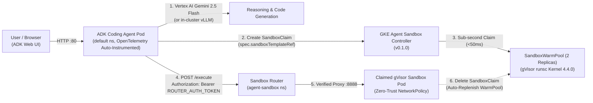
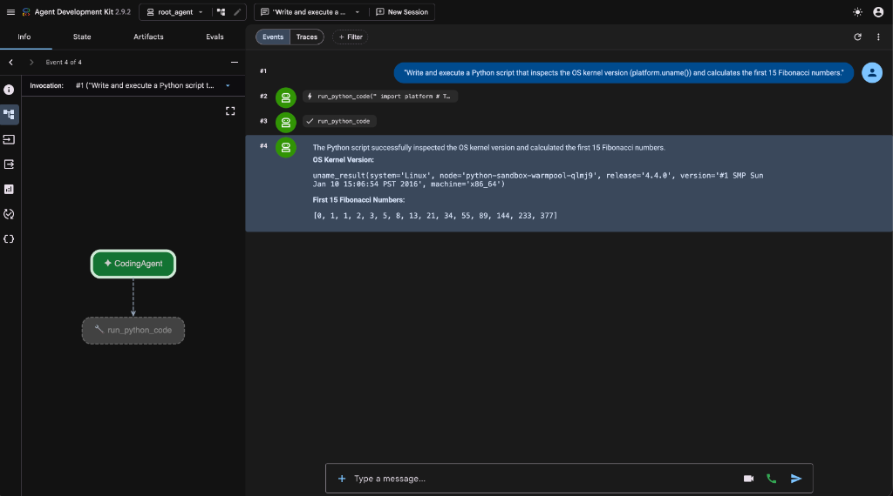
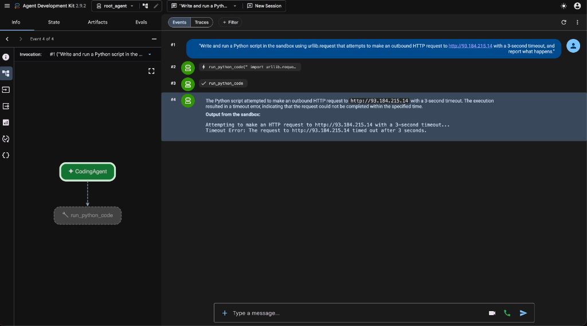

# Autonomous Coding Agent on GKE with `gVisor` Agent Sandbox & Cloud Observability

This tutorial and demo guide walks through building and deploying an
**Autonomous Coding Agent** on **Google Kubernetes Engine (GKE)** using:

1. **Google Agent Development Kit (ADK)** (`google-adk`) powered by **Gemini 2.5
   Flash** on Vertex AI (or in-cluster vLLM / Gemma).
2. **GKE Agent Sandbox (`kubernetes-sigs/agent-sandbox`)** with a pre-warmed
   **`gVisor` (`runsc`) `SandboxWarmPool`** for sub-second (`<50ms`),
   kernel-isolated execution of untrusted LLM-generated code.
3. **Zero-Trust Kubernetes `NetworkPolicy` & Authenticated `sandbox-router`**
   (`ROUTER_AUTH_TOKEN` via Kubernetes `Secret`) to prevent data exfiltration
   and unauthorized command execution.
4. **Zero-Code GKE Agent Observability** via GKE Managed OpenTelemetry
   auto-instrumentation
   (`instrumentation.opentelemetry.io/inject-python: "true"`).

---

## Architecture Overview



---

## Quickstart (Automated One-Command Deployment)

```bash
export PROJECT_ID="your-gcp-project-id"
export REGION="us-central1"
export ZONE="us-central1-a"

./deploy.sh
```

When complete, retrieve the ADK Web UI address:

```bash
export AGENT_IP=$(kubectl get svc code-agent-service -n default -o jsonpath='{.status.loadBalancer.ingress[0].ip}')
echo "Open the ADK Web UI at: http://${AGENT_IP}/dev-ui/?app=root_agent"
```

---

## 5-Minute Live Demo Script

### Act 1: Sub-Second Ephemeral `gVisor` Execution & WarmPool Replenishment

1. Open a terminal watching the `agent-sandbox` namespace:
   ```bash
   kubectl get pods -n agent-sandbox -w
   ```
   Observe the two pre-warmed `gVisor` pods (`python-sandbox-warmpool-*`)
   standing by so the agent never pays container cold-start latency during
   multi-turn code generation or RL rollouts.
2. Open the **ADK Web UI** (`http://${AGENT_IP}/dev-ui/?app=root_agent`) and
   submit:
   > **Prompt 1:** _"Write and execute a Python script that inspects the OS
   > kernel version (`platform.uname()`), calculates the first 15 Fibonacci
   > numbers, and verifies whether it is running inside a gVisor user-space
   > kernel."_
3. **What to highlight:**
   - The agent invokes `run_python_code`.
   - The response shows `release='4.4.0'` (the signature of Google's **gVisor**
     `runsc` user-space kernel intercepting system calls) and
     `node='python-sandbox-warmpool-...'` (the claimed WarmPool pod).
   - In the terminal running `kubectl get pods -n agent-sandbox -w`, the claimed
     pod is destroyed immediately upon completion (`finally:` block) and
     replaced by a brand-new `python-sandbox-warmpool-*` pod (`AGE: 1s`).



### Act 2: Zero-Trust Network Isolation (`NetworkPolicy` + `gVisor`)

1. Submit a second prompt simulating untrusted or hallucinated agent code
   attempting an outbound internet connection:
   > **Prompt 2:** _"Write and run a Python script in the sandbox using
   > `urllib.request` that attempts to make an outbound HTTP request to
   > `http://93.184.215.14` with a 3-second timeout, and report what happens."_
2. **What to highlight:**
   - The execution inside the `gVisor` sandbox times out
     (`Timeout Error: The request to http://93.184.215.14 timed out after 3 seconds.`)
     because the `restrict-sandbox-egress` Kubernetes `NetworkPolicy` drops all
     unauthorized outbound internet and cluster traffic from `agent-sandbox`
     pods.



### Act 3: Zero-Code GKE Agent Observability (Cloud Trace & GenAI Telemetry)

1. Open **Google Cloud Console -> Kubernetes Engine -> AI/ML -> Agent
   Observability**
   (`https://console.cloud.google.com/kubernetes/aiml/observability/agents?project=${PROJECT_ID}`).
2. Highlight that via a single pod annotation
   (`instrumentation.opentelemetry.io/inject-python: "true"`), GKE's Managed
   OpenTelemetry collector automatically captures distributed traces across ADK
   reasoning turns, `run_python_code` tool calls, and token latency.

---

## Step-by-Step Manual Walkthrough

### Step 1: Set Environment Variables & Enable APIs

```bash
export PROJECT_ID="your-gcp-project-id"
export PROJECT_NUMBER=$(gcloud projects describe "$PROJECT_ID" --format="value(projectNumber)")
export REGION="us-central1"
export ZONE="us-central1-a"
export CLUSTER_NAME="ai-agent-cluster"
export NETWORK_NAME="ai-agent-network"
export SUBNET_NAME="ai-agent-subnet"
export PROXY_SUBNET_NAME="proxy-only-subnet"

gcloud config set project "$PROJECT_ID"

gcloud services enable \
  container.googleapis.com \
  compute.googleapis.com \
  artifactregistry.googleapis.com \
  cloudbuild.googleapis.com \
  aiplatform.googleapis.com \
  logging.googleapis.com \
  monitoring.googleapis.com \
  cloudtrace.googleapis.com \
  telemetry.googleapis.com
```

### Step 2: Create Custom VPC, Subnets & Artifact Registry

```bash
gcloud compute networks create "$NETWORK_NAME" --subnet-mode=custom

gcloud compute networks subnets create "$SUBNET_NAME" \
  --network="$NETWORK_NAME" \
  --region="$REGION" \
  --range=10.0.0.0/20

gcloud compute networks subnets create "$PROXY_SUBNET_NAME" \
  --network="$NETWORK_NAME" \
  --region="$REGION" \
  --purpose=REGIONAL_MANAGED_PROXY \
  --role=ACTIVE \
  --range=192.168.10.0/24

gcloud artifacts repositories create agent-repo \
  --repository-format=docker \
  --location="$REGION" \
  --description="Docker repository for ADK Coding Agent"
```

### Step 3: Create the GKE Cluster with Workload Identity & Managed OpenTelemetry

```bash
gcloud beta container clusters create "$CLUSTER_NAME" \
  --zone="$ZONE" \
  --network="$NETWORK_NAME" \
  --subnetwork="$SUBNET_NAME" \
  --release-channel=rapid \
  --machine-type=e2-standard-4 \
  --num-nodes=3 \
  --workload-pool="${PROJECT_ID}.svc.id.goog" \
  --managed-opentelemetry-scope=COLLECTION_AND_INSTRUMENTATION_COMPONENTS \
  --monitoring=SYSTEM,WORKLOAD \
  --logging=SYSTEM,WORKLOAD

gcloud container node-pools create sandbox-pool \
  --cluster="$CLUSTER_NAME" \
  --zone="$ZONE" \
  --machine-type=e2-standard-4 \
  --num-nodes=2 \
  --sandbox type=gvisor
```

### Step 4: Install the GKE Agent Sandbox Controller (`v0.1.0`) & OpenTelemetry Operator

```bash
export VERSION="v0.1.0"
kubectl apply -f "https://github.com/kubernetes-sigs/agent-sandbox/releases/download/${VERSION}/manifest.yaml"
kubectl apply -f "https://github.com/kubernetes-sigs/agent-sandbox/releases/download/${VERSION}/extensions.yaml"

kubectl apply -f https://github.com/cert-manager/cert-manager/releases/download/v1.16.2/cert-manager.yaml
kubectl wait --for=condition=Available deployment --all -n cert-manager --timeout=180s

kubectl apply -f https://github.com/open-telemetry/opentelemetry-operator/releases/latest/download/opentelemetry-operator.yaml
kubectl wait --for=condition=Available deployment/opentelemetry-operator-controller-manager -n opentelemetry-operator-system --timeout=180s
```

### Step 5: Configure `ROUTER_AUTH_TOKEN` Secret, `SandboxWarmPool`, `NetworkPolicy`, and `sandbox-router`

```bash
kubectl create namespace agent-sandbox --dry-run=client -o yaml | kubectl apply -f -

TOKEN=$(python3 -c 'import secrets; print(secrets.token_urlsafe(32))')
kubectl create secret generic sandbox-router-secret -n agent-sandbox \
  --from-literal=ROUTER_AUTH_TOKEN="$TOKEN" --dry-run=client -o yaml | kubectl apply -f -
kubectl create secret generic sandbox-router-secret -n default \
  --from-literal=ROUTER_AUTH_TOKEN="$TOKEN" --dry-run=client -o yaml | kubectl apply -f -

kubectl apply -f sandbox-template-and-pool.yaml
kubectl apply -f sandbox-policy.yaml
kubectl apply -f sandbox-router.yaml
```

### Step 6: Build Image, Configure Workload Identity IAM & Deploy the ADK Coding Agent

```bash
gcloud builds submit --tag "${REGION}-docker.pkg.dev/${PROJECT_ID}/agent-repo/code-agent:v1" .

MEMBER="principal://iam.googleapis.com/projects/${PROJECT_NUMBER}/locations/global/workloadIdentityPools/${PROJECT_ID}.svc.id.goog/subject/ns/default/sa/adk-agent-sa"

for ROLE in roles/logging.logWriter roles/cloudtrace.agent roles/aiplatform.user; do
  gcloud projects add-iam-policy-binding "$PROJECT_ID" \
    --member="$MEMBER" \
    --role="$ROLE" \
    --condition=None
done

kubectl apply -f otel-instrumentation.yaml
kubectl create configmap code-agent-source -n default --from-file=agent.py=root_agent/agent.py --dry-run=client -o yaml | kubectl apply -f -
envsubst '${PROJECT_ID} ${REGION}' < agent-deployment.yaml | kubectl apply -f -
kubectl rollout status deployment/code-agent -n default
```

---

## Teardown & Cleanup

To delete all resources created by this tutorial, run `./cleanup.sh` (or execute
the commands below):

```bash
export PROJECT_ID="your-gcp-project-id"
./cleanup.sh
```
