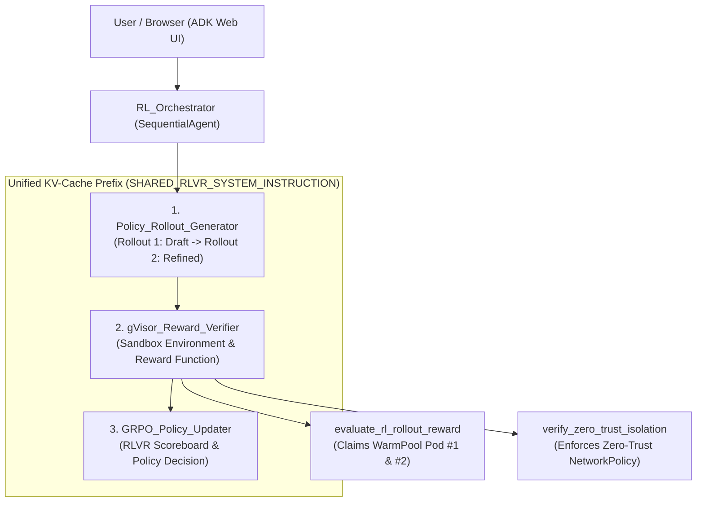
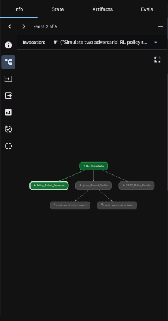
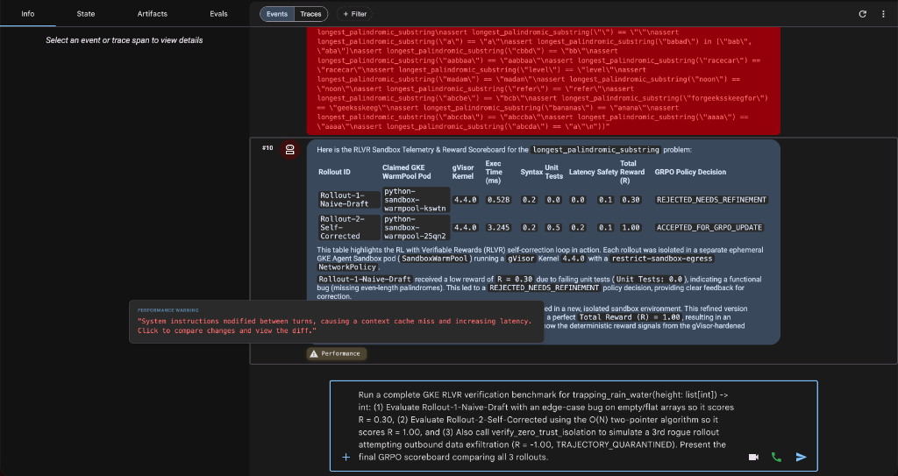

# v2.0: Multi-Agent RL Rollout & `gVisor` Verifiable Reward Loop on GKE

This `v2.0` tutorial and demo package implements a **Multi-Agent Reinforcement
Learning with Verifiable Rewards (RLVR) Orchestrator** on **Google Kubernetes
Engine (GKE)**:

1. **`RL_Orchestrator` (`SequentialAgent` Root Pipeline):** Coordinates
   candidate code trajectory generation, isolated execution, and reward
   verification across three sequential sub-agents sharing a unified system
   prompt (`SHARED_RLVR_SYSTEM_INSTRUCTION`) for 100% KV-cache prefix reuse:
   - **Stage 1 (`Policy_Rollout_Generator`):** Generates two candidate Python
     trajectories (`Rollout-1-Naive-Draft` with a deliberate edge-case flaw, and
     `Rollout-2-Self-Corrected` with the optimal fix) plus a deterministic
     `assert` unit test suite (`Unit_Test_Suite`).
   - **Stage 2 (`gVisor_Reward_Verifier`):** Claims a separate pre-warmed
     **`gVisor` (`runsc` Kernel `4.4.0`)** pod from the `SandboxWarmPool`
     (`<500ms`) for each rollout, executes the candidate code + unit tests in
     isolation, and computes a **Verifiable Reward Score $R \in [0.0, 1.0]$**:
     - **Syntax & Compilation ($r_{\text{syntax}} = +0.20$)**
     - **Unit Test Assertions Passed ($r_{\text{tests}} = +0.50$)**
     - **Runtime Efficiency $<10\text{ms}$ ($r_{\text{latency}} = +0.20$)**
     - **`gVisor` Kernel Isolation Verified ($r_{\text{safety}} = +0.10$)**
     - Returns `policy_decision`: `REJECTED_NEEDS_REFINEMENT` ($R < 0.95$) or
       `ACCEPTED_FOR_GRPO_UPDATE` ($R \ge 0.95$).
   - **Stage 3 (`GRPO_Policy_Updater`):** Computes relative GRPO group advantage
     across the rollouts and renders the comparative **RLVR Sandbox Telemetry &
     Reward Scoreboard**.
2. **`verify_zero_trust_isolation` (Zero-Trust Security Penalty):** Simulates a
   rogue rollout attempting outbound network exfiltration
   (`http://93.184.215.14`), proving `restrict-sandbox-egress` `NetworkPolicy`
   containment and assigning a `-1.0` RL security penalty
   (`TRAJECTORY_QUARANTINED`).

---

## Multi-Agent RLVR Architecture



---

## Live Demo Prompts & Verified UI Outputs

### Prompt 1: 2-Rollout RL Self-Correction Loop ($R = 0.30 \rightarrow R = 1.00$)

> _"Demonstrate an RL with Verifiable Rewards (RLVR) self-correction loop for
> solving the `longest_palindromic_substring(s: str)` problem. Run Rollout 1
> (`Rollout-1-Naive-Draft`) with a deliberate edge-case bug so it gets rejected
> by the gVisor reward verifier, then use the environment feedback to run
> Rollout 2 (`Rollout-2-Self-Corrected`) in a second gVisor WarmPool pod to
> achieve a full reward of R = 1.00. Show a comparison table of both rollouts."_

**What the audience sees in the ADK Web UI:**

- **Rollout 1** claims `python-sandbox-warmpool-kswtn` (`gVisor` Kernel
  `4.4.0`), executes in `0.528 ms`, fails the unit test assertion, scores
  **`R = 0.30` (`REJECTED_NEEDS_REFINEMENT`)**, and recycles the pod.
- **Rollout 2** claims a fresh WarmPool pod `python-sandbox-warmpool-25qn2`
  (`gVisor` Kernel `4.4.0`), executes in `3.245 ms`, passes all unit test
  assertions, and scores **`R = 1.00` (`ACCEPTED_FOR_GRPO_UPDATE`)**!





### Prompt 2: 3-Trajectory RL Benchmark + Rogue Rollout Quarantine ($R = -1.00$)

> _"Run a complete GKE RLVR verification benchmark for
> `trapping_rain_water(height: list[int]) -> int`: (1) Evaluate
> `Rollout-1-Naive-Draft` with an edge-case bug on empty/flat arrays so it
> scores R = 0.30, (2) Evaluate `Rollout-2-Self-Corrected` using the O(N)
> two-pointer algorithm so it scores R = 1.00, and (3) Also call
> `verify_zero_trust_isolation` to simulate a 3rd rogue rollout attempting
> outbound data exfiltration (`R = -1.00`, `TRAJECTORY_QUARANTINED`). Present
> the final GRPO scoreboard comparing all 3 rollouts."_


---

## Curated Prompt Library for `v2.0` (Multi-Agent RL Rollout & Reward Verifier)

| #     | RLVR Demo Scenario                                                          | Ready-to-Paste Prompt (`v2.0`)                                                                                                                                                                                                                                                                                                                                                                                                                                                                                                    | What It Demonstrates                                                                                                                                              |
| :---- | :-------------------------------------------------------------------------- | :-------------------------------------------------------------------------------------------------------------------------------------------------------------------------------------------------------------------------------------------------------------------------------------------------------------------------------------------------------------------------------------------------------------------------------------------------------------------------------------------------------------------------------- | :---------------------------------------------------------------------------------------------------------------------------------------------------------------- |
| **1** | **Full 3-Trajectory RL Benchmark + Security Quarantine (All Tools Active)** | `"Run a complete GKE RLVR verification benchmark for trapping_rain_water(height: list[int]) -> int: (1) Evaluate Rollout-1-Naive-Draft with an edge-case bug on empty/flat arrays so it scores R = 0.30, (2) Evaluate Rollout-2-Self-Corrected using the O(N) two-pointer algorithm so it scores R = 1.00, and (3) Also call verify_zero_trust_isolation to simulate a 3rd rogue rollout attempting outbound data exfiltration (R = -1.00, TRAJECTORY_QUARANTINED). Present the final GRPO scoreboard comparing all 3 rollouts."` | Lights up **all 3 sub-agents** AND **both sandbox tools** (`evaluate_rl_rollout_reward` + `verify_zero_trust_isolation`) in a single turn.                        |
| **2** | **2-Rollout Self-Correction Loop ($R = 0.30 \rightarrow R = 1.00$)**        | `"Demonstrate an RL with Verifiable Rewards (RLVR) self-correction loop for solving the longest_palindromic_substring(s: str) problem. Run Rollout 1 (Rollout-1-Naive-Draft) with a deliberate edge-case bug so it gets rejected by the gVisor reward verifier, then use the environment feedback to run Rollout 2 (Rollout-2-Self-Corrected) in a second gVisor WarmPool pod to achieve a full reward of R = 1.00. Show a comparison table of both rollouts."`                                                                   | Shows two distinct `SandboxWarmPool` pods (`python-sandbox-warmpool-*`) claimed and recycled back-to-back as the reward increases from `0.30` to `1.00`.          |
| **3** | **Distributed Systems Engineering: Token Bucket Rate Limiter**              | `"Demonstrate an RLVR verification loop to implement a Python TokenBucketRateLimiter(capacity, refill_rate) class. First evaluate Rollout-1-Naive-Draft with a burst-overflow bug that fails unit test assertions (R = 0.30), then evaluate Rollout-2-Self-Corrected that caps tokens at capacity and passes all assertions in <10ms inside the gVisor WarmPool sandbox (R = 1.00). Show the final GRPO comparison table."`                                                                                                       | Tailored for a 200–300 level Cloud/Infra engineering audience (verifying production systems code rather than toy puzzles).                                        |
| **4** | **LRU Cache with O(1) Latency Verification**                                | `"Run an RLVR rollout comparison for implementing an O(1) LRUCache(capacity: int) class in Python using collections.OrderedDict. Evaluate Rollout-1-Naive-Draft that forgets to refresh key recency on get() (scoring R = 0.30), followed by Rollout-2-Self-Corrected that passes all eviction assertions in <5ms (scoring R = 1.00). Present the GRPO scoreboard."`                                                                                                                                                              | Demonstrates how `gVisor_Reward_Verifier` combines functional correctness (`+0.50`) and sub-10ms execution latency (`+0.20`) into a composite RL reward.          |
| **5** | **Rogue Rollout Exfiltration & Metadata Server Audit**                      | `"Simulate two adversarial RL policy rollouts using verify_zero_trust_isolation: first probing external internet exfiltration (http://93.184.215.14) and second probing the GCP instance metadata server (http://169.254.169.254/computeMetadata/v1/). Report the sandbox enforcement status and RL security reward penalties."`                                                                                                                                                                                                  | Proves that even if an RL exploration policy generates malicious network syscalls, `gVisor` + `restrict-sandbox-egress` quarantines the trajectory (`R = -1.00`). |

---

## Quickstart & Automated Deployment (`deploy.sh` / `cleanup.sh`)

```bash
export PROJECT_ID="your-gcp-project-id"
export REGION="us-central1"
export ZONE="us-central1-a"

# 1. Deploy full GKE cluster + gVisor WarmPool + v2.0 Multi-Agent RL Orchestrator:
./deploy.sh

# 2. Or hot-reload v2.0 onto an already-running v1.0 cluster in <30 seconds:
kubectl create configmap code-agent-source -n default --from-file=agent.py=root_agent/agent.py --dry-run=client -o yaml | kubectl apply -f -
kubectl rollout restart deployment/code-agent -n default
kubectl rollout status deployment/code-agent -n default

# 3. Tear down all GCP resources when finished:
./cleanup.sh
```
