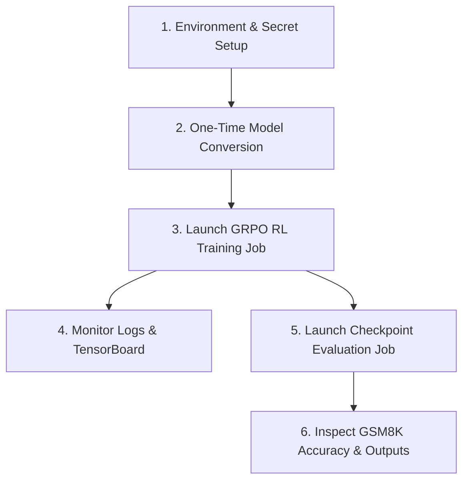

# Cloud TPU v6e MaxText GRPO RL Training & Evaluation User Guide

This guide provides step-by-step instructions for running Group Relative Policy Optimization (GRPO) Reinforcement Learning (RL) training, monitoring live metrics, and executing checkpoint evaluations on GKE using 8x Cloud TPU v6e slices.

______________________________________________________________________

## Quick Reference Workflow



______________________________________________________________________

## 1. Prerequisites & Environment Setup

### 1.1 Set Environment Variables

```bash
export PROJECT_ID="accelerated-platforms-dev"
export REGION="us-east5"
export CLUSTER_NAME="rl-kr-single"
export NAMESPACE="rl-kr-single-grpo-single-host"
export GCS_BUCKET="gs://accelerated-platforms-dev-rl-kr-single-hf-hub-models"

# Configure kubectl context
gcloud container clusters get-credentials ${CLUSTER_NAME} --location=${REGION} --project=${PROJECT_ID}
```

### 1.2 Create Namespace & Hugging Face Secret

```bash
kubectl create namespace ${NAMESPACE} --dry-run=client -o yaml | kubectl apply -f -

kubectl create secret generic hf-secret \
  --from-literal=token=${HF_TOKEN} \
  -n ${NAMESPACE} \
  --dry-run=client -o yaml | kubectl apply -f -
```

______________________________________________________________________

## 2. Step 1: One-Time HuggingFace Model Conversion

Before starting RL training, convert the base HuggingFace weights (`meta-llama/Llama-3.1-8B-Instruct`) into MaxText Orbax format:

```bash
kubectl apply -f platforms/gke/base/use-cases/reinforcement-learning/kubernetes-manifests/rl-tpu-maxtext-grpo-single-host/model-conversion-job.yaml
```

### Monitor Model Conversion:

```bash
kubectl logs -f -l job-name=hf-to-maxtext-converter -n ${NAMESPACE}
```

*Outputs will be saved to `${GCS_BUCKET}/llama_checkpoint_converted/0/items`.*

______________________________________________________________________

## 3. Step 2: Launch GRPO RL Training Job

Deploy the 150-step GRPO RL training job onto an 8-chip Cloud TPU v6e slice (`v6e-2x4`):

```bash
kubectl apply -k platforms/gke/base/use-cases/reinforcement-learning/kubernetes-manifests/rl-tpu-maxtext-grpo-single-host/v6e-2x4-llama-3-1-8b-instruct/
```

______________________________________________________________________

## 4. Step 3: Monitor Training Logs & Telemetry

### 4.1 View Live Pod Logs

```bash
kubectl logs -f -l app=maxtext-grpo -n ${NAMESPACE}
```

### 4.2 Check Saved Checkpoints in GCS

```bash
gcloud storage ls ${GCS_BUCKET}/llama_checkpoint_converted/v6e-*/checkpoints/actor/
```

### 4.3 Launch TensorBoard Dashboard

```bash
tensorboard --logdir=${GCS_BUCKET}/llama_checkpoint_converted/v6e-*/tensorboard
```

______________________________________________________________________

## 5. Step 4: Launch Dedicated Checkpoint Evaluation Job

To evaluate a specific checkpoint (e.g. Checkpoint 50) without interrupting training, deploy the dedicated evaluation job onto a second TPU slice:

```bash
# 1. Apply updated eval script ConfigMap
kubectl create configmap eval-script-ckpt50 \
  --from-file=eval.py=container-images/tpu/rl-tpu-maxtext-grpo-single-host/src/eval.py \
  -n ${NAMESPACE} --dry-run=client -o yaml | kubectl apply -f -

# 2. Launch Evaluation Job
kubectl apply -f platforms/gke/base/use-cases/reinforcement-learning/kubernetes-manifests/rl-tpu-maxtext-grpo-single-host/eval-job-ckpt50.yaml
```

______________________________________________________________________

## 6. Step 5: Inspect Evaluation Results & Reasoning Outputs

### 6.1 Monitor Evaluation Logs

```bash
kubectl logs -f -l app=grpo-eval-ckpt50 -n ${NAMESPACE}
```

### 6.2 View Extracted Prompt Completions & Scores

```bash
gcloud storage cat ${GCS_BUCKET}/llama_checkpoint_converted/eval_results_50/eval-ckpt-50/debug_rl_logs/*.txt | head -n 40
```

### 6.3 Compute Average Reward Score Across Test Dataset

```bash
gcloud storage cat ${GCS_BUCKET}/llama_checkpoint_converted/eval_results_50/eval-ckpt-50/debug_rl_logs/*.txt \
  | grep "Reward Score:" \
  | awk '{sum+=$3; count++} END {print "Total Evaluated Prompts: " count "\nAverage Reward Accuracy: " sum/count*100 "%"}'
```

______________________________________________________________________

## 7. Key Architecture Rules & Troubleshooting

1. **Ephemeral Storage Limits:** Always maintain `requests.ephemeral-storage: 30Gi` and `limits.ephemeral-storage: 80Gi` in job manifests to accommodate OpenXLA AOT compilation files on `/tmp`.
1. **Workload Identity:** Ensure all Job manifests specify `serviceAccountName: rl-kr-single-grpo-single-host-sa`.
1. **Decoupled Execution:** Keep `eval_interval=0` during training to avoid TPU VFIO device lock collisions (`/dev/vfio/0: Device or resource busy`).
