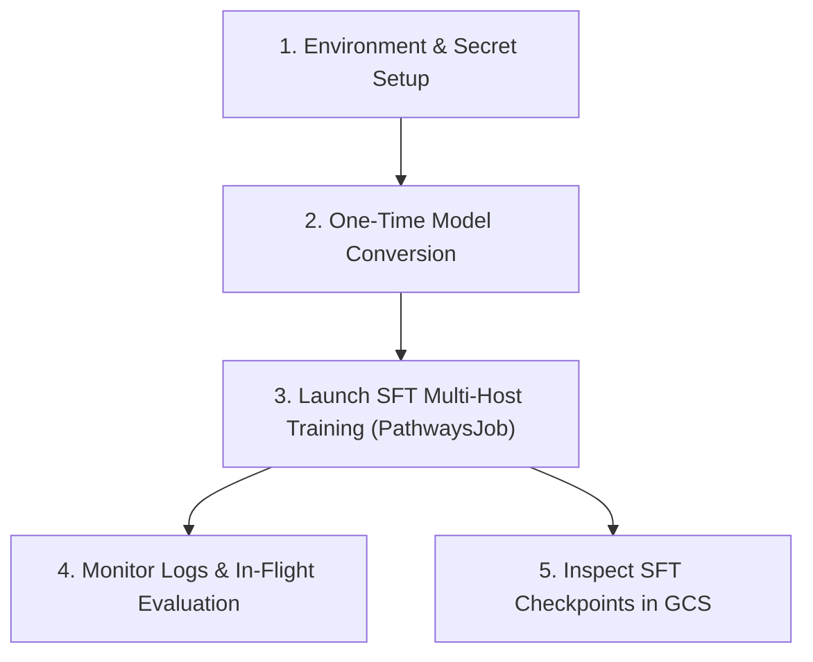

# Cloud TPU Multi-Host MaxText Supervised Fine-Tuning (SFT) Training User Guide

This guide provides step-by-step instructions for running Multi-Host Supervised
Fine-Tuning (SFT) training with in-flight evaluation and checkpoint saves on GKE
using Cloud TPU v6e multi-host/multi-slice topologies with the official MaxText
post-training image.

---

## Quick Reference Workflow



---

## 1. Prerequisites & Environment Setup

### 1.1 Sourcing Environment Variables

Source your cluster configuration variables:

```bash
source platforms/gke/base/use-cases/training-ref-arch/terraform/_shared_config/scripts/set_environment_variables.sh
```

### 1.2 Verify Hugging Face Read Token

Ensure your Hugging Face API token is stored and enabled in Secret Manager:

```bash
gcloud secrets versions list ${huggingface_hub_access_token_read_secret_manager_secret_name} \
  --project=${huggingface_secret_manager_project_id}
```

---

## 2. Step 1: One-Time Hugging Face Model Conversion

Before starting SFT training, convert the base Hugging Face weights into MaxText
Orbax format using the dedicated CPU-based checkpoint converter:

```bash
# Example 1: Gemma 4 31B
export HF_MODEL_ID="gemma4-31b"

# Example 2: Qwen 3 14B
# export HF_MODEL_ID="qwen3-14b"

# Example 3: Gemma 3 4B
# export HF_MODEL_ID="gemma3-4b"

# Configure the CPU checkpoint converter
platforms/gke/base/use-cases/training-ref-arch/kubernetes-manifests/maxtext-checkpoint-converter/configure_checkpoint_converter.sh

# Deploy the CPU Conversion Job
kubectl apply -k platforms/gke/base/use-cases/training-ref-arch/kubernetes-manifests/maxtext-checkpoint-converter/checkpoint-converter
```

### Monitor Model Conversion:

```bash
kubectl logs -f -l app=maxtext-checkpoint-converter -n ${sft_cpu_maxtext_checkpoint_converter_kubernetes_namespace_name}
```

_Outputs will be saved to
`gs://${huggingface_hub_models_bucket_name}/${HF_MODEL_NAME}/0/items`._

---

## 3. Step 2: Launch SFT Multi-Host Training Job (`PathwaysJob`)

1. **Configure the GKE manifest variables**:

   ```bash
   platforms/gke/base/use-cases/training-ref-arch/kubernetes-manifests/sft-tpu-maxtext-multi-host/configure_job.sh
   ```

2. **Deploy the SFT training job**:

   - **For TPU v6e-16 (`v6e-4x4`, Gemma 4 31B)**:

     ```bash
     kubectl apply -k platforms/gke/base/use-cases/training-ref-arch/kubernetes-manifests/sft-tpu-maxtext-multi-host/v6e-4x4-gemma-4-31b-instruct/
     ```

   - **For TPU v6e-32 (`v6e-4x8`, Qwen 3 14B)**:

     ```bash
     kubectl apply -k platforms/gke/base/use-cases/training-ref-arch/kubernetes-manifests/sft-tpu-maxtext-multi-host/v6e-4x8-qwen-3-14b-instruct/
     ```

   - **For Multi-Slice TPU v6e (`2x4x4`, Gemma 3 4B)**:

     ```bash
     kubectl apply -k platforms/gke/base/use-cases/training-ref-arch/kubernetes-manifests/sft-tpu-maxtext-multi-host/v6e-multislice-2x4x4-gemma-3-4b/
     ```

---

## 4. Step 3: Monitor Training Logs & In-Flight Evaluation

### 4.1 View Live Training & Eval Logs

Stream live loss, learning rate, TFLOPs, and evaluation metrics:

```bash
kubectl logs -f -l app=sft-trainer -n ${sft_tpu_maxtext_multi_host_kubernetes_namespace_name}
```

### 4.2 Check Saved Checkpoints in GCS

```bash
gcloud storage ls gs://${sft_tpu_maxtext_multi_host_dataset_bucket_name}/${HF_MODEL_ID}-sft-v6e/checkpoints/
```

---

## 5. Early Stopping Guidelines

- **When to stop**: Monitor the **Eval Loss** trend at each 100-step evaluation
  interval (`eval_interval=100`). When validation loss plateaus or begins rising
  (indicating overfitting), the model has reached optimal performance.
- **Resuming from Best Checkpoint**: Since checkpoints are saved periodically,
  you can pick the step with lowest eval loss directly as the base policy for
  downstream RL training.
