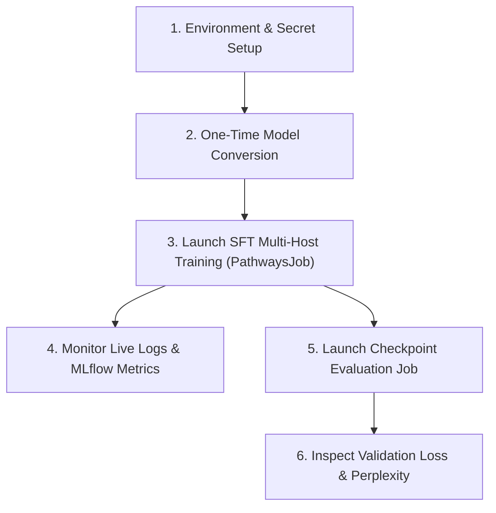

# Cloud TPU Multi-Host MaxText Supervised Fine-Tuning (SFT) Training & Evaluation User Guide

This guide provides step-by-step instructions for running Multi-Host Supervised
Fine-Tuning (SFT) training with Pathways orchestration, monitoring live metrics
with MLflow, and executing checkpoint evaluations on GKE using Cloud TPU v6e
multi-host/multi-slice topologies.

---

## Quick Reference Workflow



---

## 1. Prerequisites & Environment Setup

### 1.1 Sourcing Environment Variables

Source your training reference architecture environment configuration:

```bash
source platforms/gke/base/use-cases/training-ref-arch/terraform/_shared_config/scripts/set_environment_variables.sh
```

### 1.2 Verify Hugging Face Read Token

Ensure your Hugging Face API token is stored and enabled in Secret Manager:

```bash
gcloud secrets versions list ${huggingface_hub_access_token_read_secret_manager_secret_name} \
  --project=${huggingface_secret_manager_project_id}
```

---

## 2. Step 1: One-Time Hugging Face Model Conversion

Before starting SFT training, convert base Hugging Face weights into MaxText
Orbax format using the CPU-based checkpoint converter:

```bash
# Example: Gemma 4 31B
export HF_MODEL_ID="google/gemma-4-31b-it"
export MODEL_NAME="gemma4-31b"

# Configure the CPU checkpoint converter
platforms/gke/base/use-cases/reinforcement-learning/kubernetes-manifests/maxtext-checkpoint-converter/configure_checkpoint_converter.sh

# Deploy the CPU Conversion Job
kubectl apply -k platforms/gke/base/use-cases/reinforcement-learning/kubernetes-manifests/maxtext-checkpoint-converter/checkpoint-converter
```

### Monitor Model Conversion:

```bash
kubectl logs -f -l app=maxtext-checkpoint-converter -n ${training_ref_arch_sft_tpu_maxtext_multi_host_kubernetes_namespace_name}
```

_Converted checkpoints will be saved to
`gs://${training_ref_arch_dataset_bucket_name}/${MODEL_NAME}/0/items`._

---

## 3. Step 2: Launch SFT Multi-Host Training Job (`PathwaysJob`)

1. **Configure the GKE manifest variables**:

   ```bash
   platforms/gke/base/use-cases/training-ref-arch/kubernetes-manifests/sft-tpu-maxtext-multi-host/configure_job.sh
   ```

2. **Deploy the SFT training workload** onto your desired multi-host TPU slice:

   - **Gemma 4 31B on TPU v6e-16 (`v6e-4x4`, 16 chips)**:

     ```bash
     kubectl apply -k platforms/gke/base/use-cases/training-ref-arch/kubernetes-manifests/sft-tpu-maxtext-multi-host/v6e-4x4-gemma-4-31b-instruct/
     ```

   - **Qwen 3 14B on TPU v6e-32 (`v6e-4x8`, 32 chips)**:

     ```bash
     kubectl apply -k platforms/gke/base/use-cases/training-ref-arch/kubernetes-manifests/sft-tpu-maxtext-multi-host/v6e-4x8-qwen-3-14b-instruct/
     ```

   - **Gemma 3 4B on Multi-Slice TPU v6e (`numSlices: 2` $\times$ `4x4`, 32
     chips total)**:

     ```bash
     kubectl apply -k platforms/gke/base/use-cases/training-ref-arch/kubernetes-manifests/sft-tpu-maxtext-multi-host/v6e-multislice-2x4x4-gemma-3-4b/
     ```

---

## 4. Step 3: Monitor Training Logs & Telemetry

### 4.1 View Live Pod Logs

Inspect the `PathwaysJob` status and stream logs from the trainer container:

```bash
kubectl get pathwaysjob -n ${sft_tpu_maxtext_multi_host_kubernetes_namespace_name}
kubectl logs -f -l 'jobset.sigs.k8s.io/jobset-name=sft-tpu-maxtext-multi-host' -c sft-trainer -n ${sft_tpu_maxtext_multi_host_kubernetes_namespace_name}
```

### 4.2 Check Saved Checkpoints in GCS

```bash
gcloud storage ls gs://${sft_dataset_bucket_name}/pathways/checkpoints/
```

### 4.3 Launch MLflow Tracking UI

Port-forward the MLflow tracking service to monitor real-time training loss,
evaluation perplexity, and learning rate:

```bash
kubectl port-forward --namespace=${sft_cpu_mlflow_kubernetes_namespace_name} svc/mlflow-service-svc 5000:5000
```

Open `http://localhost:5000` in your browser.

---

## 5. Step 4: Launch Dedicated Checkpoint Evaluation Job

To evaluate a saved model checkpoint against the test dataset split without
restarting training:

1. **Configure the Evaluation manifest variables**:

   ```bash
   platforms/gke/base/use-cases/training-ref-arch/kubernetes-manifests/sft-tpu-maxtext-multi-host/checkpoint-evaluation/configure_job.sh
   ```

2. **Deploy the Checkpoint Evaluation Job**:

   - **Gemma 4 31B Evaluation on TPU v6e-16 (`v6e-4x4`)**:

     ```bash
     kubectl apply -k platforms/gke/base/use-cases/training-ref-arch/kubernetes-manifests/sft-tpu-maxtext-multi-host/checkpoint-evaluation/v6e-4x4-gemma-4-31b-instruct/
     ```

   - **Qwen 3 14B Evaluation on TPU v6e-32 (`v6e-4x8`)**:

     ```bash
     kubectl apply -k platforms/gke/base/use-cases/training-ref-arch/kubernetes-manifests/sft-tpu-maxtext-multi-host/checkpoint-evaluation/v6e-4x8-qwen-3-14b-instruct/
     ```

---

## 6. Step 5: Inspect Evaluation Results & Perplexity Convergence

### 6.1 View Live Evaluation Logs

```bash
kubectl logs -f -l 'jobset.sigs.k8s.io/jobset-name=sft-tpu-maxtext-multi-host-eval' -c sft-evaluator -n ${sft_tpu_maxtext_multi_host_kubernetes_namespace_name}
```

### 6.2 Evaluation Metrics

The evaluation run records test metrics across evaluation batches:

- **Eval Loss**: Cross-entropy loss on held-out dialogues (`test_sft`).
- **Eval Perplexity**: \( \exp(\text{Eval Loss}) \) tracking language modeling
  prediction accuracy.
- **TFLOP/s / device**: Effective compute utilization across TPU chips during
  forward evaluation passes.

---

## 7. Key Architecture Rules & Troubleshooting

1. **Pathways Head Pod Colocation**: The head pod colocates `sft-trainer`,
   `pathways-proxy` (`grpc://127.0.0.1:29000`), and `pathways-rm` (`29001`)
   containers when using `deploymentMode: colocate_head_with_workers`.
2. **Workload Identity**: Ensure all manifests use
   `serviceAccountName: ${sft_tpu_maxtext_multi_host_kubernetes_service_account_name}`
   with permissions to read the HF token secret and write to the GCS dataset
   bucket.
3. **Decoupled Checkpoint Storage**: Checkpoints are stored via Orbax with
   asynchronous persistence (`ENABLE_PATHWAYS_PERSISTENCE="1"`).
