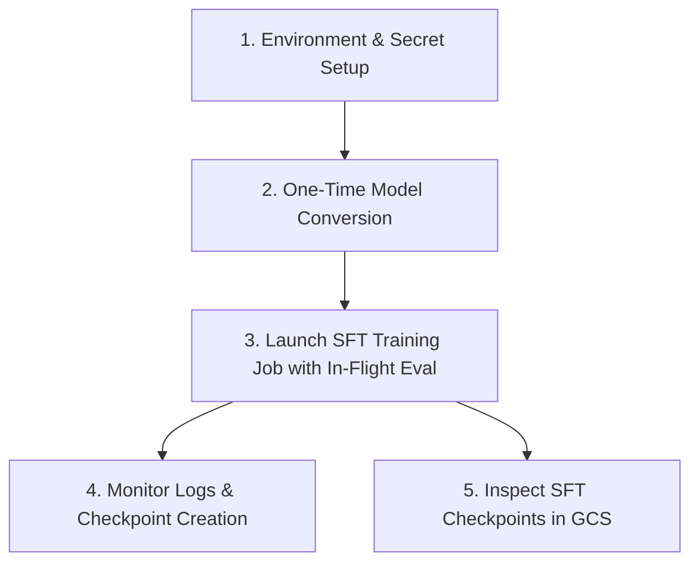

# Cloud TPU v6e MaxText Supervised Fine-Tuning (SFT) Training & Evaluation User Guide

This guide provides step-by-step instructions for running Supervised Fine-Tuning (SFT) training with in-flight evaluation, monitoring live metrics, and executing checkpoint saves on GKE using Cloud TPU v6e slices.

---

## Quick Reference Workflow



---

## 1. Prerequisites & Environment Setup

### 1.1 Sourcing Environment Variables

Source your cluster configuration variables:

```bash
source platforms/gke/base/use-cases/reinforcement-learning/terraform/_shared_config/scripts/set_environment_variables.sh
```

### 1.2 Verify Hugging Face Read Token

Ensure your Hugging Face API token is stored and enabled in Secret Manager:

```bash
gcloud secrets versions list ${huggingface_hub_access_token_read_secret_manager_secret_name} \
  --project=${huggingface_secret_manager_project_id}
```

---

## 2. Step 1: One-Time HuggingFace Model Conversion

Before starting SFT training, convert the base HuggingFace weights into MaxText Orbax format using the CPU-based checkpoint converter:

```bash
# Example 1: Gemma 3 4B
export HF_MODEL_ID="google/gemma-3-4b-it"
export MODEL_NAME="gemma3-4b"

# Configure the CPU checkpoint converter
platforms/gke/base/use-cases/reinforcement-learning/kubernetes-manifests/maxtext-checkpoint-converter/configure_checkpoint_converter.sh

# Deploy the CPU Conversion Job
kubectl apply -k platforms/gke/base/use-cases/reinforcement-learning/kubernetes-manifests/maxtext-checkpoint-converter/checkpoint-converter
```

### Monitor Model Conversion:

```bash
kubectl logs -f -l app=maxtext-checkpoint-converter -n ${rl_cpu_maxtext_checkpoint_converter_kubernetes_namespace_name}
```

*Outputs are saved to `gs://${huggingface_hub_models_bucket_name}/${MODEL_NAME}/0/items`.*

---

## 3. Step 2: Launch SFT Training Job with In-Flight Evaluation

### 3.1 Deploying the 1,000-Step SFT Training Job

Deploy the Supervised Fine-Tuning job configured with in-flight evaluation and asynchronous checkpointing onto an 8-chip Cloud TPU v6e slice (`v6e-2x4`):

```bash
kubectl apply -f - <<EOF
apiVersion: batch/v1
kind: Job
metadata:
  name: gemma3-4b-sft-1000steps
  namespace: ${rl_cpu_maxtext_checkpoint_converter_kubernetes_namespace_name}
spec:
  backoffLimit: 0
  template:
    metadata:
      labels:
        app: gemma3-4b-sft-1000steps
    spec:
      restartPolicy: Never
      serviceAccountName: ${rl_cpu_maxtext_checkpoint_converter_kubernetes_service_account_name}
      nodeSelector:
        cloud.google.com/gke-tpu-accelerator: tpu-v6e-slice
        cloud.google.com/gke-tpu-topology: 2x4
        cloud.google.com/reservation-affinity: specific
        cloud.google.com/reservation-name: multihost-rl-128-tpu-v6e
        topology.kubernetes.io/zone: us-east5-a
      volumes:
      - name: huggingface-token
        csi:
          driver: secrets-store-gke.csi.k8s.io
          readOnly: true
          volumeAttributes:
            secretProviderClass: 7a4221e9-huggingface-token-read
      containers:
      - name: maxtext-sft
        image: us-docker.pkg.dev/cloud-tpu-images/maxtext-images/tpu_post_training:0.2.3
        imagePullPolicy: IfNotPresent
        command: ["/bin/bash", "-c"]
        args:
        - |
          set -ex
          export HF_TOKEN=\$(cat /var/run/secrets/huggingface.co/token)

          python3 -m maxtext.trainers.post_train.sft.train_sft             src/maxtext/configs/post_train/sft.yml             run_name="gemma3-4b-sft-1000steps"             base_output_directory="gs://${huggingface_hub_models_bucket_name}/gemma3-4b-sft-1000steps"             model_name="gemma3-4b"             load_parameters_path="gs://${huggingface_hub_models_bucket_name}/gemma3-4b/0/items"             per_device_batch_size=1             steps=1000             eval_interval=100             eval_steps=10             eval_split="test_sft"             checkpoint_period=100             async_checkpointing=True             dataset_type=hf             hf_path="HuggingFaceH4/ultrachat_200k"             train_split="train_sft"             train_data_columns="['messages']"             tokenizer_type=huggingface             tokenizer_path="google/gemma-3-4b-it"             scan_layers=True             hf_access_token="\${HF_TOKEN}"             managed_mldiagnostics=False             skip_jax_distributed_system=True
        resources:
          requests:
            google.com/tpu: "8"
          limits:
            google.com/tpu: "8"
        volumeMounts:
        - name: huggingface-token
          mountPath: /var/run/secrets/huggingface.co
          readOnly: true
EOF
```

---

## 4. Step 3: Monitor Training Logs & In-Flight Evaluation

### 4.1 View Live Training & Eval Logs

Stream live loss, learning rate, TFLOPs, and evaluation metrics:

```bash
kubectl logs -f -l app=gemma3-4b-sft-1000steps -n ${rl_cpu_maxtext_checkpoint_converter_kubernetes_namespace_name}
```

### 4.2 Interpreting In-Flight Evaluation Metrics

Every 100 steps (`eval_interval=100`), training pauses briefly while the TPU evaluates 10 test batches (`eval_steps=10`, 80 validation dialogues) from `HuggingFaceH4/ultrachat_200k` (`test_sft`):

```text
[Step 100] Training Loss: 1.84 | Learning Rate: 1.95e-5 | Step Time: 342ms
[Step 100] Starting in-flight evaluation (10 batches)...
[Step 100] Eval Loss: 1.76 | Eval Accuracy: 0.628
[Step 100] Async checkpoint saved to gs://${huggingface_hub_models_bucket_name}/gemma3-4b-sft-1000steps/checkpoints/100/
```

### 4.3 Check Saved Checkpoints in GCS

```bash
gcloud storage ls gs://${huggingface_hub_models_bucket_name}/gemma3-4b-sft-1000steps/checkpoints/
```

---

## 5. Early Stopping Guidelines

* **When to stop**: Monitor the **Eval Loss** trend at each 100-step interval. When validation loss plateaus or begins rising (indicating overfitting), the model has reached optimal performance.
* **Resuming from Best Checkpoint**: Since checkpoints are saved every 100 steps (`100/`, `200/`, `300/`, etc.), you can pick the step with lowest eval loss directly as the base policy for RL training.
