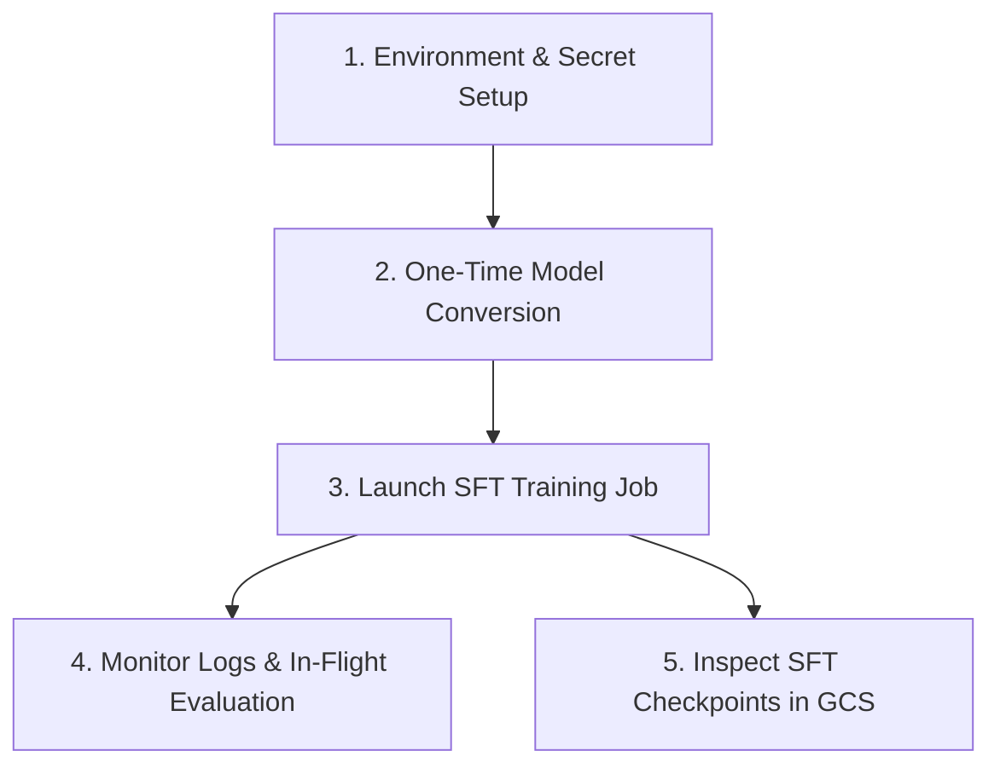

# Cloud TPU MaxText Supervised Fine-Tuning (SFT) Training User Guide

This guide provides step-by-step instructions for running Supervised Fine-Tuning
(SFT) training with in-flight evaluation and checkpoint saves on GKE using Cloud
TPU v5e and v6e slices with the official MaxText post-training image.

---

## Quick Reference Workflow



---

## 1. Prerequisites & Environment Setup

### 1.1 Sourcing Environment Variables

Source your cluster configuration variables:

```bash
source platforms/gke/base/use-cases/training-ref-arch/terraform/_shared_config/scripts/set_environment_variables.sh
```

### 1.2 Verify Hugging Face Read Token

Ensure your Hugging Face API token is stored and enabled in Secret Manager:

```bash
gcloud secrets versions list ${huggingface_hub_access_token_read_secret_manager_secret_name} \
  --project=${huggingface_secret_manager_project_id}
```

---

## 2. Step 1: One-Time Hugging Face Model Conversion

Before starting SFT training, convert the base Hugging Face weights into MaxText
Orbax format using the dedicated CPU-based checkpoint converter:

```bash
# Example 1: Gemma 3 4B
export HF_MODEL_ID="google/gemma-3-4b-it"

# Example 2: LLaMA 3.1 8B
# export HF_MODEL_ID="meta-llama/Llama-3.1-8B-Instruct"

# Configure the CPU checkpoint converter
platforms/gke/base/use-cases/training-ref-arch/kubernetes-manifests/maxtext-checkpoint-converter/configure_checkpoint_converter.sh

# Deploy the CPU Conversion Job
kubectl apply -k platforms/gke/base/use-cases/training-ref-arch/kubernetes-manifests/maxtext-checkpoint-converter/checkpoint-converter
```

### Monitor Model Conversion:

```bash
kubectl logs -f -l app=maxtext-checkpoint-converter -n ${sft_cpu_maxtext_checkpoint_converter_kubernetes_namespace_name}
```

*Outputs will be saved to `gs://${huggingface_hub_models_bucket_name}/${HF_MODEL_NAME}/0/items`.*

---

## 3. Step 2: Launch SFT Training Job

1. **Configure the GKE manifest variables**:

   ```bash
   platforms/gke/base/use-cases/training-ref-arch/kubernetes-manifests/sft-tpu-maxtext-single-host/configure_job.sh
   ```

2. **Deploy the SFT training job**:

   - **For TPU v6e (Gemma 3 4B)**:

     ```bash
     kubectl apply -k platforms/gke/base/use-cases/training-ref-arch/kubernetes-manifests/sft-tpu-maxtext-single-host/v6e-2x4-gemma-3-4b-instruct/
     ```

   - **For TPU v6e (LLaMA 3.1 8B)**:

     ```bash
     kubectl apply -k platforms/gke/base/use-cases/training-ref-arch/kubernetes-manifests/sft-tpu-maxtext-single-host/v6e-2x4-llama-3-1-8b-instruct/
     ```

   - **For TPU v5e (LLaMA 3.1 8B)**:

     ```bash
     kubectl apply -k platforms/gke/base/use-cases/training-ref-arch/kubernetes-manifests/sft-tpu-maxtext-single-host/v5e-2x4-llama-3-1-8b-instruct/
     ```

---

## 4. Step 3: Monitor Training Logs & In-Flight Evaluation

### 4.1 View Live Training & Eval Logs

Stream live loss, learning rate, TFLOPs, and evaluation metrics:

```bash
kubectl logs -f -l app=sft-trainer -n ${sft_tpu_maxtext_single_host_kubernetes_namespace_name}
```

### 4.2 Check Saved Checkpoints in GCS

```bash
gcloud storage ls gs://${sft_tpu_maxtext_single_host_dataset_bucket_name}/${HF_MODEL_ID}-sft-v6e/checkpoints/
```

---

## 5. Early Stopping Guidelines

* **When to stop**: Monitor the **Eval Loss** trend at each 100-step evaluation interval (`eval_interval=100`). When validation loss plateaus or begins rising (indicating overfitting), the model has reached optimal performance.
* **Resuming from Best Checkpoint**: Since checkpoints are saved periodically, you can pick the step with lowest eval loss directly as the base policy for downstream RL training.
