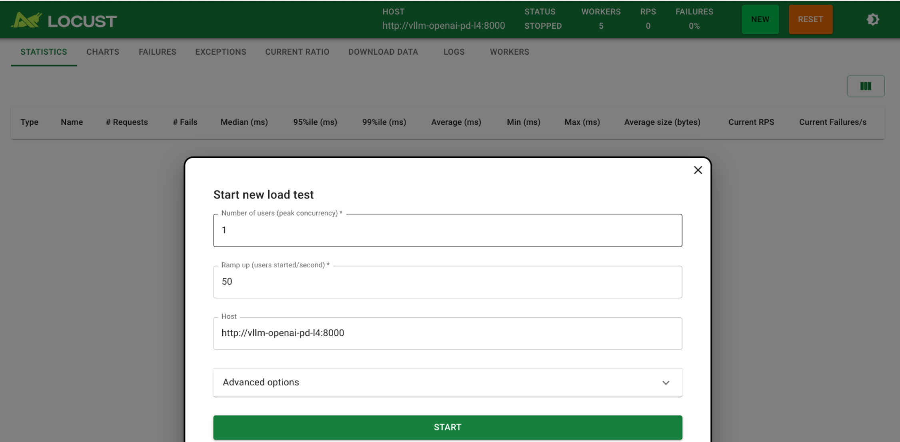

# Benchmarking with Locust

We can run inference benchmark on our deployed model using locust.
Locust is an open source performance/load testing tool for HTTP and other protocols.
Refer to the documentation to [set up](https://docs.locust.io/en/stable/installation.html) locust locally or deploy as a container on GKE.

## Pre-requisites

- A model is deployed using one of the vLLM guides
  - [Distributed Inference and Serving with vLLM using GCSFuse](/use-cases/inferencing/serving/vllm/gcsfuse/README.md)
  - [Distributed Inference and Serving with vLLM using Hyperdisk ML](/use-cases/inferencing/serving/vllm/hyperdisk-ml/README.md)
  - [Distributed Inference and Serving with vLLM using Persistent Disk](/use-cases/inferencing/serving/vllm/persistent-disk/README.md)
- Metrics are being scraped from the vLLM server ss shown in the [vLLM Metrics](/use-cases/inferencing/serving/vllm/metrics/README.md) guide.

## Preparation

- Clone the repository.

  ```sh
  git clone https://github.com/GoogleCloudPlatform/accelerated-platforms && \
  cd accelerated-platforms
  ```

- Change directory to the guide directory.

  ```sh
  cd use-cases/inferencing/benchmark
  ```

- Ensure that your `MLP_ENVIRONMENT_FILE` is configured.

  ```sh
  cat ${MLP_ENVIRONMENT_FILE} && \
  source ${MLP_ENVIRONMENT_FILE}
  ```

  > You should see the various variables populated with the information specific to your environment.

- Get credentials for the GKE cluster

  ```sh
  gcloud container fleet memberships get-credentials ${MLP_CLUSTER_NAME} --project ${MLP_PROJECT_ID}
  ```

## Build the container image

- Build container image using Cloud Build and push the image to Artifact Registry.

  ```sh
  cd src
  git restore cloudbuild.yaml
  sed -i -e "s|^serviceAccount:.*|serviceAccount: projects/${MLP_PROJECT_ID}/serviceAccounts/${MLP_BUILD_GSA}|" cloudbuild.yaml
  gcloud beta builds submit \
  --config cloudbuild.yaml \
  --gcs-source-staging-dir gs://${MLP_CLOUDBUILD_BUCKET}/source \
  --project ${MLP_PROJECT_ID} \
  --substitutions _DESTINATION=${MLP_BENCHMARK_IMAGE}
  cd -
  ```

## Deploy Locust

- Configure the environment.

  > Set the environment variables based on the accelerator and model storage type used to serve the model.
  > The default values below are set for NVIDIA L4 GPUs and persistent disk.

  | Variable      | Description                                                                    | Example      |
  | ------------- | ------------------------------------------------------------------------------ | ------------ |
  | ACCELERATOR   | Type of GPU accelerator used (a100, h100, l4)                                  | l4           |
  | MODEL_NAME    | The name of the model folder in the root of the GCS model bucket               | model-gemma2 |
  | MODEL_STORAGE | Type of storage used for the model (gcs, hdml, pd)                             | pd           |
  | MODEL_VERSION | The name of the version folder inside the model folder of the GCS model bucket | experiment   |

  ```sh
  ACCELERATOR="l4"
  MODEL_NAME="model-gemma2"
  MODEL_STORAGE="pd"
  MODEL_VERSION="experiment"
  ```

  ```sh
  BENCHMARK_MODEL_PATH="/${MODEL_STORAGE}/${MODEL_NAME}/${MODEL_VERSION}"
  HOST="http://vllm-openai-${MODEL_STORAGE}-${ACCELERATOR}:8000"
  ```

- Configure the deployment.

  ```sh
  git restore manifests/locust-master-controller.yaml manifests/locust-master-service.yaml manifests/locust-worker-controller.yaml
  sed \
  -i -e "s|V_IMAGE_URL|${MLP_BENCHMARK_IMAGE}|" \
  -i -e "s|V_KSA|${MLP_MODEL_OPS_KSA}|" \
  -i -e "s|V_BENCHMARK_MODEL_PATH|${BENCHMARK_MODEL_PATH}|" \
  -i -e "s|V_HOST|${HOST}|" \
  manifests/locust-master-controller.yaml \
  manifests/locust-master-service.yaml \
  manifests/locust-worker-controller.yaml
  ```

- Deploy the workload.

  ```
  kubectl --namespace ${MLP_MODEL_OPS_NAMESPACE} apply -f manifests
  ```

  ```
  deployment.apps/locust-master created
  service/locust-master created
  service/locust-master-web-svc created
  deployment.apps/locust-worker created
  ```

- Watch the deployment until it is ready and available.

  ```sh
  watch --color --interval 5 --no-title \
  "kubectl --namespace ${MLP_MODEL_OPS_NAMESPACE} get deployment/locust-master | GREP_COLORS='mt=01;92' egrep --color=always -e '^' -e '1/1     1            1'"
  ```

  ```
  NAME            READY   UP-TO-DATE   AVAILABLE   AGE
  locust-master   1/1     1            1           XXXXX
  ```

- Run the following command to output the URL for Locust.

  ```sh
  echo -e "\n${MLP_MODEL_OPS_NAMESPACE} Locust: ${MLP_LOCUST_NAMESPACE_ENDPOINT}\n"
  ```

- Open Locust in the browser.

  > It can take several minutes for Gradio to be available via the gateway.

  If you are seeing `fault filter abort`, wait a moment and retry.

- Start a new load test.

  

  - If the **Start new load test** screen is not open, click the **NEW** button near the upper right of the page.
  - Enter a value for **Number of users (peak concurrency)**.
  - Enter a value for **Ramp up (users started/second)**.
  - The **Host** value should be populated with the correct URL.
  - Click **START** to start the load test

## What's next

- [Batch inference on GKE](/use-cases/inferencing/batch-inference/README.md)
