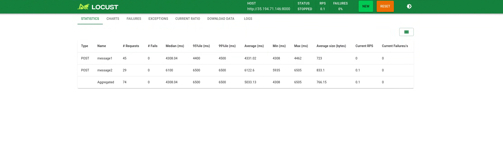
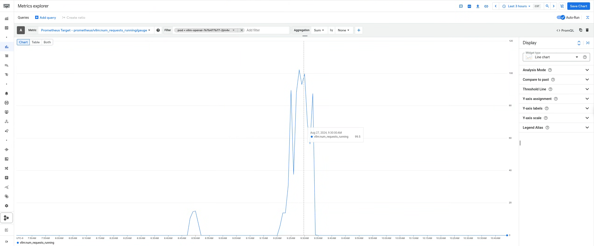

# Distributed Inferencing on vLLM

There are three common strategies for inference on vLLM:

- Single GPU (no distributed inference)
- Single-Node Multi-GPU (tensor parallel inference)
- Multi-Node Multi-GPU

In this guide, you will serve a fine-tuned Gemma large language model (LLM) using graphical processing units (GPUs) on Google Kubernetes Engine (GKE) with the vLLM serving framework with the above mentioned deployment strategies. You can choose to swap the Gemma model with any other fine-tuned or instruction based model for inference on GKE.

- Single GPU (no distributed inference) - If your model fits in a single GPU, you probably don’t need to use distributed inference. Just use the single GPU to run the inference.

- Single-Node Multi-GPU (tensor parallel inference) - If your model is too large to fit in a single GPU, but it can fit in a single node with multiple GPUs, you can use tensor parallelism. The tensor parallel size is the number of GPUs you want to use. For example, if you need 4 GPUs, you can set the tensor parallel size to 4.

By the end of this guide, you should be able to perform the following steps:

1. Create a Persistent Disk for the LLM model weights
1. Deploy a vLLM container to your cluster to host your model
1. Use vLLM to serve the fine-tuned Gemma model
1. View Production metrics for your model serving
1. Use custom metrics and Horizontal Pod Autoscaler (HPA) to scale your model

## Prerequisites

- This guide was developed to be run on the [playground AI/ML platform](/platforms/gke-aiml/playground/README.md). If you are using a different environment the scripts and manifest will need to be modified for that environment.
- A bucket containing the fine-tuned model from the [Fine-tuning example](/use-cases/model-fine-tuning-pipeline/fine-tuning/pytorch/README.md)

## Preparation

- Clone the repository and change directory to the guide directory

  ```sh
  git clone https://github.com/GoogleCloudPlatform/accelerated-platforms && \
  cd accelerated-platforms/use-cases/inferencing/serving-with-vllm
  ```

- Ensure that your `MLP_ENVIRONMENT_FILE` is configured

  ```sh
  cat ${MLP_ENVIRONMENT_FILE} && \
  source ${MLP_ENVIRONMENT_FILE}
  ```

  > You should see the various variables populated with the information specific to your environment.

- Set environment variables

  ```sh
  PROJECT_ID=your-project-id>
  PROJECT_NUMBER=$(gcloud projects describe ${PROJECT_ID} --format="value(projectNumber)")
  V_MODEL_BUCKET=<model-artifacts-bucket>
  CLUSTER_NAME=<your-gke-cluster>
  NAMESPACE=ml-team
  KSA=<k8s-service-account>
  HF_TOKEN=<your-Hugging-Face-account-token>
  MODEL_ID=<your-model-id>
  REGION=<your-region>
  IMAGE_NAME=<your-image-name>
  DISK_NAME=<your-disk-name>
  ZONE=<your-disk-zone>
  ACCELERATOR_TYPE=<accelerator_type> # nvidia-l4 | nvidia-tesla-a100
  ```

- Get Credentials for the GKE cluster

  ```sh
  gcloud container fleet memberships get-credentials ${MLP_CLUSTER_NAME} --project ${MLP_PROJECT_ID}
  ```

- Grant permission to kubernetes service account in cluster to access the storage bucket to view model weights

  ```sh
  gcloud storage buckets add-iam-policy-binding "gs://$V_MODEL_BUCKET" \
    --member "principal://iam.googleapis.com/projects/"${PROJECT_NUMBER}"/locations/global/workloadIdentityPools/${PROJECT_ID}.svc.id.goog/subject/ns/$NAMESPACE/sa/$KSA" \
    --role "roles/storage.objectViewer"
  ```

- Update the bucket access level to uniform.

  ```sh
  gcloud storage buckets update "gs://$V_MODEL_BUCKET"  --uniform-bucket-level-access
  ```

## Create PV, PVC and Persistent disk

Loading model weights from a Persistent Volume is a method to load models faster. In GKE, Persistent Volumes backed by GCP Persistent Disks can be mounted read-only simultaneously by multiple nodes(ReadOnlyMany), this allows multiple pods access the model weights from a single volume.

1. Create a PVC for the model weights

  ```sh
  kubectl apply -f manifests/volume-prep/pvc-disk-images.yaml
  ```

1. Create a job downloading the models to the volume and review logs for successful completion.

  ```sh
  sed -i -e "s|_YOUR_BUCKET_NAME_|${V_MODEL_BUCKET}|" manifests/batch_job_download_model_on_pv_volume.yaml
  kubectl create -f manifests/batch_job_download_model_on_pv_volume.yaml
  ```

1. Wait for the job to show completion.

  ```sh
  ...
  ```

1. Create the PV and PVC

  ```sh
  PV_NAME="$(kubectl get pvc/block-pvc-model -o jsonpath='{.spec.volumeName}')"
  DISK_REF="$(kubectl get pv "$PV_NAME" -o jsonpath='{.spec.csi.volumeHandle}')"
  ```

  ```sh
  gcloud compute images create model-weights-image --source-disk="$DISK_REF"
  ```

  ```sh
  gcloud compute disks create models-fine-tune-disk-v1 --size=1TiB \
  --type=pd-ssd --zone=${ZONE} --image=model-weights-image
  ```
  
  > Note: Choose the appropriate zone based on cluster location and GPU availability

  ```sh
  sed -i -e "s|_NAMESPACE_|${NAMESPACE}|" manifests/volume-prep/pv-and-pvc.yaml
  kubectl apply -f manifests/volume-prep/pv-and-pvc.yaml
  ```

## Deploy a vLLM container to your cluster

- Run the batch job to deploy model using persistent disk on GKE.

  ```sh
  sed -i -e "s|_NAMESPACE_|${NAMESPACE}|" manifests/volume-prep/batch-job-model-deployment.yaml
  sed -i -e "s|_ACCELERATOR_TYPE_|${ACCELERATOR_TYPE}|" manifests/volume-prep/batch-job-model-deployment.yaml
  ```

  ```sh
  kubectl create -f manifests/model_deployment.yaml
  kubectl logs -f -l app=vllm-openai -n ${NAMESPACE}
  ```

  ```sh
  INFO:     Started server process [1]
  INFO:     Waiting for application startup.
  INFO:     Application startup complete.
  INFO:     Uvicorn running on http://0.0.0.0:8000 (Press CTRL+C to quit)
  ```

## Serve the deployed model through curl and a web chat interface

- Test your deployed model through the CLI

  ```sh
  kubectl port-forward svc/vllm-openai -n ${NAMESPACE} 8000
  ```

  Run the curl prompt with your values

  ```sh
  USER_PROMPT="I'm looking for comfortable cycling shorts for women, what are some good options?"
  MODEL_ID=""

  curl http://localhost:8000/v1/chat/completions \
    -H "Content-Type: application/json" \
    -d '{
        "model": "${MODEL_ID}",
        "messages": [
            {"role": "user", "content": "${USER_PROMPT}"}],
             "temperature": 0.70,
             "top_p": 1.0,
             "top_k": 1.0,
             "max_tokens": 256
    }'  
  ```

- You can also deploy a gradio chat interface to view the model chat interface. [OPTIONAL]

  ```sh
  sed -i -e "s|_NAMESPACE_|${NAMESPACE}|" manifests/gradio.yaml
  kubectl apply -f manifests/gradio.yaml
  ```

### Production Metrics

vLLM exposes a number of metrics that can be used to monitor the health of the system. These metrics are exposed via the `/metrics` endpoint on the vLLM OpenAI compatible API server.

  ```sh
  curl http://localhost:8000/metrics
  ```

### View vLLM serving metrics for your model on GKE

You can configure monitoring of the metrics above using the [pod monitoring](https://cloud.google.com/stackdriver/docs/managed-prometheus/setup-managed#gmp-pod-monitoring)

  ```sh
  kubectl apply -f manifests/pod_monitoring.yaml
  ```

### Create a dashboard for Cloud Monitoring to view vLLM metrics

Cloud Monitoring provides an [importer](https://cloud.google.com/monitoring/dashboards/import-grafana-dashboards) that you can use to import dashboard files in the Grafana JSON format into Cloud Monitoring

1. Clone github repository

  ```sh
  git clone https://github.com/GoogleCloudPlatform/monitoring-dashboard-samples
  ```

1. Change to the directory for the dashboard importer:

  ```sh
  cd monitoring-dashboard-samples/scripts/dashboard-importer
  ```

The dashboard importer includes the following scripts:

- import.sh, which converts dashboards and optionally uploads the converted dashboards to Cloud Monitoring.
- upload.sh, which uploads the converted dashboards—or any Monitoring dashboards—to Cloud Monitoring. The import.sh script calls this script to do the upload.

1. Import the dashboard

  ```sh
  ./import.sh ./configs/grafana.json ${PROJECT_ID}
  ```

  When you use the import.sh script, you must specify the location of the Grafana dashboards to convert. The importer creates a directory that contains the converted dashboards and other information.

### Run benchmarks for inference

The model is ready to run the benchmarks for inference job. We can run few performance tests using locust.
Locust is an open source performance/load testing tool for HTTP and other protocols.
You can refer to the documentation to [set up](https://docs.locust.io/en/stable/installation.html) locust locally or deploy as a container on GKE.

We have created a sample [locustfile](https://docs.locust.io/en/stable/writing-a-locustfile.html) to run tests against our model using sample prompts which we tried earlier in the exercise.
Here is a sample  to review.

- Install the locust library locally:

  ```sh
  pip3 install locust==2.29.1
  ```

- Launch the benchmark python script for locust

  ```sh
  benchmarks/locust.py
  ```

### Inference at Scale

There are different metrics available that could be used to scale your inference workloads on GKE.

1. Server metrics: LLM inference servers vLLM provides workload-specific performance metrics. GKE simplifies scraping and autoscaling of workloads based on these server-level metrics. You can use these metrics to gain visibility into performance indicators like batch size, queue size, and decode latencies

In case of vLLM, [production metrics class](https://docs.vllm.ai/en/latest/serving/metrics.html) exposes a number of useful metrics which GKE can use to horizontally scale inference workloads.

```sh
vllm:num_requests_running - Number of requests currently running on GPU.
vllm:num_requests_waiting - Number of requests waiting to be processed
```

1. GPU metrics:

```none
GPU Utilization (DCGM_FI_DEV_GPU_UTIL) - Measures the duty cycle, which is the amount of time that the GPU is active.
GPU Memory Usage (DCGM_FI_DEV_FB_USED) - Measures how much GPU memory is being used at a given point in time. This is useful for workloads that implement dynamic allocation of GPU memory.
```

1. CPU metrics: Since the inference workloads primarily rely on GPU resources, we don't recommend CPU and memory utilization as the only indicators of the amount of resources a job consumes. Therefore, using CPU metrics alone for autoscaling can lead to suboptimal performance and costs.

HPA is an efficient way to ensure that your model servers scale appropriately with load. Fine-tuning the HPA settings is the primary way to align your provisioned hardware cost with traffic demands to achieve your inference server performance goals.

We recommend setting these HPA configuration options:

- Stabilization window: Use this HPA configuration option to prevent rapid replica count changes due to fluctuating metrics. Defaults are 5 minutes for scale-down (avoiding premature downscaling) and 0 for scale-up (ensuring responsiveness). Adjust the value based on your workload's volatility and your preferred responsiveness.

- Scaling policies: Use this HPA configuration option to fine-tune the scale-up and scale-down behavior. You can set the "Pods" policy limit to specify the absolute number of replicas changed per time unit, and the "Percent" policy limit to specify by the percentage change.

For more details, see Horizontal pod autoscaling in the Google Cloud Managed Service for Prometheus [documentation](https://cloud.google.com/kubernetes-engine/docs/horizontal-pod-autoscaling).

Pre-requisites:

1. GKE cluster running inference workload as shown in previous examples.
2. Export the metrics from the vLLM server to Cloud Monitoring as shown in enable monitoring section.

We have couple of options to scale the inference workload on GKE using the HPA and custom metrics adapter.

1. Scale pod on the same node as the existing inference workload.
2. Scale pod on the other nodes in the same node pool as the existing inference workload.

#### Prepare your environment to autoscale with HPA metrics

Install the Custom Metrics Adapter. This adapter makes the custom metric that you exported to Cloud Monitoring visible to the HPA. For more details, see HPA in the [Google Cloud Managed Service for Prometheus documentation](https://cloud.google.com/stackdriver/docs/managed-prometheus/hpa).

1. The following example command shows how to install the adapter:

  ```sh
  kubectl apply -f kubectl apply -f https://raw.githubusercontent.com/GoogleCloudPlatform/k8s-stackdriver/master/custom-metrics-stackdriver-adapter/deploy/production/adapter_new_resource_model.yaml
  ```

1. Set up the custom metric-based HPA resource. Deploy an HPA resource that is based on your preferred custom metric.

Here is a sample  to review.

Select **ONE** of the options below `Queue-depth` or `Batch-size` to configure the HPA resource in your manifest:

> NOTE: Adjust the appropriate target values for `vllm:num_requests_running` or `vllm:num_requests_waiting` in the yaml file.

- Queue-depth

  ```sh
  kubectl apply -f manifests/inference-scale/hpa-vllm-openai-queue-size.yaml -n ${NAMESPACE}
  ```

- Batch-size

  ```sh
  kubectl apply -f manifests/inference-scale/hpa-vllm-openai-batch-size.yaml -n ${NAMESPACE}
  ```

> Note: Below is an example of the batch size HPA scale test below:

```sh
kubectl get hpa vllm-openai-hpa -n ${NAMESPACE} --watch
NAME              REFERENCE                TARGETS   MINPODS   MAXPODS   REPLICAS   AGE
vllm-openai-hpa   Deployment/vllm-openai   0/10      1         5         1          6d16h
vllm-openai-hpa   Deployment/vllm-openai   13/10     1         5         1          6d16h
vllm-openai-hpa   Deployment/vllm-openai   17/10     1         5         2          6d16h
vllm-openai-hpa   Deployment/vllm-openai   12/10     1         5         2          6d16h
vllm-openai-hpa   Deployment/vllm-openai   17/10     1         5         2          6d16h
vllm-openai-hpa   Deployment/vllm-openai   14/10     1         5         2          6d16h
vllm-openai-hpa   Deployment/vllm-openai   17/10     1         5         2          6d16h
vllm-openai-hpa   Deployment/vllm-openai   10/10     1         5         2          6d16h
```

```sh
kubectl get pods -n ${NAMESPACE} --watch
NAME                           READY   STATUS      RESTARTS   AGE
gradio-6b8698d7b4-88zm7        1/1     Running     0          10d
model-eval-2sxg2               0/1     Completed   0          8d
vllm-openai-767b477b77-2jm4v   1/1     Running     0          3d17h
vllm-openai-767b477b77-82l8v   0/1     Pending     0          9s
```

Pod scaled up
```sh
kubectl get pods -n ml-serve --watch
NAME                           READY   STATUS      RESTARTS   AGE
gradio-6b8698d7b4-88zm7        1/1     Running     0          10d
model-eval-2sxg2               0/1     Completed   0          8d
vllm-openai-767b477b77-2jm4v   1/1     Running     0          3d17h
vllm-openai-767b477b77-82l8v   1/1     Running     0          111s
```

The new pod is deployed on a node triggered by the cluster autoscaler.
> NOTE: The existing node where inference workload was deployed in this case had only two GPUS. Hence a new node is required to deploy the copy pod of inference workload.

```sh
kubectl describe pods vllm-openai-767b477b77-82l8v -n ml-serve

Events:
  Type     Reason                  Age    From                                   Message
  ----     ------                  ----   ----                                   -------
  Warning  FailedScheduling        4m15s  gke.io/optimize-utilization-scheduler  0/3 nodes are available: 1 Insufficient ephemeral-storage, 1 Insufficient nvidia.com/gpu, 2 node(s) didn't match Pod's node affinity/selector. preemption: 0/3 nodes are available: 1 No preemption victims found for incoming pod, 2 Preemption is not helpful for scheduling.
  Normal   TriggeredScaleUp        4m13s  cluster-autoscaler                     pod triggered scale-up: [{https://www.googleapis.com/compute/v1/projects/gkebatchexpce3c8dcb/zones/us-east4-a/instanceGroups/gke-kh-e2e-l4-2-c399c5c0-grp 1->2 (max: 20)}]
  Normal   Scheduled               2m40s  gke.io/optimize-utilization-scheduler  Successfully assigned ml-serve/vllm-openai-767b477b77-82l8v to gke-kh-e2e-l4-2-c399c5c0-vvm9
  Normal   SuccessfulAttachVolume  2m36s  attachdetach-controller                AttachVolume.Attach succeeded for volume "model-weights-disk-1024gb-zone-a"
  Normal   Pulling                 2m29s  kubelet                                Pulling image "vllm/vllm-openai:v0.5.3.post1"
  Normal   Pulled                  2m25s  kubelet                                Successfully pulled image "vllm/vllm-openai:v0.5.3.post1" in 4.546s (4.546s including waiting). Image size: 5586843591 bytes.
  Normal   Created                 2m25s  kubelet                                Created container inference-server
  Normal   Started                 2m25s  kubelet                                Started container inference-server
```
