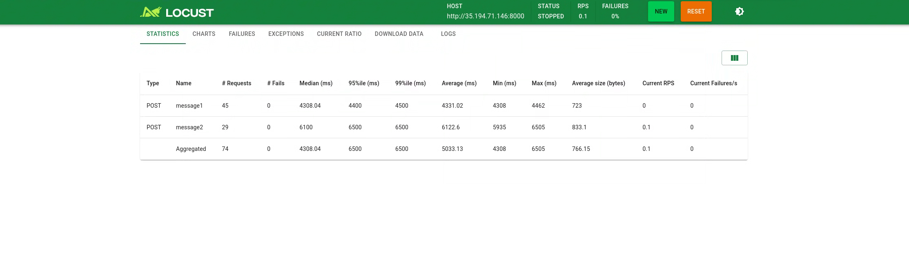

### Run benchmarks for inference

We can run inference benchmark on our deployed model using locust.
Locust is an open source performance/load testing tool for HTTP and other protocols.
Refer to the documentation to [set up](https://docs.locust.io/en/stable/installation.html) locust locally or deploy as a container on GKE.

#### Prepare your environment

*   Ensure that your `MLP_ENVIRONMENT_FILE` is configured

    ```sh
    cat ${MLP_ENVIRONMENT_FILE} && \
    source ${MLP_ENVIRONMENT_FILE}
    ```

*   Switch to inference directory

    ```sh
    cd ${INFERENCE_BENCHMARK_DIR}
    ```

#### Build the image of the source and execute bencmark job

*   Build container image using Cloud Build and push the image to Artifact Registry. 

    ```sh
    cd src
    sed -i -e "s|^serviceAccount:.*|serviceAccount: projects/${MLP_PROJECT_ID}/serviceAccounts/${MLP_BUILD_GSA}|" cloudbuild.yaml
    gcloud beta builds submit \
    --config cloudbuild.yaml \
    --gcs-source-staging-dir gs://${MLP_CLOUDBUILD_BUCKET}/source \
    --project ${MLP_PROJECT_ID} \
    --substitutions _DESTINATION=${MLP_BENCHMARK_IMAGE}
    cd -
    ```

*   Set variables

    ```sh
    BENCHMARK_MODEL_PATH=/data/models/${MODEL_ID}/${MODEL_PATH}
    ENDPOINT="http://vllm-openai:8000/v1/chat/completions" # The model endpoint
    HOST="http://vllm-openai:8000/"
    ```

*   Replace variables in inference job manifest and deploy the job
    ```sh
    sed -i -e "s|_IMAGE_URL_|${MLP_BENCHMARK_IMAGE}|" \
        -i -e "s|_KSA_|${MLP_SERVE_KSA}|" \
        -i -e "s|_BENCHMARK_MODEL_PATH_|${BENCHMARK_MODEL_PATH}|" \
        -i -e "s|_ENDPOINT_|${ENDPOINT}|" \
        -i -e "s|_NAMESPACE_|${MLP_KUBERNETES_NAMESPACE}|" \
        -i -e "s|_HOST_|${HOST}|" \
        locust-master-controller.yaml

    sed -i -e "s|_IMAGE_URL_|${MLP_BENCHMARK_IMAGE}|" \
        -i -e "s|_KSA_|${MLP_SERVE_KSA}|" \
        -i -e "s|_BENCHMARK_MODEL_PATH_|${BENCHMARK_MODEL_PATH}|" \
        -i -e "s|_ENDPOINT_|${ENDPOINT}|" \
        -i -e "s|_NAMESPACE_|${MLP_KUBERNETES_NAMESPACE}|" \
        -i -e "s|_HOST_|${HOST}|" \
        locust-worker-controller.yaml

    sed -i -e "s|_NAMESPACE_|${MLP_KUBERNETES_NAMESPACE}|" \
         locust-master-service.yaml

    kubectl apply -f locust-master-controller.yaml -f locust-worker-controller.yaml -f locust-master-service.yaml
    ```

-   Access the locust dashboard and launch swarming requests.
  
    Note : Locust service make take upto 5 minutes to load completely.

    ```sh
    echo $MLP_LOCUST_NAMESPACE_ENDPOINT
    ```
    Paste the locust endpoint optained above in a browser to open the chat interface to your deployed model.

Here is a sample  to review.