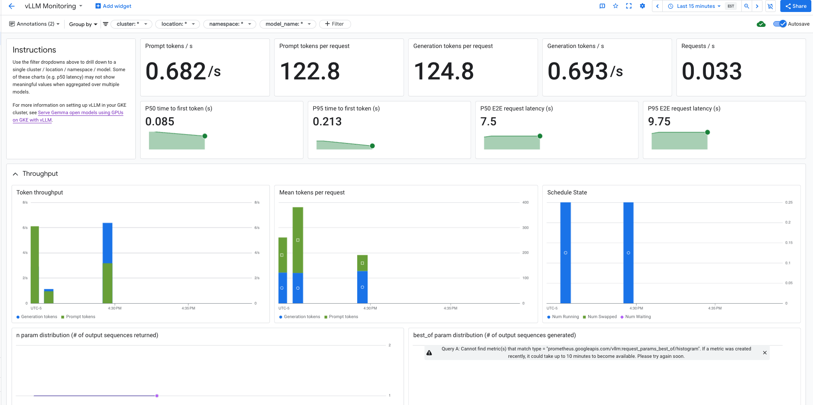
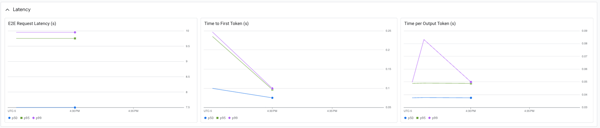
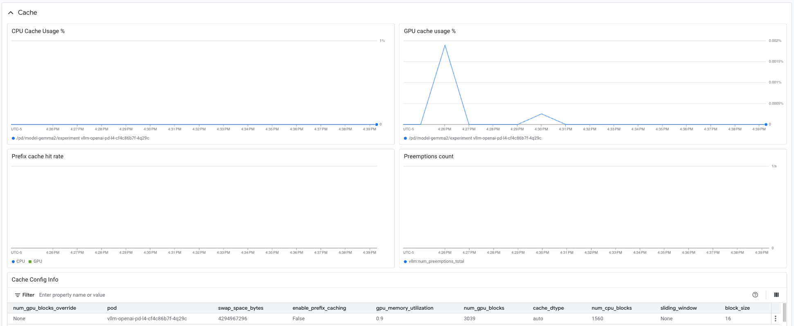
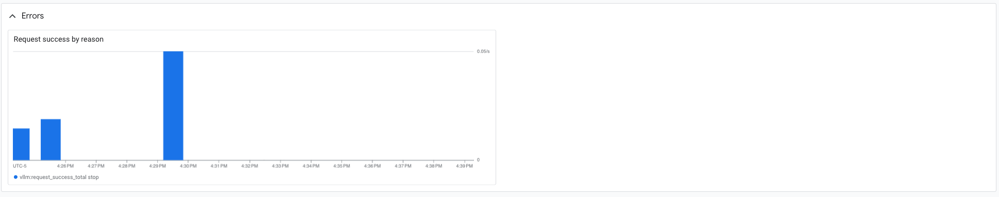

# vLLM Metrics

vLLM exposes a number of metrics that can be used to monitor the health of the
system. These metrics are exposed via the `/metrics` endpoint on the vLLM OpenAI
compatible API server. These metrics can be scraped using Google Managed
Prometheus (GMP) and made available in
[Cloud Metrics](https://console.cloud.google.com/monitoring/metrics-explorer).
For more details, see
[pod monitoring with Google managed prometheus](https://cloud.google.com/stackdriver/docs/managed-prometheus/setup-managed#gmp-pod-monitoring).

## Prerequisites

- A model is deployed using one of the vLLM guides
  - [Distributed Inference and Serving with vLLM using GCSFuse](/use-cases/inferencing/serving/vllm/gcsfuse/README.md)
  - [Distributed Inference and Serving with vLLM using Hyperdisk ML](/use-cases/inferencing/serving/vllm/hyperdisk-ml/README.md)
  - [Distributed Inference and Serving with vLLM using Persistent Disk](/use-cases/inferencing/serving/vllm/persistent-disk/README.md)

## Preparation

- Clone the repository and change directory to the guide directory.

  ```sh
  git clone https://github.com/GoogleCloudPlatform/accelerated-platforms && \
  cd accelerated-platforms
  ```

- Change directory to the guide directory.

  ```sh
  cd use-cases/inferencing/serving/vllm/metrics
  METRICS_DIR=$(pwd)
  ```

- Ensure that your `MLP_ENVIRONMENT_FILE` is configured.

  ```sh
  cat ${MLP_ENVIRONMENT_FILE} && \
  source ${MLP_ENVIRONMENT_FILE}
  ```

## Deploy the PodMonitoring resource

- Configure the environment.

  > Set the environment variables based on the accelerator and model storage
  > type used to serve the model. The default values below are set for NVIDIA L4
  > GPUs and persistent disk.

  | Variable      | Description                                        | Example |
  | ------------- | -------------------------------------------------- | ------- |
  | ACCELERATOR   | Type of GPU accelerator used (a100, h100, l4)      | l4      |
  | MODEL_STORAGE | Type of storage used for the model (gcs, hdml, pd) | pd      |

  ```sh
  ACCELERATOR="l4"
  MODEL_STORAGE="pd"
  ```

- Configure the PodMonitoring resource.

  ```sh
  git restore manifests/pod-monitoring.yaml
  sed \
  -i -e "s|V_ACCELERATOR|${ACCELERATOR}|" \
  -i -e "s|V_MODEL_STORAGE|${MODEL_STORAGE}|" \
  manifests/pod-monitoring.yaml
  ```

- Create the PodMonitoring resource.

  ```sh
  kubectl --namespace ${MLP_MODEL_SERVE_NAMESPACE} apply -f manifests/pod-monitoring.yaml
  ```

  ```
  podmonitoring.monitoring.googleapis.com/vllm-inference-XXX-XXX created
  ```

## View the metrics

- Make several requests to your model to populate metrics, you can use the
  previously deployed chat interface.

  ```sh
  echo -e "\nGradio chat interface: ${MLP_GRADIO_MODEL_OPS_ENDPOINT}\n"
  ```

- Wait for the metrics to populate, then they can be viewed in the Metrics
  explorer.

  - Go to the
    [Metrics explorer](https://console.cloud.google.com/monitoring/metrics-explorer)
  - Click the **Select a metric** dropdown near the upper left of the screen
  - Select **Prometheus Target**
  - Select **Vllm**, you should now see a list of the available metrics.
  - Select **Prometheus/vllm:avg_generation_throughput_toks_per_s/gauge**
  - Click **Apply**
  - Click **Add filter** in the **Filter** text box
  - Under **Resource labels** select **cluster**
  - For the **value** select the name of your cluster
  - You should now see the metrics for your cluster

## Create a dashboard

### Create a Cloud Monitoring custom dashboard

After you've verified that the vLLM metrics are available in Cloud Monitoring
using the metrics explorer, you can create a custom vLLM dashboard by running
the following command:

```sh
gcloud monitoring dashboards create --config-from-file=../metrics/dashboard/cloud-monitoring-vllm.json
```

If you want to use the Cloud Monitoring console to import the dashboard, copy
the contents of
[cloud-monitoring-vllm.json](../metrics/dashboard/cloud-monitoring-vllm.json)
and paste them into the dashboard JSON editor. Then, save your changes. You can
read the doc
[here](https://cloud.google.com/monitoring/charts/dashboards#copy-dashboard) for
more details.

The sample Cloud Monitoring dashboard created are organized with multiple
sections to display metrics such as throughput, latency, cache utilization and
errors:









This dashboard uses several key vLLM metrics, pulled from Prometheus, to provide
insights into various aspects of the server's operation:

1. E2E Request Latency

   `vllm:e2e_request_latency_seconds_bucket`: This is a histogram metric that
   tracks the end-to-end latency of requests in seconds. The dashboard uses
   histogram_quantile to calculate and display the P99, P95, P90, and P50
   latency values. It also shows the average latency. This panel gives you a
   good overview of the overall responsiveness of your vLLM server.

2. Token Throughput

   `vllm:prompt_tokens_total`: This counter metric tracks the total number of
   prompt tokens processed by the server. The dashboard uses rate to show the
   rate of prompt tokens processed per second.

   `vllm:generation_tokens_total`: Similar to the above, this counter metric
   tracks the total number of generated tokens. The dashboard shows the rate of
   generation tokens per second. This panel helps you understand the throughput
   of your server in terms of token processing.

3. Time Per Output Token Latency

   `vllm:time_per_output_token_seconds_bucket`: This histogram metric tracks the
   latency per output token in seconds. Like the "E2E Request Latency" panel,
   this one also uses histogram_quantile to show different percentiles (P99,
   P95, P90, P50) and the mean latency per generated token. This provides
   insights into the efficiency of token generation.

4. Scheduler State

   `vllm:num_requests_running`: A gauge metric indicating the number of requests
   currently being processed by the GPUs.

   `vllm:num_requests_swapped`: A gauge metric showing the number of requests
   that have been swapped to CPU.

   `vllm:num_requests_waiting`: A gauge metric indicating the number of requests
   waiting in the queue to be processed. This panel helps you understand the
   current load on the server and how requests are being scheduled.

5. Time To First Token Latency

   `vllm:time_to_first_token_seconds_bucket`: This histogram metric tracks the
   time it takes to generate the first token in a request. The dashboard
   displays various percentiles (P99, P95, P90, P50) and the average time to
   first token. This is a critical metric as it reflects the initial response
   time experienced by users.

6. Cache Utilization

   `vllm:gpu_cache_usage_perc`: A gauge metric showing the percentage of GPU
   cache blocks used.

   `vllm:cpu_cache_usage_perc`: A gauge metric showing the percentage of CPU
   cache blocks used. This panel helps you monitor cache utilization, which is
   crucial for performance optimization.

7. Request Prompt Length & 8. Request Generation Length

   `vllm:request_prompt_tokens_bucket` and
   `vllm:request_generation_tokens_bucket`: These are histogram metrics that
   track the distribution of prompt lengths and generation lengths respectively.
   The heatmaps visualize these distributions, showing how many requests fall
   into different length buckets.

This dashboard provides a comprehensive view of the vLLM server's performance by
combining these metrics. By monitoring these panels, you can identify potential
bottlenecks, optimize resource allocation, and ensure the efficient and reliable
operation of your LLM serving system.

> NOTE:
> [Check here](/docs/use-cases/inferencing/README.md#effective-scaling-metrics)
> for additional details on metrics that can be utilized for scaling.

### [Optional] Import a vLLM Grafana dashboard

Alternatively, you can import a Grafana vLLM dashboard into Cloud Monitoring.
Here's an example:

Cloud Monitoring provides
[an importer tool](https://cloud.google.com/monitoring/dashboards/import-grafana-dashboards)
that allows you to import dashboard files in the Grafana JSON format.

- Clone the repository.

  ```sh
  git clone https://github.com/GoogleCloudPlatform/monitoring-dashboard-samples
  ```

- Change to the directory for the dashboard importer.

  ```sh
  cd monitoring-dashboard-samples/scripts/dashboard-importer
  ```

- The dashboard importer includes the following scripts:

  - `import.sh`, which converts dashboards and optionally uploads the converted
    dashboards to Cloud Monitoring.
  - `upload.sh`, which uploads the converted dashboards or any Monitoring
    dashboards to Cloud Monitoring. The `import.sh` script calls this script to
    do the upload.

- Import the dashboard. When prompted, answer `y`

  ```sh
  ./import.sh ${METRICS_DIR}/dashboard/grafana-vllm.json ${MLP_PROJECT_ID}
  ```

  ```
  Converting: vLLM
  ✓ vLLM converted successfully

  Conversion of /XXXXXXXXXX/XXXXXXXXXX/XXXXXXXXXX/accelerated-platforms/use-cases/inferencing/serving/vllm/metrics/dashboard/grafana-vllm.json complete. Conversion Report located at: reports/YYYY-MM-DD/HH:MM:SS/report.json


  To upload these dashboard(s) manually, you can run:
  ./upload.sh reports/YYYY-MM-DD/HH:MM:SS/ <PROJECT_ID>

  Conversion complete. Proceeding to upload...

  Now running: ./upload.sh reports/YYYY-MM-DD/HH:MM:SS/ <PROJECT_ID>

  Uploading 1 dashboard(s) from a directory with the following args:
  Directory: reports/YYYY-MM-DD/HH:MM:SS/
  Project: <PROJECT_ID>

  The following are your dashboards:
  - vllm.json

  Would you like to continue? (y/n) y
  ```

  ```
  ✓ vllm.json successfully uploaded:
  https://console.cloud.google.com/monitoring/dashboards/builder/XXXXXXXX-XXXX-XXXX-XXXX-XXXXXXXXXXXX?project=<PROJECT_ID>

  Upload log created in reports/YYYY-MM-DD/HH:MM:SS/upload_HH:MM:SS.txt

  Need to troubleshoot? Please visit:
  https://github.com/GoogleCloudPlatform/monitoring-dashboard-samples/tree/master/scripts/dashboard-importer/README.md#troubleshooting
  ```

- A link to the dashboard will be output by the script, or navigate to the
  [Monitoring Dashboards](https://console.cloud.google.com/monitoring/dashboards)
  page in the console and look for the **vLLM** Custom dashboard.

## What's next

- [vLLM autoscaling with horizontal pod autoscaling (HPA)](/use-cases/inferencing/serving/vllm/autoscaling/README.md)
- [Benchmarking with Locust](/use-cases/inferencing/benchmark/README.md)
- [Batch inference on GKE](/use-cases/inferencing/batch-inference/README.md)
