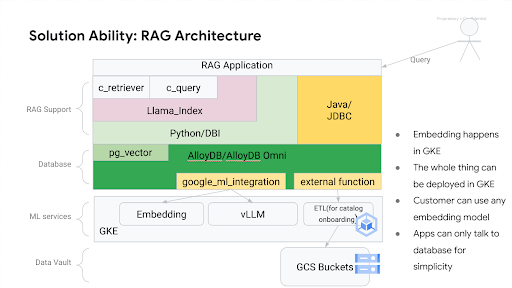

# Retrieval Augment Generation

We have come to a point in the solution where we can use the fine-tuned model to run as a chatbot.
Now, we can extend that model to use for different retail use cases for the end customers.

## Retail chat bot use case

<TO-DO> Explain the use case here
Use case helps the the retailer suggest semantically similiar items from the product catalog if the product item user requested is out of stock or unavailable.

## Dataset

[This](https://www.kaggle.com/datasets/PromptCloudHQ/flipkart-products) is a pre-crawled public dataset, taken as a subset of a bigger dataset (more than 5.8 million products) that was created by extracting data from [Flipkart](https://www.flipkart.com/), a leading Indian eCommerce store.

The dataset has product information such as id, name, brand, description, image urls, product specifications.

## Architecture



## Set up the environment

Here is what we need:

- Create the vector store database in alloyDB to store Product Catalog Information in a table.
- Add ml-integration suite to alloyDB. This helps alloyDB to call out the multimodal embeddings model to request text and image embeddings.
- Host a multimodal embeddings model to generate the embeddings(text and image)
- Using an ETL pipeline generate text embeddings using the multimodal model and store them to the alloyDB vector store in a separate table.
- Host the fine tuned model developed using model-finetuned pipeline.
- Deploy the backend API to interface with embeddings and fine tuned model and process user prompts.
- Deploy the Frontend UI built-in gradio to start the chatbot to receive end customers prompts.

## Prerequisites

- Use the existing  [playground AI/ML platform](/platforms/gke-aiml/playground/README.md). If you are using a different environment the scripts and manifest will need to be modified for that environment.

- Host the fine tuned model developed using [ model-finetuned pipeline](/platforms/use-cases/model-finetuned/README.md)

## Preparation

### Set vars

```
PROJECT_ID=your-project-id>
PROJECT_NUMBER=$(gcloud projects describe ${PROJECT_ID} --format="value(projectNumber)")
V_MODEL_BUCKET=<model-artifacts-bucket>
MLP_DATA_BUCKET=<dataset-bucket>
CLUSTER_NAME=<your-gke-cluster>
NAMESPACE=ml-team
KSA=<k8s-service-account>
HF_TOKEN=<your-Hugging-Face-account-token>
MODEL_ID=<your-model-id>
REGION=<your-region>
IMAGE_NAME=<your-image-name>
DISK_NAME=<your-disk-name>
ZONE=<your-disk-zone>
ACCELERATOR_TYPE=<accelerator_type> # nvidia-l4 | nvidia-tesla-a100
```

### Configuration

- Download the raw data csv file from [Kaggle](https://kaggle.com)

  - You will need kaggle cli to download the file. The kaggle cli can be installed using the following command in Cloud Shell:
    ```shell
    pip3 install --user kaggle
    ```
    For more details, you can read those [instructions](https://github.com/Kaggle/kaggle-api#installation).

  - To use the cli you must create an API token. To create the token, register on [kaggle.com](https://kaggle.com) if you already don't have an account. Go to `kaggle.com/settings > API > Create New Token`, the downloaded file should be stored in `$HOME/.kaggle/kaggle.json`. Note, you will have to create the dir `$HOME/.kaggle`. After the configuration is done, you can run the following command to download the dataset and copy it to the GCS bucket:
    ```shell
      kaggle datasets download --unzip atharvjairath/flipkart-ecommerce-dataset && gcloud storage cp flipkart_com-ecommerce_sample.csv gs://${MLP_DATA_BUCKET}/flipkart_raw_dataset/flipkart_com-ecommerce_sample.csv && rm flipkart_com-ecommerce_sample.csv
    ```
  - Alternatively, you can [downloaded the dataset](https://www.kaggle.com/datasets/atharvjairath/flipkart-ecommerce-dataset) directly from the kaggle website and copy it to the bucket.

### Create alloyDB and import Product Catalog

#### Create AlloyDB cluster using terraform modules

 Add your Google Project ID to the terraform config to create alloyDB cluster.

```shell
   git clone https://github.com/GoogleCloudPlatform/accelerated-platforms
   cd accelerated-platforms/use-cases/rag-on-gke/alloyDB
   # TODO: remove the next line when merge to man
   git checkout llamaindex-for-rag
   terraform init
   terraform plan
   terraform apply
```

#### Import Product Catalog to the alloyDB instance

TODO: Convert this paragraph to a python code running in GKE

Database is ready to import the dataset.You can follow the [Import CSV to alloyDB ](https://cloud.google.com/alloydb/docs/connect-psql)
instructions.

The default terraform configuration creates VPC network name ```simple-adb```

- Create a Compute Engine VM that can connect to AlloyDB instances using private services access in this VPC.
- A VPC network in the Google Cloud project that you are using must already be configured for private services access to AlloyDB.

Get the IP address of the AlloyDB primary instance where your database is located  and ssh to machine.

```
gcloud compute ssh --project=PROJECT_ID --zone=ZONE VM_NAME
```

Copy the CSV file to the client host's local file system

```
gcloud storage cp gs://${MLP_DATA_BUCKET}/flipkart_raw_dataset/flipkart_com-ecommerce_sample.csv .
```

Run the psql client tool and then, at the psql prompt, connect to the database.

```
psql -h <IP_ADDRESS> -U postgres -d postgres

```

Generate DDL for the table from the CSV file

```
echo "create table flipkart ("; head -n 1 flipkart_com-ecommerce_sample.csv  |sed 's/,/ text\n,/g; $s/$/ text/';echo ");"
```

Alternatively you can use the following command to generate the DDL for the flipkart table.

```
create table flipkart (
uniq_id text
,crawl_timestamp text
,product_url text
,product_name text
,product_category_tree text
,pid text
,retail_price text
,discounted_price text
,image text
,is_FK_Advantage_product text
,description text
,product_rating text
,overall_rating text
,brand text
,product_specifications text
);
```

Import from CSV file

Delete any existing data in flipkart table

```
truncate table flipkart; 
```

Import flipkart Product Catalog from CSV file

```
\copy flipkart from 'flipkart_com_sample.csv' WITH (FORMAT CSV, HEADER true, NULL 'null')
```

Create the embedding table to store text and image embeddings.

```
truncate table flipkart_embeded; -- clear existing data from the table
insert into flipkart_embeded select uniq_id, google_ml.embedding_text(description) from flipkart ;
```

#### Create ml-integration functions in AlloyDB

The [Google Ml Integration](https://cloud.google.com/alloydb/docs/ai/invoke-predictions)
makes the ML services callable from inside the database, so that ML inferencing 
services can be integrated with the SQL queries.

The benefits of doing so are:

- Embedding happens in GKE
- The whole thing can be deployed in GKE
- Customer can use any embedding model
- Apps can only talk to database for simplicity

The ml-integration provided in `ml-integration/assets` file will create the 
following ml functions in the AlloyDB:

- `vllm_completion` This function calls the finetuned model for inference
- `gemma2_completion` This function calls a pretrained gemma2 2B model for 
  inference
- `google_ml.embedding_text` This function calls the "blip2" model for generating
  embeddings for text
- `google_ml.multimodal_embedding` This function calls the "blip2" model for 
  generating multi-model embedding: text, image, and combined embedding

To create the ml-integration functions, set these environment variables and then
run `psql`:

```bash
export FINETUNE_MODEL_EP=<your-finetuned-model-endpoint>
export PRETRAINED_MODEL_EP=<your-pretained-model-endpoint>
export EMBEDDING_ENDPOINT=<your-embedding-service-ebdpoint>
psql <your-connection-string> -f ml-integration/assets/ml-integration.sql
```


### Deploy the Ml playground and finetuned gemma2 model


### Deploy the Multimodal model on the playground cluster

- Build container image using Cloud Build and push the image to Artifact Registry

  ```shell

  ```

## Run the job

- Get credentials for the GKE cluster

  ```shell
  gcloud container fleet memberships get-credentials ${MLP_CLUSTER_NAME} --project ${MLP_PROJECT_ID}
  ```

- Configure the job

  ```shell
  sed \
  -i -e "s|V_DATA_BUCKET|${MLP_DATA_BUCKET}|" \
  -i -e "s|V_IMAGE_URL|${MLP_DATA_PROCESSING_IMAGE}|" \
  -i -e "s|V_KSA|${MLP_DATA_PROCESSING_KSA}|" \
  manifests/job.yaml
  ```

- Create the job

  ```shell
  kubectl --namespace ${MLP_KUBERNETES_NAMESPACE} apply -f manifests/job.yaml
  ```

- Monitor the execution in Ray Dashboard. You can run the following command to get the dashboard endpoint:
  ```shell
  echo -e "\n${MLP_KUBERNETES_NAMESPACE} Ray dashboard: ${MLP_RAY_DASHBOARD_NAMESPACE_ENDPOINT}\n"
  ```
  Read [the section about KubeRay](/platforms/gke-aiml/playground/README.md#software-installed-via-reposync-and-rootsync) for more info.
- From the Ray Dashboard, view the following about the jobs:

  - Jobs -> Running Job ID
    - See the Tasks/actors overview for Running jobs
    - See the Task Table for a detailed view of task and assigned node(s)
  - Cluster -> Node List
    - See the Ray actors running on the worker process

- You can check the job status from the GKE console or [query the logs](#log-query-sample) in the [Logs Explorer](https://console.cloud.google.com/logs). Once the Job is completed, both the prepared dataset as a CSV and the images are stored in Google Cloud Storage.

  ```shell
  gcloud storage ls gs://${MLP_DATA_BUCKET}/flipkart_preprocessed_dataset/flipkart.csv
  gcloud storage ls gs://${MLP_DATA_BUCKET}/flipkart_images
  ```

> For additional information about developing using this codebase see the [Developer Guide](DEVELOPER.md)

> For additional information about converting you code from a notebook to run as a Job on GKE see the [Conversion Guide](CONVERSION.md)

## Observability

By default, both GKE and the workloads you run expose metrics and logs in Google Cloud's Observability suite. You can view that information either from the Cloud Observability console or the GKE Observability page.

For more information about infrastructure and application metrics, see [View observability metrics](https://cloud.google.com/kubernetes-engine/docs/how-to/view-observability-metrics).

Specifically for the data processing use case described in this example, you can perform additional analysis based on the workload logs.

### Log query sample

In the Google Cloud console, go to the [Logs Explorer](https://console.cloud.google.com/logs) page to run your queries.

- Find when the data processing job started and finished. You may need to adjust the time window in the UI or use [timestamp](https://cloud.google.com/logging/docs/view/logging-query-language) in the query:

  ```
  labels."k8s-pod/app"="data-processing"
  resource.type="k8s_container"
  jsonPayload.message: "Started" OR jsonPayload.message: "Finished"
  severity=INFO
  ```

- Find all error logs for the job:

  ```
  labels."k8s-pod/app"="data-processing"
  resource.type="k8s_container"
  severity=ERROR
  ```

- Search for specific errors from the `textPayload` using a regex expression:

  ```
  labels."k8s-pod/app"="data-processing"
  resource.type="k8s_container"
  textPayload =~ "ray_worker_node_id.+Image.+not found$"
  severity=ERROR
  ```

You can narrow down the results by adding extra filters, such as using additional labels. For more GKE query samples, you can read [Kubernetes-related queries](https://cloud.google.com/logging/docs/view/query-library#kubernetes-filters).

### Log-based Metrics

To gain insight into your workload status, you can also utilize [log-based metrics](https://cloud.google.com/logging/docs/logs-based-metrics). Several methods exist for their creation. The most straightforward approach involves modifying your log queries to locate the relevant logs. Subsequently, you can generate a custom metric by clicking the `Create metric` link and defining it as per your requirements. For example:


For this example, the following query is used, utilizing a more specific regular expression to search the error logs. With the log entries found, you can create log-based metrics.

```
labels."k8s-pod/app"="data-processing"
resource.type="k8s_container"
textPayload =~ "ray_worker_node_id.+Image.+not found$"
severity=ERROR
```

The following is a definition for a metric such as `No_Image_found_Product`. Notice both the GKE node and Ray worker node id are added as labels.

```yaml
filter: |-
  labels."k8s-pod/app"="data-processing"
  resource.type="k8s_container"
  textPayload =~ "ray_worker_node_id.+Image.+not found$"
  severity=ERROR
labelExtractors:
  gke_node: EXTRACT(labels."compute.googleapis.com/resource_name")
  ray_woker_node_id: REGEXP_EXTRACT(textPayload, "ray_worker_node_id:(.+) Image")
metricDescriptor:
  labels:
    - key: gke_node
    - key: ray_woker_node_id
  metricKind: DELTA
  name: projects/xxxxx/metricDescriptors/logging.googleapis.com/user/No_Image_Found_Product
  type: logging.googleapis.com/user/No_Image_Found_Product
  unit: "1"
  valueType: INT64
name: No_Image_Found_Product
resourceName: projects/xxxxx/metrics/No_Image_Found_Product
```

Once the metrics are defined, the next time you run your workloads, you will be able to use them. For example, the following chart visualizes the metric defined above:


### Log Analytics

You can also use [Log Analytics](https://cloud.google.com/logging/docs/log-analytics#analytics) to [analyze your logs](<(https://cloud.google.com/logging/docs/analyze/query-and-view)>). If your log buckets are not upgraded for Log Analytics, you need to upgrade them first. After the log buckets are upgraded, you can run SQL queries to gain insight from the newly ingested logs. The query results can also be charted. For example, the following query returns the `Image not found` error and chart the result:

```sql
WITH
  logs AS (
  SELECT
    *
  FROM
    `[Your Project Id].global._Default._AllLogs` )
SELECT
  timestamp,
  severity,
  text_payload,
  proto_payload,
  json_payload
FROM
  logs
WHERE
  SAFE.STRING(logs.labels["k8s-pod/app"]) = "data-processing"
  AND logs.resource.type= "k8s_container"
  AND logs.text_payload IS NOT NULL
  AND REGEXP_CONTAINS(logs.text_payload, "ray_worker_node_id.+Image.+not found$")
  AND logs.severity = "ERROR"
ORDER BY
  timestamp DESC,
  insert_id DESC
LIMIT
  10000
```

You should see output like the following:

