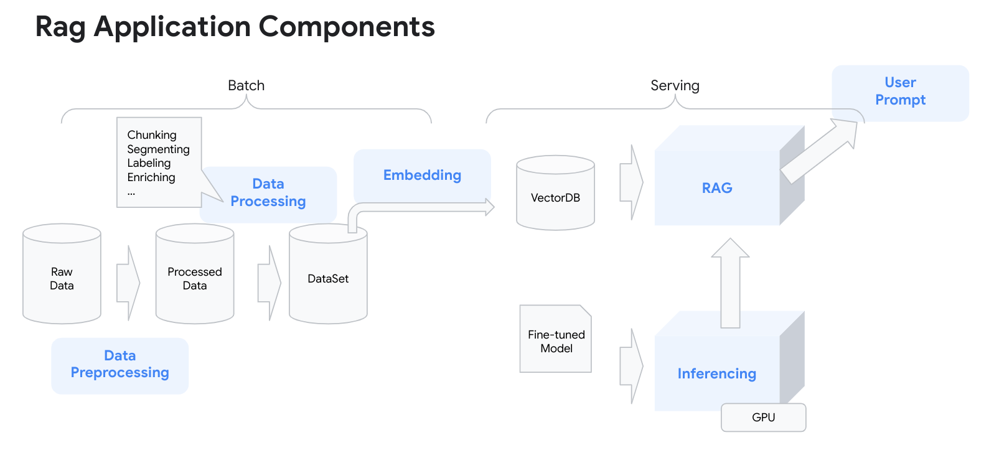
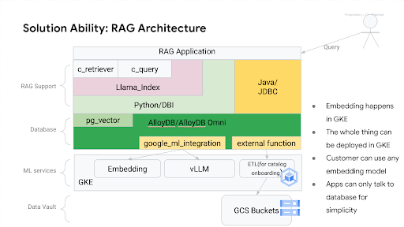

# Retrieval Augment Generation

We have come to a point in the solution where we can use the fine-tuned model to run as a chatbot.
Now, we can extend that model to use for different retail use cases for the end customers.

## Retail chat bot use case

<TODO> Explain the use case here before submitting to main
Use case helps the the retailer suggest semantically similiar items from the product catalog if the product item user requested is out of stock or unavailable.

## Dataset

[This](https://www.kaggle.com/datasets/PromptCloudHQ/flipkart-products) is a pre-crawled public dataset, taken as a subset of a bigger dataset (more than 5.8 million products) that was created by extracting data from [Flipkart](https://www.flipkart.com/), a leading Indian eCommerce store.

The dataset has product information such as id, name, brand, description, image urls, product specifications.

## Architecture



## Set up the environment

Here is what we need:

- Create the vector store database in alloyDB to store Product Catalog Information in a table.
- Add ml-integration suite to alloyDB. This helps alloyDB to call out the multimodal embeddings model to request text and image embeddings.
- Host a [blip2 multimodal embeddings model](https://github.com/salesforce/LAVIS/blob/main/examples/blip_feature_extraction.ipynb) to generate the embeddings(text and image)
- Using an ETL pipeline generate text embeddings using the multimodal model and store them to the alloyDB vector store in a separate table.
- Host the fine tuned model developed using model-finetuned pipeline.
- Host the pre-trained gemma2 model to generate prompt responses for the retail customers.
- Deploy the backend API in [llamaIndex](https://www.llamaindex.ai/) to interface with multimodal embeddings model and fine tuned model via alloyDB vectore store to process user prompts and generate appropriate responses.
- Deploy the Frontend UI built-in [gradio](https://gradio.app/) to start the chatbot to receive end customers prompts.

## Prerequisites

- Use the existing  [playground AI/ML platform](/platforms/gke-aiml/playground/README.md). If you are using a different environment the scripts and manifest will need to be modified for that environment.

- Host the fine tuned model developed using [ model-finetuned pipeline](/platforms/use-cases/model-finetuned/README.md)

## Preparation

#### Set vars

```
<TODO> Clean up the vars before submitting to main
PROJECT_ID=your-project-id>
PROJECT_NUMBER=$(gcloud projects describe ${PROJECT_ID} --format="value(projectNumber)")
V_MODEL_BUCKET=<model-artifacts-bucket>
MLP_DATA_BUCKET=<dataset-bucket>
CLUSTER_NAME=<your-gke-cluster>
NAMESPACE=ml-team
KSA=<k8s-service-account>
HF_TOKEN=<your-Hugging-Face-account-token>
MODEL_ID=<your-model-id>
REGION=<your-region>
IMAGE_NAME=<your-image-name>
DISK_NAME=<your-disk-name>
ZONE=<your-disk-zone>
ACCELERATOR_TYPE=<accelerator_type> # nvidia-l4 | nvidia-tesla-a100
```

#### Configuration

- Download the flipkart processed CSV file to your local environment to function as your Product Catalog.

    ```
    <TODO: Make this location publicly accessible>
    gcloud storage cp gs://flipkart-dataset-rag/flipkart_processed_dataset/flipkart.csv .
    ```
  - Alternatively, you can use the processed dataset from your earlier [data preprocessing job](https://github.com/GoogleCloudPlatform/accelerated-platforms/tree/llamaindex-for-rag/use-cases/model-fine-tuning-pipeline/data-processing/ray)

## Deploy the ML playground and finetuned gemma2 model

You can use a previously deployed version of the fine tuned model that you created using [model-finetuned pipeline](/platforms/use-cases/model-finetuned/README.md).

You can also refer to the [inferencing guide]() to better understand how to host and deploy fine-tuned models on GKE with various storage options.

Alternatively, you can use below steps:

<TODO> Check with Aaron if the fine tuned image can be made publicly accessible.

Assumption : Fine tuned model has been uploaded to Google Storage bucket.

1. Grant the Kubernetes service account privilege to download the model to the pod.

```

PROJECT_NUMBER=<your_gcp_project_number>
PROJECT_ID=<your_gcp_project_id>
NAMESPACE=ml-serve-fine-tuned-model
KSA=fine-tuned-model-sa
MODEL_BUCKET_NAME=<your_model_bucket_name>

kubectl create ns $NAMESPACE
kubectl create sa $KSA --namespace $NAMESPACE

gcloud storage buckets add-iam-policy-binding "gs://$MODEL_BUCKET_NAME" \
    --member "principal://iam.googleapis.com/projects/"$PROJECT_NUMBER"/locations/global/workloadIdentityPools/${PROJECT_ID}.svc.id.goog/subject/ns/$NAMESPACE/sa/$KSA" \
    --role "roles/storage.objectViewer"
```

2. Edit the `deployment.yaml` file in the `fine-tuned-model` directory, change the following things:

    - The value of `MODEL_ID` should point to a proper model path
    - The `cloud.google.com/gke-nodepool` nodeSelector should be changed according to your GKE cluster
    - The `bucketName` of the gcs-fuse volume, this bucket should contain the model 
    
3. Create the deployment

```bash
kubectl apply -f deployment.yaml
```

### Get the ip address of the service

This ip address will be used in the step "Create alloyDB and import Product Catalog". 

Do the following:

```bash
kubectl -n $NAMESPACE service/fine-tuned-model-service
```

Take a note for the "EXTERNAL-IP".


## Deploy the Multimodal Embedding Model on the playground cluster

The Multimodal Embedding Model provides the embedding functionality: 
- Embed a text into a vector
- Embed an image into a vector
- Embed an image along with the caption text into a vector

To deploy the Multimodal embedding model, goto `multimodal-embedding` under the `embedding-models` folder, and do the following steps.

### Build the container image

Run these commands:

```bash
export PROJECT_ID=<your_gcp_project_id>
gcloud builds submit .
```

### Deploy the model

Fisrt, we create the namespace `multimodal-embedding-model`:

```bash
kubectl creat ns multimodal-embedding-model
```

Then we edit the `embedding.yaml`, change the following:
- The image of `blip2-container`
  Replace "<PROJECT_ID>" to your value

Apply the deployment:

```bash
kubectl apply -f embedding.yaml
```

### Get the ip address of the service

This ip address will be used in the step "Create alloyDB and import Product Catalog". 

Do the following:

```bash
kubectl -n multimodal-embedding-model service/multimodal-embedding-model-service
```

Take a note for the "EXTERNAL-IP".

## Deploy pre-trained model gemma2 on the playground cluster

### Deploy the model
Set the following variables:

```bash
  HF_TOKEN=<your-Hugging-Face-account-token>
  NAMESPACE=ml-serve-pre-trained-model-2
```

Then we need to create a secret storing it
```
kubectl create -n $NAMESPACE secret generic hf-secret \
--from-literal=hf_api_token=$HF_TOKEN \
--dry-run=client -o yaml | kubectl apply -f -

```

Apply the deployment:

```bash
kubectl apply -f deployment.yaml
```

### Get the ip address of the service

This ip address will be used in the step "Create alloyDB and import Product Catalog". 

Do the following:

```bash
kubectl -n $NAMESPACE service/pre-trained-model-service
```

Take a note for the "EXTERNAL-IP".


## Create alloyDB and import Product Catalog

#### Create AlloyDB cluster using terraform modules

 Add your Google Project ID to the terraform config to create alloyDB cluster.

```shell
   git clone https://github.com/GoogleCloudPlatform/accelerated-platforms
   cd accelerated-platforms
   # TODO: remove the next line when merge to main
   git checkout llamaindex-for-rag
   cd use-cases/rag-on-gke/alloyDB/build-db
   terraform init

   terraform apply
```

This will create the following objects:
- An alloydb cluster `cluster-us-central1` 
  - And a primary instance `cluster-us-central1-instance1` in the cluster
- A gcp service account `alloydb-superuser@<project_id>.iam.gserviceaccount.com`
  - An alloydb user `alloydb-superuser@<project_id>`
  - This user has "alloydbsuperuser" role
- A gcp service account `alloydb-raguser@<project_id>.iam.gserviceaccount.com`
  - An alloydb user `alloydb-raguser@<project_id>`

#### Create database objects for ML integraion

In `use-cases/rag-on-gke/alloyDB/init_database_objects`, prepare a `terraform.tfvars` file containing the following information:

```terraform
project_id = "<your_project_id>"
gke_cluster_name = "<your_gke_cluster_name>"
gke_cluster_location = "<your_gke_cluster_location"
dba_service_account = "dba-ksa"
rag_service_account = "rag-ksa"
alloydb_cluster = "cluster-us-central1"
alloydb_instance = "cluster-us-central1-instance1"
alloydb_region = "us-central1"
finetuned_model_endpoint = "<your_finetuned_model_endpoint>"
pretrained_model_endpoint = "<your_pretrained_model_endpoint>"
embedding_endpoint = "<your_embedding_model_endpoint>"
```

For the endpoints, input the full http urls to the endpoints. For example, a model hosted using vLLM has the endpoint like this: `http://10.0.0.101:8000/v1/completions`. You should have the ip address of the services from previous steps:

- finetuned_model: In the step "Deploy the ML playground and finetuned gemma2 model"
- pretrained_model: In the step "Deploy pre-trained model gemma2 on the playground cluster"
- embedding_model: In the step "Deploy the Multimodal Embedding Model on the playground cluster"

Then run the following commands:

```bash
terraform init
terraform apply
```

This will do the following initialization tasks:

- Create a service account `dba-ksa` in the GKE cluster
  - Grant the gcp service account `alloydb-superuser@<project_id>.iam.gserviceaccount.com` to the kubernetes service account `dba-ksa`
  - The `dba-ksa` service account will have the privilege of "alloydb-superuser"n
- Create a service account `rag-ksa` in the GKE cluster
  - Grant the gcp service account `alloydb-raguser@<project_id>.iam.gserviceaccount.com` to the kubernetes service account `dba-ksa`
  - The `rag-ksa` service account will have the privilege of "alloydb-raguser"
- Create a database "ragdb" in the alloydb cluster
  - Grant necessary privileges in "ragdb" to the "alloydb-raguser"
- Create the google_ml integration functions/models
  - You can find the definition in `use-cases/rag-on-gke/alloyDB/init_database_objects/assets/ml-integration.sql`


#### Create a configmap in GKE for database connectivity information

In `use-cases/rag-on-gke/alloyDB/create-database-configmap`, prepare a `terraform.tfvars` file containing the following information:

```terraform
project_id = "<your_project_id>"
gke_cluster_name = "<your_gke_cluster_name>"
gke_cluster_location = "<your_gke_cluster_location"
alloydb_cluster = "cluster-us-central1"
alloydb_instance = "cluster-us-central1-instance1"
alloydb_region = "us-central1"
```

Then run the following commands:

```bash
terraform init
terraform apply
```

This will create a configmap `alloydb-config` in the default namespace holding two keys:

- `pghost`: the ipaddress pointing to the primary instance in the alloydb cluster
- `pgdatabase`: the database name in the alloydb cluster

#### Import Product Catalog to the alloyDB instance

In the `use-cases/rag-on-gke/etl`, do the following 

```bash
make
kubectl apply -f etl-import-data.yaml
```

After the job finishes, the data will load to the database and an embedding table will also be created.

- The datasource: "https://www.kaggle.com/api/v1/datasets/download/PromptCloudHQ/flipkart-products"
- target table: flipkart
- the column "description" is used to generate embedding


## Create ml-integration functions in AlloyDB

<TODO> remove this part

The [Google Ml Integration](https://cloud.google.com/alloydb/docs/ai/invoke-predictions)
makes the ML services callable from inside the database, so that ML inferencing 
services can be integrated with the SQL queries.



Why we are using this approach to generate embeddings:

- It gives us an option to deploy any custom or OSS embedding model on GKE.
- Applications can interface with database to generate and store embeddings as a single source of truth. 
- It helps create custom functions in sql to generate, store and retrieve embeddings.

The ml-integration.sql script provided in `ml-integration/assets` file will create the following ml functions in the AlloyDB:

- `vllm_completion` This function allows you to call fine-tuned model for inference.

- `gemma2_completion` This function allows you to call a pretrained gemma2 2B   model for inference

- `google_ml.text_embedding` This function allows you to call the "blip2" model forcalls the "blip2" model for generating text embeddings only.

- `google_ml.multimodal_embedding` This function calls the "blip2" model for 
  generating multi-model embedding: text, image, and combined embedding

To create the ml-integration functions, set these environment variables and then
connect to the database using `psql` and run the script.

These environment variables help set the endpoint urls of the custom or OSS embedding models hosted in your enviorment.

```bash
export FINETUNE_MODEL_EP=<FINE-TUNED-MODEL-URL>
export PRETRAINED_MODEL_EP=<PRE-TRAINED-MODEL-URL>
export EMBEDDING_ENDPOINT=<EMBEDDING-MODEL-URL>
```

```
psql <your-connection-string> -f ml-integration/assets/ml-integration.sql
```


## Run the gradio application

In `use-cases/rag-on-gke/llama-index-alloydb`, run the following commands

```bash
make
kubectl apply -f query-gradio.yaml
```

The application will be deployed and a service will be created pointing to the application.
