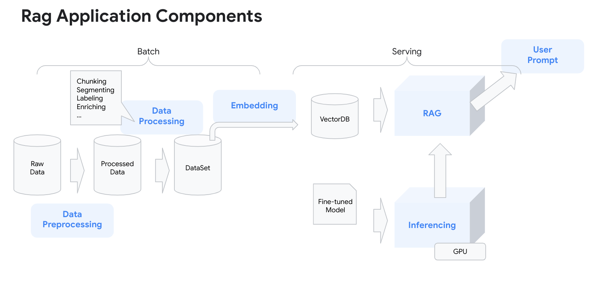

# Retrieval Augment Generation

We have come to a point in the solution where we can use the fine-tuned model to run as a chatbot.
Now, we can extend that model to use for different retail use cases for the end customers.

## Retail chat bot use case

<TODO> Explain the use case here before submitting to main
Use case helps the the retailer suggest semantically similiar items from the product catalog if the product item user requested is out of stock or unavailable.

## Dataset

[This](https://www.kaggle.com/datasets/PromptCloudHQ/flipkart-products) is a pre-crawled public dataset, taken as a subset of a bigger dataset (more than 5.8 million products) that was created by extracting data from [Flipkart](https://www.flipkart.com/), a leading Indian eCommerce store.

The dataset has product information such as id, name, brand, description, image urls, product specifications.

## Architecture



## Set up the environment

Here is what we need:

- Create the vector store database in alloyDB to store Product Catalog Information in a table.
- Host a [blip2 multimodal embeddings model](https://github.com/salesforce/LAVIS/blob/main/examples/blip_feature_extraction.ipynb) to generate the embeddings(text and image)
- Using an ETL pipeline generate text embeddings using the multimodal model and store them to the alloyDB vector store in a separate table.
- Host the fine tuned model developed using model-finetuned pipeline.
- Host the pre-trained gemma2 model to generate prompt responses for the retail customers.
- Deploy the backend API in [llamaIndex](https://www.llamaindex.ai/) to interface with multimodal embeddings model and fine tuned model via alloyDB vectore store to process user prompts and generate appropriate responses.
- Deploy the Frontend UI built-in [gradio](https://gradio.app/) to start the chatbot to receive end customers prompts.

## Prerequisites

- Use the existing  [playground AI/ML platform](/platforms/gke-aiml/playground/README.md). If you are using a different environment the scripts and manifest will need to be modified for that environment.

- Host the fine tuned model developed using [ model-finetuned pipeline](/platforms/use-cases/model-finetuned/README.md)

## Preparation

#### Set vars

```
<TODO> Clean up the vars before submitting to main
PROJECT_ID=your-project-id>
PROJECT_NUMBER=$(gcloud projects describe ${PROJECT_ID} --format="value(projectNumber)")
V_MODEL_BUCKET=<model-artifacts-bucket>
MLP_DATA_BUCKET=<dataset-bucket>
CLUSTER_NAME=<your-gke-cluster>
NAMESPACE=ml-team
KSA=<k8s-service-account>
HF_TOKEN=<your-Hugging-Face-account-token>
MODEL_ID=<your-model-id>
REGION=<your-region>
IMAGE_NAME=<your-image-name>
DISK_NAME=<your-disk-name>
ZONE=<your-disk-zone>
ACCELERATOR_TYPE=<accelerator_type> # nvidia-l4 | nvidia-tesla-a100
```

#### Configuration

## Create alloyDB and import Product Catalog

#### Create AlloyDB cluster using terraform modules

## Run ETL pipeline for embedding generation

## Deploy the Multimodal Model on the playground cluster


## Deploy the backend on the playground cluster


## Deploy the frontend on the playground cluster


## Deploy pre-trained model gemma2 on the playground cluster

```
  export HF_TOKEN=<your-Hugging-Face-account-token>
```

```
kubectl create secret generic hf-secret \
--from-literal=hf_api_token=$HF_TOKEN \
--dry-run=client -o yaml -n $NAMESPACE| kubectl apply -f -
````

```
kubectl create -f pre-trained-model/manifests/deployment.yaml -n $NAMESPACE
```
## Run the end-to-end flow

# Steps

Run following commands in cloud shell

## Pre Req

```
cat ${MLP_ENVIRONMENT_FILE}
source ${MLP_ENVIRONMENT_FILE}
gcloud config set project ${MLP_PROJECT_ID}
```

## Setup the platform:

- This guide was developed to be run on the [playground AI/ML platform](/platforms/gke-aiml/playground/README.md). If you are using a different environment the scripts and manifest will need to be modified for that environment.

## Get Fleet credentials

```
gcloud container fleet memberships get-credentials ${MLP_CLUSTER_NAME} --project ${MLP_PROJECT_ID}
```

# Deploy RAG Architecture

- Deploy Multi modal embedding model in GKE, follow the [README](/use-cases/rag-pipeline/multimodal-emb/README.md)
- Build AlloyDB, follow the [README](/use-cases/rag-pipeline/alloy-db/README.md)
- Deploy instruction-tuned model in GKE, follow the [README](/use-cases/rag-pipeline/instruction-tuned-model-deployment/README.md)
- Deploy backend application in GKE, follow the [README](/use-cases/rag-pipeline/backend-application/README.md)
- Test the backend-application with the curl job

  ```
  kubectl --namespace ${MLP_KUBERNETES_NAMESPACE} apply -f manifests/curl-job.yaml
  ```