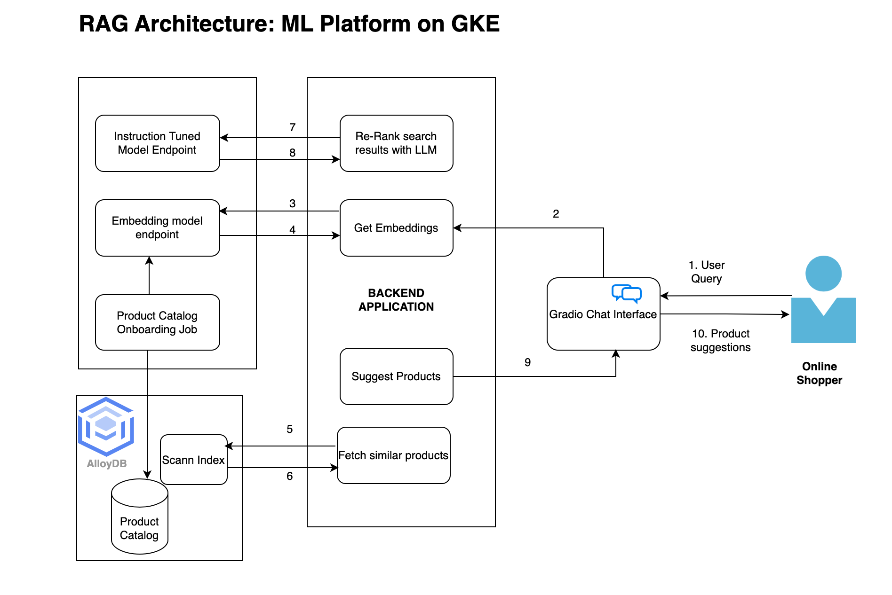

# Retrieval Augment Generation

This solution implements a Retrieval Augmented Generation (RAG) pipeline to
enhance product recommendations in an e-commerce setting.

## Architecture

### Setting up the RAG Pipeline deployment

This section outlines the steps to set up the Retrieval Augmented Generation
(RAG) pipeline for product recommendations.

### Prerequisites

Use the existing
[playground AI/ML platform](/platforms/gke-aiml/playground/README.md). If you
are using a different environment the scripts and manifest will need to be
modified for that environment.

### Data Preprocessing for RAG

We need a input dataset to feed to our RAG pipeline. We take a raw dataset and
filter and clean it up to prepare it for our RAG pipeline. Perform the data
preprocessing steps as described in
[README](/use-cases/rag-pipeline/data-preprocessing/README.md) to prepare input
dataset.

## Deploy RAG Components

This section outlines the steps to deploy the Retrieval Augmented Generation
(RAG) pipeline to the playground cluster.

### 1. Deploy the Multimodal embedding Model on the playground cluster

Deploy
[Blip2 multimodal](https://github.com/salesforce/LAVIS/blob/main/examples/blip_feature_extraction.ipynb)
embedding model. Follow the
[README](/use-cases/rag-pipeline/embedding-models/multimodal-embedding/README.md)

### 2. Deploy Instruction Tuned model on the playground cluster

Deploy [gemma2-2b-it model](https://huggingface.co/google/gemma-2b-it) on ML
playground, follow the
[README](/use-cases/rag-pipeline/instruction-tuned-model/README.md)

### 3. Create database to import Product Catalog

Create the `product_catalog` database in
[AlloyDB](https://cloud.google.com/alloydb/docs/introduction). This database
will house the `clothes` table, which stores product catalog information. Use an
ETL pipeline to generate embeddings (text, image, and multimodal) using the
deployed Blip2 model. Store these embeddings in separate columns within the
`clothes` table in AlloyDB. Follow the
[README](/use-cases/rag-pipeline/alloy-db-setup/README.md)

### 4. Deploy the backend on the playground cluster

Deploy the FastAPI backend. Follow the
[README](/use-cases/rag-pipeline/backend/README.md). This API serves as the
interface between the user interface, embedding model, instruction-tuned model,
and the AlloyDB vector store. It processes user prompts and generates product
recommendations.

### 5. Deploy the frontend on the playground cluster

Deploy frontend application on the MLP playground cluster, follow the
[README](/use-cases/rag-pipeline/frontend/README.md)
